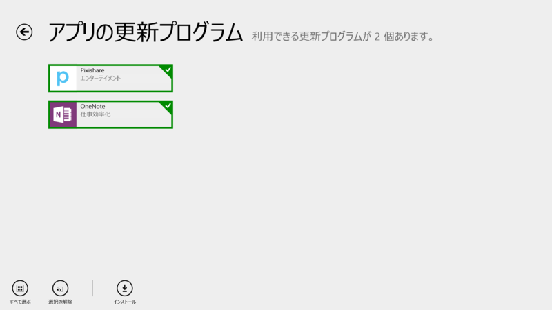
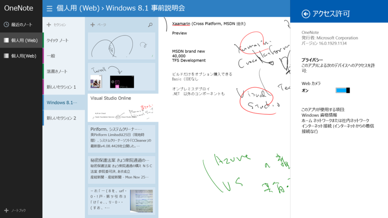
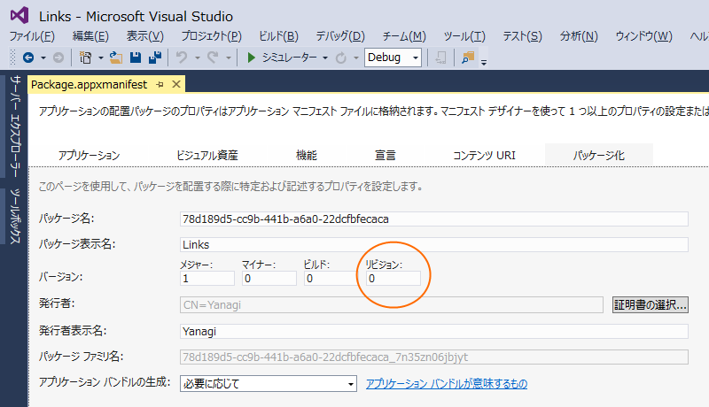

 

<h3>OneNote 16.0.1929.1133 → 16.0.1929.1134</h3>

 

<blockquote>

最近使ったノートとページ サムネール --- ページ プレビューや一番上にある最近使ったノートから、すばやくノートを見つけられます。 写真を撮る --- デバイスのカメラで写真を撮ってノートに追加できます。画像内のテキストは OCR で検索可能になります。 ホワイトボードや文書をスキャン --- デバイスのカメラを使用するだけで、後は自動でトリミング、拡張されます。 OneNote と共有 --- Windows チャーム バーの共有オプションを使用して、OneNote にコンテンツをクリップすることができます。

</blockquote>

リビジョンが一つ上がっただけ。

たぶん不具合か何かの修正だろうと思う。

<ul>
<li><a href="http://apps.microsoft.com/windows/ja-jp/app/onenote/f022389f-f3a6-417e-ad23-704fbdf57117">Windows &#x30B9;&#x30C8;&#x30A2; &#x306E; Windows &#x7528; OneNote &#x30A2;&#x30D7;&#x30EA;</a></li>
</ul>

