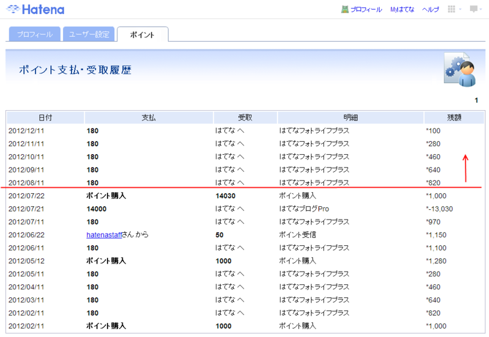
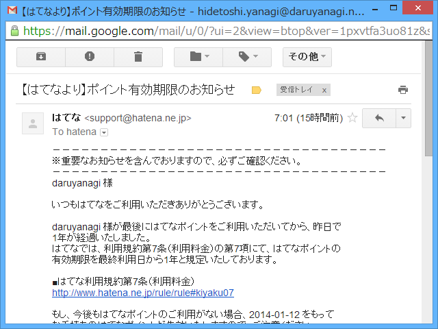

今となっては割とどうでもいい話なのだけど、「はてなブログ Pro（有料）」を使う前は「はてなブログ（無料）」＋「はてなフォトライフ（有料、自動継続）」という構成で使ってたんだよ。ブログの新規作成画面のサイドバーで画像を簡単に上げられる UI が結構気に入っていたので。その後、「はてなブログ Pro」がどんどん便利になっていくので、確かドメインを割り当てられるようになったことがきっかけで、「はてなブログ Pro」へ移行したのさ。

「はてなブログ Pro」へ移行すれば、実質「はてなフォトライフ（有料）」がついてくるようなものなので、そっちは解約すればいい。最初は「はてなブログ Pro」を契約すれば「はてなフォトライフ」は自動解約になるのかなと思ってたのだけど、そこまで便利じゃなかった。残念。しょうがないので手動で「はてなフォトライフ」を解約しようと思ったが……これができないんだよ！（当時の話、今は知らん）

というわけで、「はてなフォトライフ（有料、自動継続）」は解約できず、端数の「はてなポイント」が毎月なくなっていくのを見ているしかなかった。とはいえ、まぁ、これぐらいのおカネなら寄付と思えばいいやと思っていたので、それほど気にはしていない（フィードバックも面倒だったのでやってない）。ただ、このブログは2年間14,000円ではなく、実質14,720円だということだ。もうちょっと大事に使わねばならん。

なんでこんなことを書いたのかというと、こういうメールがきたのでそのことを思い出したから。まぁ、残り100円程度ではなにもできんので、これもはてなに寄付することにする。

