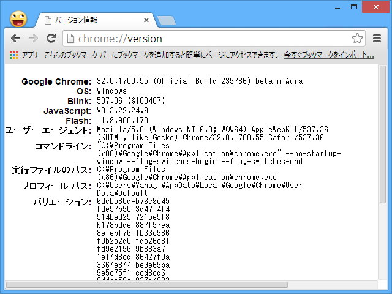
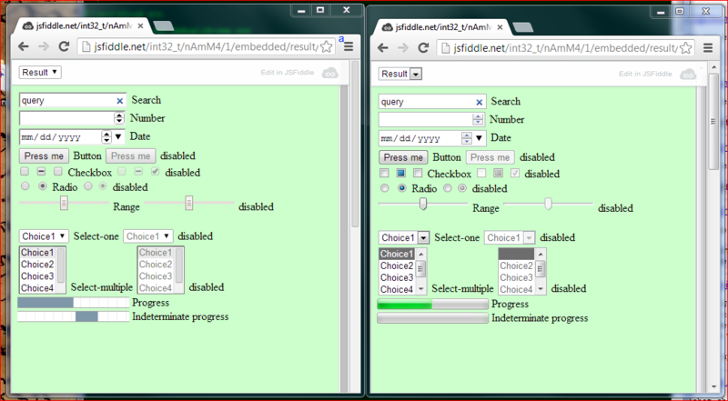

なんかふと違和感を感じたのだけど、「Google Chrome」のスクロールバーからスクロールボタンがなくなってた。

これは「Google Chrome 32」からの変更であるらしい。<a href="https://blog.daruyanagi.jp/entry/2013/11/15/065043">Google Chrome 32 &#x3068; Web &#x691C;&#x7D22; - &#x3060;&#x308B;&#x308D;&#x3050;</a> このときは全然気が付いてなかった。まぁ、気が付かないってことは要らないってことだろう。これも Aura がらみの変更なのかな。

<h4>追記</h4>

 

<blockquote cite="http://b.hatena.ne.jp/entry/daruyanagi.jp/entry/2013/12/15/171526">

Aura絡みで合ってます．外枠だけじゃなくて，Form の各コントロールについてもAuraベースの共通ルックアンド&フィールに置き換えられてます．この辺参照．<a href="https://code.google.com/p/chromium/issues/detail?id=176221#c17">https://code.google.com/p/chromium/issues/detail?id=176221#c17</a>

<cite><a href="http://b.hatena.ne.jp/entry/daruyanagi.jp/entry/2013/12/15/171526">http://b.hatena.ne.jp/entry/daruyanagi.jp/entry/2013/12/15/171526</a></cite>
</blockquote>

<a href="http://blog.hatena.ne.jp/NyaRuRu/">id:NyaRuRu</a> さん、ありがとう！

