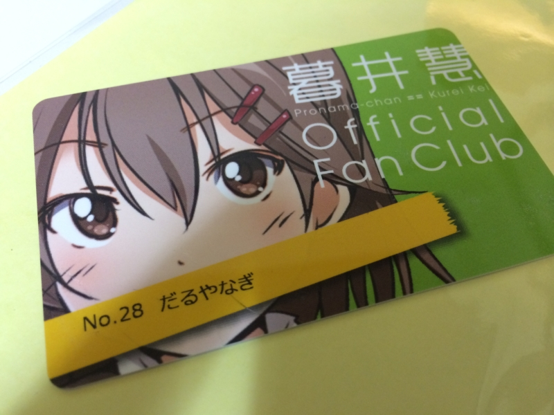
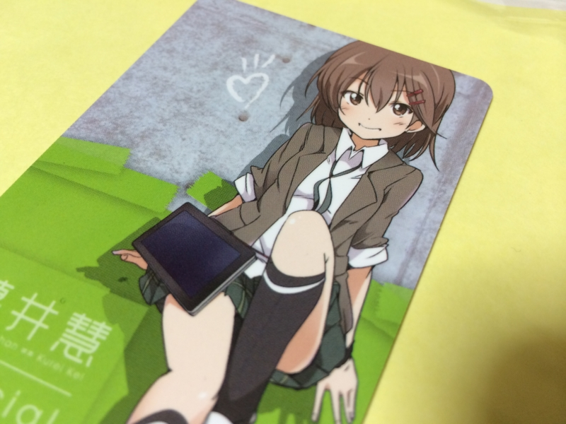

<a href="http://pronama.azurewebsites.net/2013/07/25/fan-club/">&#x30D7;&#x30ED;&#x751F;&#x3061;&#x3083;&#x3093;&#x30D5;&#x30A1;&#x30F3;&#x30AF;&#x30E9;&#x30D6;&#xFF01; &#x4F1A;&#x54E1;&#x52DF;&#x96C6;&#x306E;&#x4E88;&#x544A; | &#x30D7;&#x30ED;&#x30B0;&#x30E9;&#x30DF;&#x30F3;&#x30B0;&#x751F;&#x653E;&#x9001;</a> の会員証が届いたよ！　書下ろしのイラストに燦然と輝く<i>「No.28 だるやなぎ」</i>の文字。ちょっとお口を隠しているのがカワイイ。ついニヤニヤ（28×2）しちゃいますね！

こっちは裏面（たぶん）。これはこれでいいじゃないですかやだー！

この会員証、実は NFC になっているらしくて、今のところ

<blockquote cite="http://fshianasan.hateblo.jp/entry/2013/12/15/210722">

SONY の PaSoRi などにかざしてみると プログラミング生放送のウェブサイトにつながりますよ。

<cite><a href="http://fshianasan.hateblo.jp/entry/2013/12/15/210722">&#x30D7;&#x30ED;&#x751F;&#x3061;&#x3083;&#x3093;&#x30D5;&#x30A1;&#x30F3;&#x30AF;&#x30E9;&#x30D6;&#x306E;&#x30B0;&#x30C3;&#x30BA;&#x304C;&#x5C4A;&#x3044;&#x305F;&#x3002; - Alea jacta est!</a></cite>
</blockquote>

とのこと。展開次第では面白いことになるかも……勉強会でもこれをつかったネタが増えそう。わしもリーダー・ライター買うかな――ってことで。

<a href="http://www.amazon.co.jp/exec/obidos/ASIN/B00948CGAG/bestylesnet-22/">SONY 非接触ICカードリーダー/ライター PaSoRi(パソリ) USB対応 RC-S380</a>
<ul><li>出版社/メーカー: ソニー(SONY)</li><li>発売日: 2012/10/10</li><li>メディア: Personal Computers</li><li>購入: 5人 クリック: 9回</li><li><a href="http://d.hatena.ne.jp/asin/B00948CGAG/bestylesnet-22" target="_blank">この商品を含むブログ (10件) を見る</a></li></ul>

とりあえず購入。

