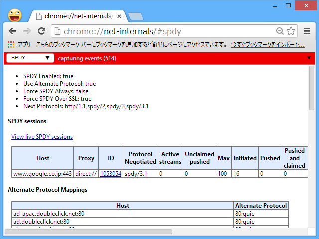

Mozilla Firefox 26 の場合。レスポンスヘッダに X-Firefox-Spdy: "3" が入ってる。

Mozilla Firefox 27 の場合。レスポンスヘッダに X-Firefox-Spdy: "3.1" が入ってる。

<ul>
<li><a href="http://www.forest.impress.co.jp/docs/news/20131216_627875.html">&#x300C;Firefox 27&#x300D;&#x304C;&#x30D9;&#x30FC;&#x30BF;&#x7248;&#x306B;&#x3001;&ldquo;TLS 1.2&rdquo;&#x3068;&ldquo;SPDY 3.1&rdquo;&#x3092;&#x30B5;&#x30DD;&#x30FC;&#x30C8; - &#x7A93;&#x306E;&#x675C;</a></li>
</ul>

ちなみに Google Chrome の場合は“chrome://net-internals/#spdy”で SPDY 関連の情報が取得できるようだ。知らない間に割といろいろなサイトですでに SPDY/3.1 が利用できるのがわかる。

Internet Explorer 11 は F12 で。こっちは SPDY/3 までに対応。Internet Explorer 12 では SPDY/3.1 に対応するんだと思うけど、それまではそのままなのかな。

<ul>
<li><a href="http://blogs.msdn.com/b/ie_ja/archive/2013/12/09/getting-to-the-content-you-want-faster-in-ie11.aspx">IE11 &#x306B;&#x5B9F;&#x88C5;&#x3055;&#x308C;&#x305F;&#x3055;&#x307E;&#x3056;&#x307E;&#x306A;&#x30D6;&#x30E9;&#x30A6;&#x30B8;&#x30F3;&#x30B0;&#x9AD8;&#x901F;&#x5316;&#x624B;&#x6CD5;&#x3092;&#x7D39;&#x4ECB;&#x3057;&#x307E;&#x3059; - IEBlog &#x65E5;&#x672C;&#x8A9E; - Site Home - MSDN Blogs</a></li>
</ul>