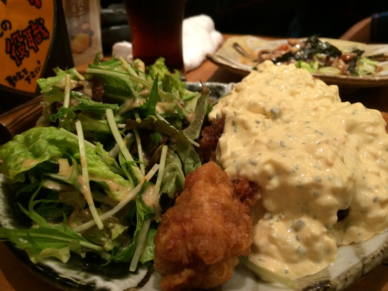

<a href="https://blog.daruyanagi.jp/entry/2013/12/04/030733">&#x306F;&#x3066;&#x306A;&#x30D6;&#x30ED;&#x30B0;&#x306B;&#x3053;&#x3053;&#x6570;&#x65E5;&#x30ED;&#x30B0;&#x30A4;&#x30F3;&#x3067;&#x304D;&#x306A;&#x304B;&#x3063;&#x305F;&#x4EF6;&#x306B;&#x3064;&#x3044;&#x3066; - &#x3060;&#x308B;&#x308D;&#x3050;</a> などの騒動もあって割りと書くのを忘れていたのだけど、ちょっとまえに <a href="http://r.gnavi.co.jp/g753359/">&#x5BAE;&#x5D0E;&#x770C;&#x65E5;&#x5357;&#x5E02; &#x585A;&#x7530;&#x8FB2;&#x5834; &#x79CB;&#x8449;&#x539F;&#x4E2D;&#x592E;&#x901A;&#x308A;&#x5E97;&#xFF08;&#x79CB;&#x8449;&#x539F;/&#x5C45;&#x9152;&#x5C4B;&#xFF09; - &#x3050;&#x308B;&#x306A;&#x3073;</a> へ行ってきた。

@shibayan によるとテレビでも紹介されていたのだそうな。グロサミへ行く（帰る？）途中の飛行機の中で見たとか見なかったとか。

ココはご飯もフツーに美味しいのだけど、なんせ接客が熱い。あんまり無理せんでええでって思うのだけど、なんかノリがいいし、釣られてホイホイとビール飲んじゃう。

イケメン店員さんが生ビールにハートマーク書いてくれたりとかな。ノンケのオレでも惚れてまうで。

あと、初来店記念のデザートくれたりとかな。「大阪生まれで築港にもばあちゃんいるのにユニバーサルスタジオ行ったことないねん！」って言う話を少ししたら、チョコでなんかユニバーサルスタジオの絵をかいてくれた。まじイケメン。

あと、帰りしなにシール（Surface 2 に貼ったった）や味噌（これが割とうまい）、カードをもらった。このカードは店に通い詰めるとポイントがたまり、主任から社長へと出世できるのだそうだ。おもしろいし、課長までぐらいには出世したいと思った。リアルワールドでもお酒飲むだけで出世してお給料が増えたらいいのに。

あと、この日ではないのだけど @shibayan から MVP Summit 2013（<a href="http://www.2013novembermvpsummit.com/">http://www.2013novembermvpsummit.com/</a>）のお土産をもらった。

Microsoft Office の T シャツは割りといいな。来年の夏までとっておこう――それまでにロゴが変わったりしなければいいが。

握るとケラケラと笑う人形は、正直扱いに困る。ムカついたときに殴ればいいんだろうか。

