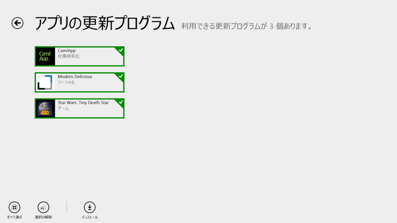
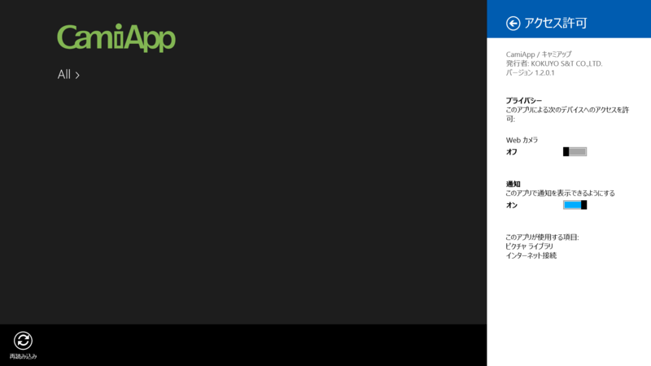
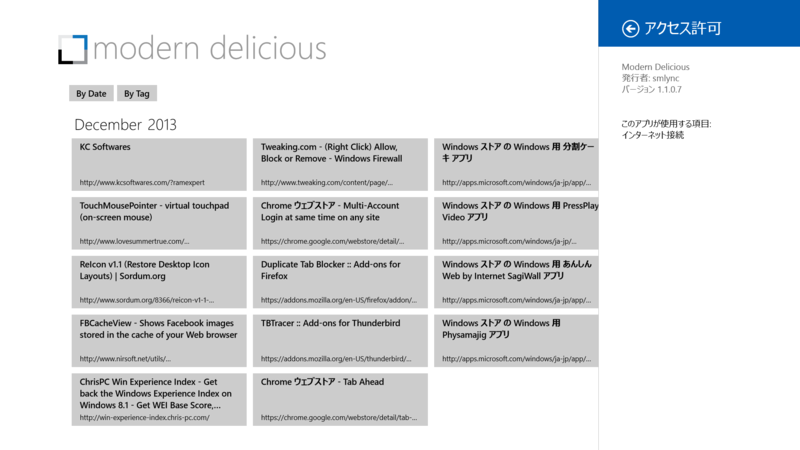

 

<h3>CamiApp 1.1.0.1 → 1.2.0.1</h3>

 

<blockquote>

――――――――――――――――――――――― 
【お知らせ】[V1.2.0] 
――――――――――――――――――――――― 
■Windows8.1対応

<ul>
<li>ホーム画面をWindows8.1 UIに対応しました</li>
</ul>
■不具合修正

<ul>
<li>軽微なバグ</li>
</ul>
</blockquote>

<a href="http://www.kokuyo-st.co.jp/stationery/camiapp/">CamiApp&#xFF1C;&#x30AD;&#x30E3;&#x30DF;&#x30A2;&#x30C3;&#x30D7;&#xFF1E; - &#x30B3;&#x30AF;&#x30E8;S&amp;T</a> の Windows ストア アプリ。キングジムの SHOT NOTE <s>をパクった</s>からインスパイアされた製品なのかな。割りとよさげなのだけど、まだ使ったことがない。

<ul>
<li><a href="http://apps.microsoft.com/windows/ja-jp/app/camiapp/f3166f41-79f2-4c04-b161-d1ab3f247e5e">Windows &#x30B9;&#x30C8;&#x30A2; &#x306E; Windows &#x7528; CamiApp &#x30A2;&#x30D7;&#x30EA;</a></li>
</ul>

<h3>Modern Delicious 1.0.0.5 → 1.1.0.7</h3>

 

<blockquote>

Fixes update bug preventing the import of changes to posts made from other clients. Semantic zoom tiles now half size per power user feedback. 
Release 4 adds additional locale support. 
Release 5 fixes bugs related to tags. Spaces in tags are now fully supported. Casing issues in semantic zoom should now be fixed. 
<b>Release 6 converts to Windows 8.1 and adds search. Fixes broken Delicious Registration link.</b>

</blockquote>

Delicious 使いなら入れておきたい Windows ストア アプリ。［共有］チャームからのブックマークがいい感じ。逆にいえば、それだけ。でも、それでいいんじゃないかな。

<ul>
<li><a href="http://apps.microsoft.com/windows/ja-jp/app/modern-delicious/729b104f-b40e-44a2-972e-7a5142b4a9a6">Windows &#x30B9;&#x30C8;&#x30A2; &#x306E; Windows &#x7528; Modern Delicious &#x30A2;&#x30D7;&#x30EA;</a></li>
<li><a href="http://www.forest.impress.co.jp/docs/review/20131118_623046.html">&#x3010;&#x30EC;&#x30D3;&#x30E5;&#x30FC;&#x3011;Windows 8/8.1&#x30E6;&#x30FC;&#x30B6;&#x30FC;&#x306B;&#x304A;&#x52E7;&#x3081;&#x306E;&ldquo;Delicious&rdquo;&#x30AF;&#x30E9;&#x30A4;&#x30A2;&#x30F3;&#x30C8;&#x300C;Modern Delicious&#x300D; - &#x7A93;&#x306E;&#x675C;</a></li>
</ul>

