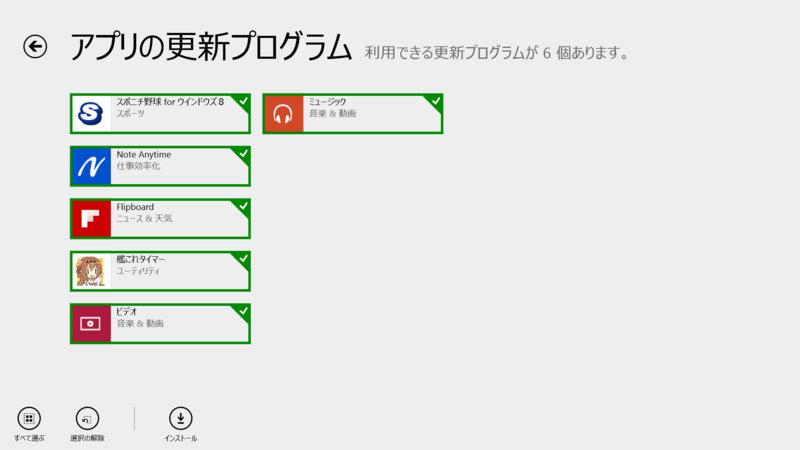
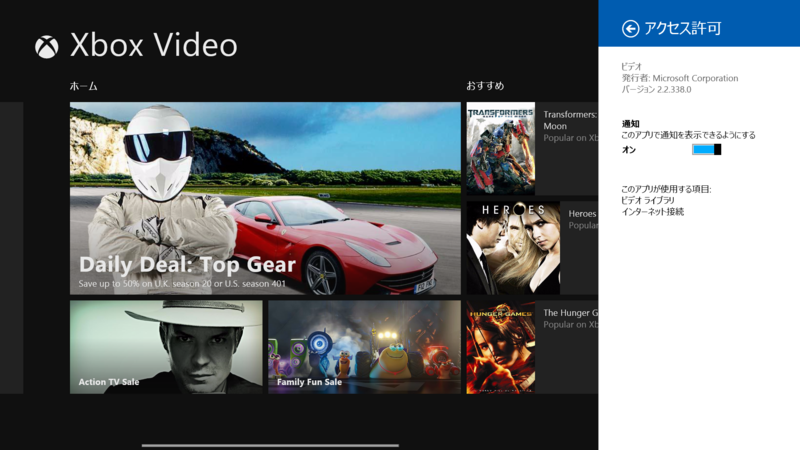
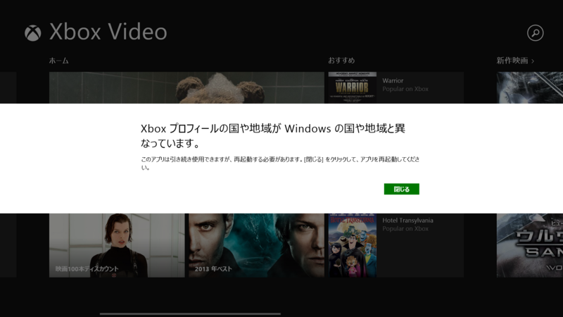
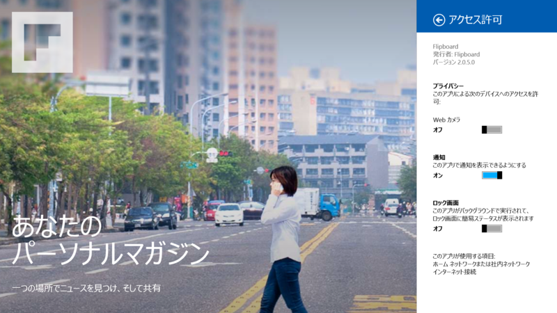
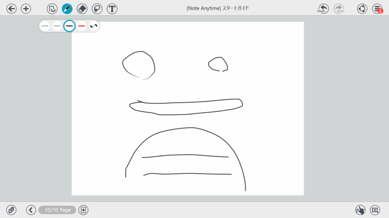

 

<h3>ミュージック 2.2.299.0 → 2.2.339.0</h3>

<blockquote>

アップデート内容: 
タップするだけで、コレクションの全曲をシャッフル再生 
コレクションやストアでお好きな曲をダブルクリックしてプレイ 
アーティストの詳細ページから人気の曲を再生可能 
ヒット曲を見つけよう - [見つけよう] からお好きなジャンルのトップソングを見つけることができます 
アルバムや曲の購入がより簡単に。Microsoft ギフト カードも利用可能

お住まいの国や地域で利用できる機能は、Xbox Music の機能リストをご確認ください。 <a href="http://support.xbox.com/apps/windows-8/xbox-on-windows-features">http://support.xbox.com/apps/windows-8/xbox-on-windows-features</a>

</blockquote>

変更点不明。

<ul>
<li><a href="http://apps.microsoft.com/windows/ja-jp/app/music/16db93bf-8748-449a-96ba-e9ed3a5f872d">Windows &#x30B9;&#x30C8;&#x30A2; &#x306E; Windows &#x7528; &#x30DF;&#x30E5;&#x30FC;&#x30B8;&#x30C3;&#x30AF; &#x30A2;&#x30D7;&#x30EA;</a></li>
</ul>

<h3>ビデオ 2.2.229.0 → 2.2.338.0</h3>

 

<blockquote>

アップデート内容: 
簡単な操作で映画やテレビ番組を購入できます。Microsoft ギフトカードもご利用いただけます。 
その他の修正

Xbox の映画ストアが利用可能な国や地域のみ。 お住まいの国や地域で利用できる機能は、Xbox Video の機能リストをご確認ください。 <a href="http://support.xbox.com/apps/windows-8/xbox-on-windows-features">http://support.xbox.com/apps/windows-8/xbox-on-windows-features</a>

</blockquote>

<ul>
<li><a href="http://apps.microsoft.com/windows/ja-jp/app/video/64b22df1-5a9c-4c88-aa1f-42cefaf8b281">Windows &#x30B9;&#x30C8;&#x30A2; &#x306E; Windows &#x7528; &#x30D3;&#x30C7;&#x30AA; &#x30A2;&#x30D7;&#x30EA;</a></li>
</ul>

関係ないけど、ウチの Live アカウントがどうも米国と紐づけられているようで、このようなエラー画面がでる（HTC HD7 を使うために作成したのだが、当時は米国アカウントしか使えなかったのかな？　よく覚えていない）。これはどこで変更できるのだろうか。

<h3>Flipboard 2.0.4.0 → 2.0.5.0</h3>

リリースノートなし。

<ul>
<li><a href="http://apps.microsoft.com/windows/ja-jp/app/flipboard/e62e393a-acc9-40d9-a34a-13a41f2eeef0">Windows &#x30B9;&#x30C8;&#x30A2; &#x306E; Windows &#x7528; Flipboard &#x30A2;&#x30D7;&#x30EA;</a></li>
</ul>

<h3>Note Anytime 2.0.0.0 → 2.0.2.0</h3>

 

<blockquote>

[2.0.2] 
こまかな修正

</blockquote>

<ul>
<li><a href="http://apps.microsoft.com/windows/ja-jp/app/note-anytime/b143522d-3500-4858-9be5-2dec4dcb693e">Windows &#x30B9;&#x30C8;&#x30A2; &#x306E; Windows &#x7528; Note Anytime &#x30A2;&#x30D7;&#x30EA;</a></li>
</ul>

