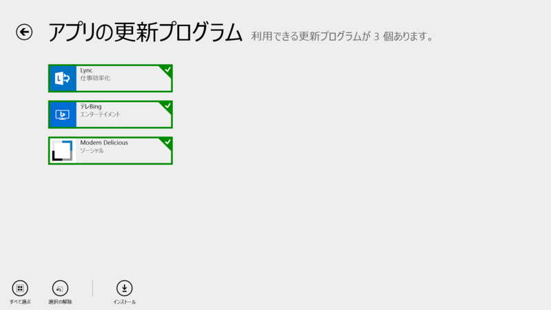
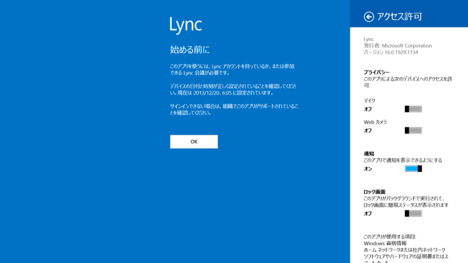
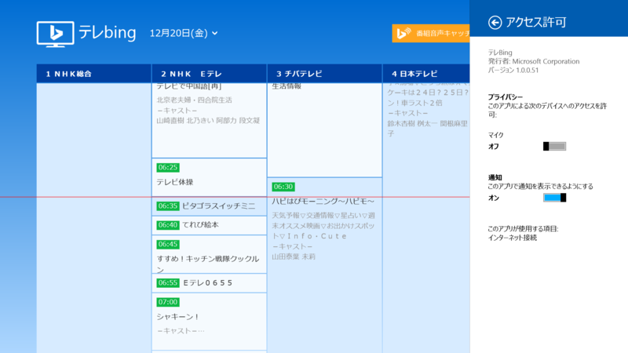
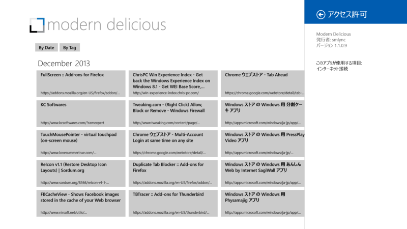

 

<h3>Lync 16.0.1929.1134 → 16.0.1929.1140</h3>

 

<blockquote>

Lync Windows ストア アプリの更新:2013 年 11 月の更新には新機能が含まれています。次のことができるようになりました。 • 新しいアプリを Windows 8.1 にインストールした場合は、新しい Windows の機能を活用できます。 • Lync 会議にアップロードされた共有画面や、アプリ、PowerPoint デッキを制御できます。 • 別のアプリと同時に操作する必要があるときは、Lync をどんなウィンドウ サイズでも別のアプリと左右に並べて実行できます。 • デバイスがロックされているときに音声通話やビデオ通話がかかってきた場合、ロックを解除しなくても迅速に対応できます。 • シンプルなアプリ内の連絡先検索を使って、連絡先をすばやく見つけられます。 • すべての機能について、パフォーマンスが向上しています。

</blockquote>

使ってないからよくわかんない。

<ul>
<li><a href="http://apps.microsoft.com/windows/ja-jp/app/lync/ba4b9485-8712-41ff-a9ea-6243a3e07682">Windows &#x30B9;&#x30C8;&#x30A2; &#x306E; Windows &#x7528; Lync &#x30A2;&#x30D7;&#x30EA;</a></li>
</ul>

<h3>テレBing 1.0.0.50 → 1.0.0.51</h3>

これは割りとおすすめなアプリ。

リリースノートなし。リビジョンが上がっただけなので、大した修正ではなさそう。

<ul>
<li><a href="http://apps.microsoft.com/windows/ja-jp/app/bing/f9d26949-474a-41b8-9638-cb1900317178">Windows &#x30B9;&#x30C8;&#x30A2; &#x306E; Windows &#x7528; &#x30C6;&#x30EC;Bing &#x30A2;&#x30D7;&#x30EA;</a></li>
</ul>

<h3>Modern Delicious 1.1.0.7 → 1.1.0.9</h3>

 

<blockquote>

Release 7 fixes bugs related to search.

</blockquote>

<ul>
<li><a href="http://apps.microsoft.com/windows/ja-jp/app/modern-delicious/729b104f-b40e-44a2-972e-7a5142b4a9a6">Windows &#x30B9;&#x30C8;&#x30A2; &#x306E; Windows &#x7528; Modern Delicious &#x30A2;&#x30D7;&#x30EA;</a></li>
</ul>

