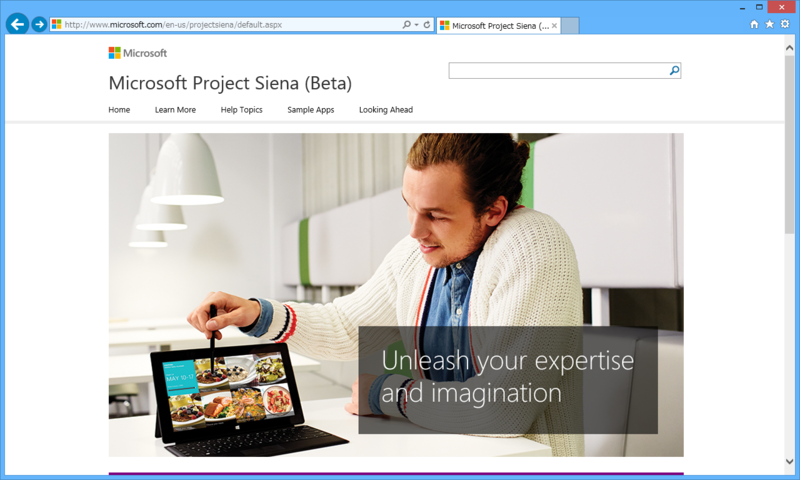
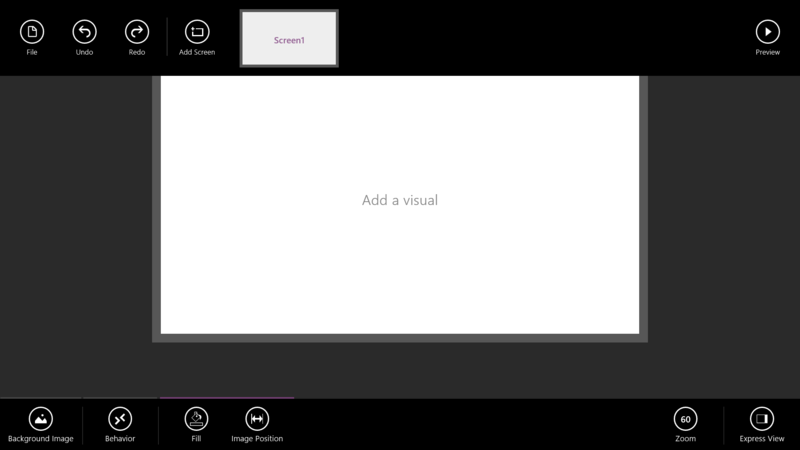
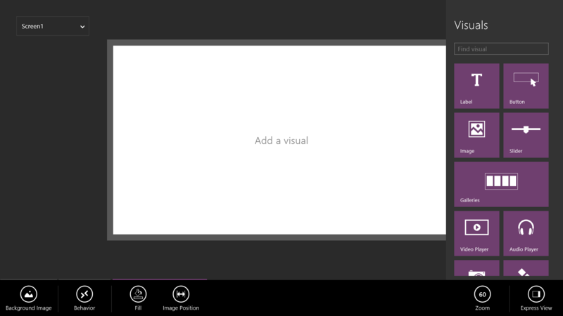
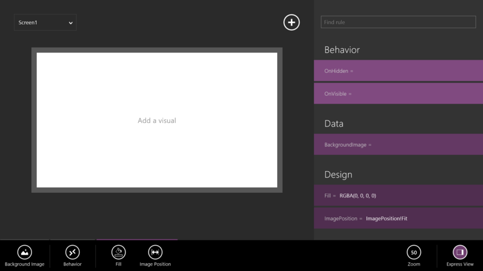
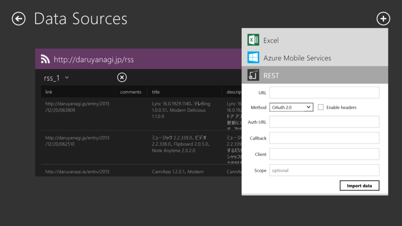
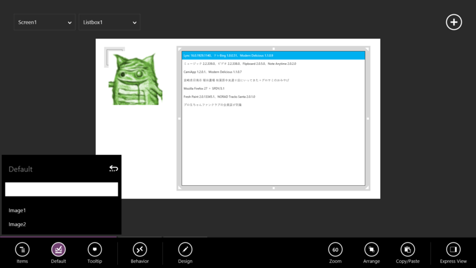
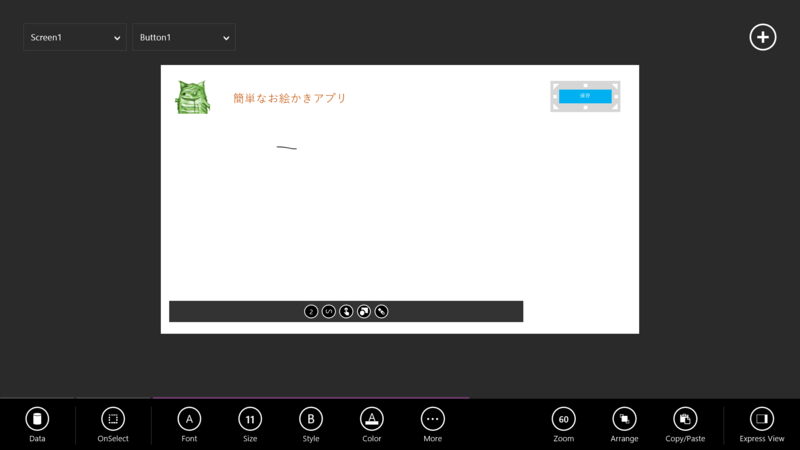
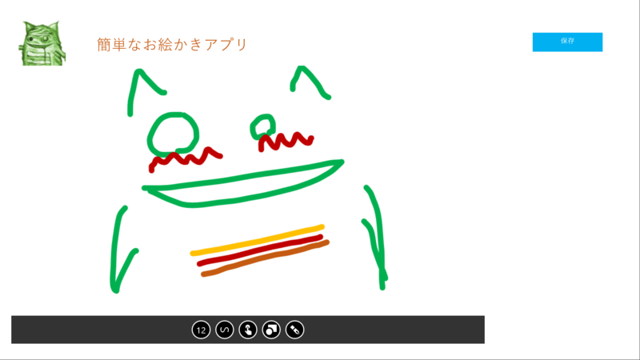
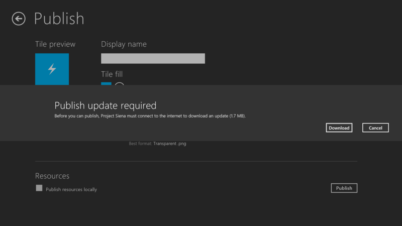
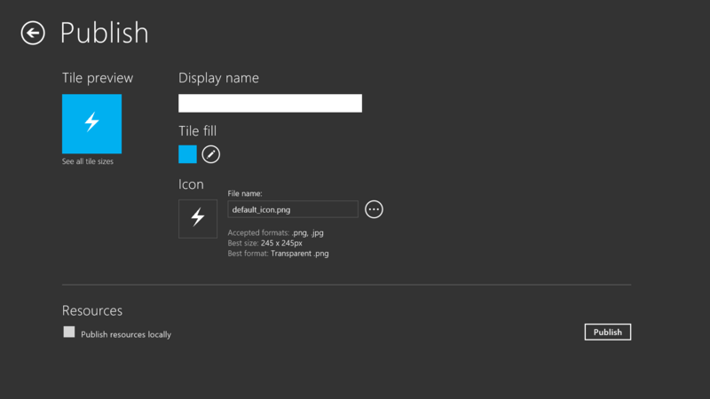

 

<ul>
<li><a href="http://www.microsoft.com/en-us/projectsiena/default.aspx">Microsoft Project Siena (Beta)</a></li>
</ul>
なんかすんごいのぶっこんできたなー。

<blockquote>

Microsoft Project Siena (code name) is the beta release of a new technology for business experts, business analysts, consultants and other app imagineers. Now, without any programming, you can create powerful apps for the device-first and cloud-connected world, with the potential to transform today’s business processes. 

<ul>
<li>Apps to explore media-rich product catalogs and create ensembles that together serve a customer’s needs</li>
<li>Apps used on the spot to resolve customer service bottlenecks and logistics exceptions, with the custom intelligence to help the user make local trade-offs</li>
<li>Apps for auditing and inspecting a manufacturing facility through photos, videos and pen and voice notes, all tied to an asset database</li>
</ul>
Siena apps are as easy as editing a document. You place some visuals on a canvas. You hook them up to your data. You customize how your app looks and works. Then, if you need special logic and intelligence, you write some Excel-like expressions. You can use your app immediately, or share it with colleagues or the world.

With Siena, you can conceptualize, validate and build your app ideas almost as fast as you can come up with them. And if your needs change tomorrow, updating your app is no problem. Open it. Change it. Share it again, and you’re off to do business. 

Siena works well with corporate and web data and media content: SharePoint lists, Excel and Azure tables, RSS feeds and the gamut of RESTful services. 

Siena apps are just HTML5 and JavaScript and are deployed and managed like any other Windows 8.x app. In fact, developers can open them up, see what’s there and, if needed, extend them in their favorite programming tools.

Install Siena, watch one of the how-to videos at <a href="http://aka.ms/ProjectSiena,">http://aka.ms/ProjectSiena,</a> and then build the app that you’ve been imagining... in under an hour.

</blockquote>

とりあえず少しだけ触ってみたのでテキトーにスクリーンショットを張ってみる。

初期画面。

Visual をペタペタと貼って――

プロパティなんかを設定していく。たぶんすべてタッチ操作だけで行える。タイマーやマイク、カメラなんてものも用意されていて、割りといろんなことができそう。

データソースを引っ張ってきて――

リストなんかにバインドすることもできるみたい。

REST な Web アプリなんかとの連携が簡単そうだけど、<s>もう少し凝ったデザインにしたいときはどうすればいいんだろう。</s>頑張ったらできるっぽい。

キャンバスコントロールを張って、お絵かきアプリを気取ってみた。

アプリの公開も視野に入っているようだ。

正直タッチだけでやるのはつらいく、これひとつでクオリティの高いアプリケーションを作るのは難しいと思ったけれど、アプリ開発のすそ野を広げる実験としてはなかなか面白いかもしれないと思った。<s>Visual Studio のプロジェクトファイルなんかが吐き出せたら、細かい微調整をデスクトップでできていいんだけどな。</s>HTML/JavaScript で吐き出せた。

<ul>
<li><a href="https://blogs.technet.com/b/projectsiena/archive/2013/12/19/project-siena-enabling-business-users-to-create-mobile-apps-for-the-enterprise.aspx">Project Siena: Enabling Business Users to Create Mobile Apps for the Enterprise - Project Siena - Site Home - TechNet Blogs</a></li>
</ul>

<h4>追記</h4>

<ul>
<li><a href="http://www.forest.impress.co.jp/docs/news/20131220_628544.html">Microsoft&#x3001;&#x30B3;&#x30FC;&#x30C7;&#x30A3;&#x30F3;&#x30B0;&#x30EC;&#x30B9;&#x306E;&#x30B9;&#x30C8;&#x30A2;&#x30A2;&#x30D7;&#x30EA;&#x958B;&#x767A;&#x30A2;&#x30D7;&#x30EA;&#x300C;Project Siena&#x300D;&#x3092;&#x30D9;&#x30FC;&#x30BF;&#x516C;&#x958B; - &#x7A93;&#x306E;&#x675C;</a></li>
</ul>
Build Insider などなどにさっそく使ってました記事も上がってた。

<ul>
<li><a href="http://www.buildinsider.net/mobile/projectsiena/01">&#x30DE;&#x30A4;&#x30AF;&#x30ED;&#x30BD;&#x30D5;&#x30C8;&#x304C;&#x30EA;&#x30EA;&#x30FC;&#x30B9;&#x3057;&#x305F;&#x65B0;&#x305F;&#x306A;Windows&#x30B9;&#x30C8;&#x30A2;&#x30A2;&#x30D7;&#x30EA;&#x958B;&#x767A;&#x30C4;&#x30FC;&#x30EB;&#x300C;Microsoft Project &ldquo;Siena&rdquo;&#x300D;&#x3092;&#x4F7F;&#x3063;&#x3066;&#x307F;&#x305F; - Build Insider</a></li>
<li><a href="http://blogs.msdn.com/b/shosuz/archive/2013/12/20/microsoft-project-siena.aspx">Microsoft Project Siena:&#x30D3;&#x30B8;&#x30CD;&#x30B9;&#x30E6;&#x30FC;&#x30B6;&#x30FC;&#x304C; Windows &#x30D3;&#x30B8;&#x30CD;&#x30B9;&#x30B9;&#x30C8;&#x30A2;&#x30A2;&#x30D7;&#x30EA;&#x958B;&#x767A;&#x53EF;&#x80FD;&#x306B; - Virtuoso - Shotaro Suzuki&#39;s Blog - Site Home - MSDN Blogs</a></li>
</ul>
記事書く前に読みたかった（

