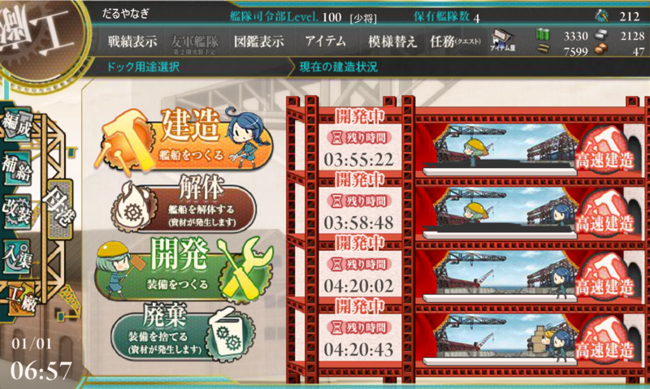
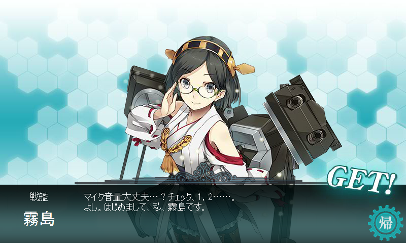
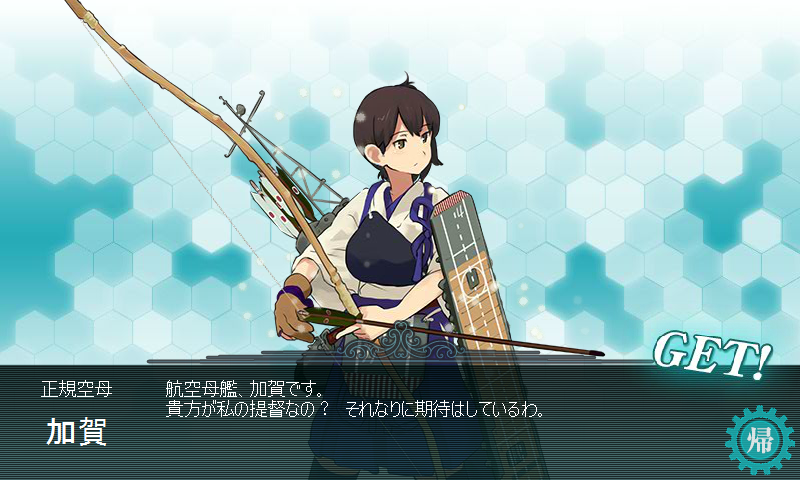
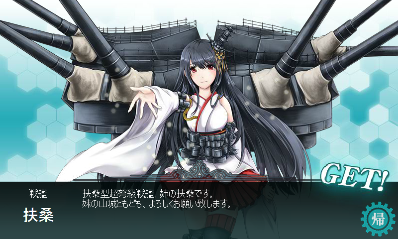

とりあえず資材あるだけぶっこんでみた。レシピは……適当。3000/3000/6000/6000/100 とか。

<h3>一人目: 金剛型戦艦・霧島</h3>

ま……まぁ、一人目だし。

<h3>二人目: 再びマイクチェック</h3>

泣いた。

<h3>三人目: 正規空母・加賀</h3>

近代化改修のエサにすれば対空値を上げられるから、うれしい（震え声

<h3>四人目: 不幸型戦艦・扶桑</h3>

今年もあかん気がしてきた ／(＾o＾)＼

