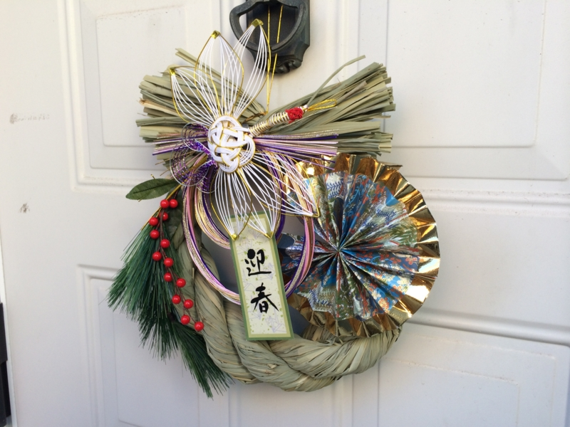
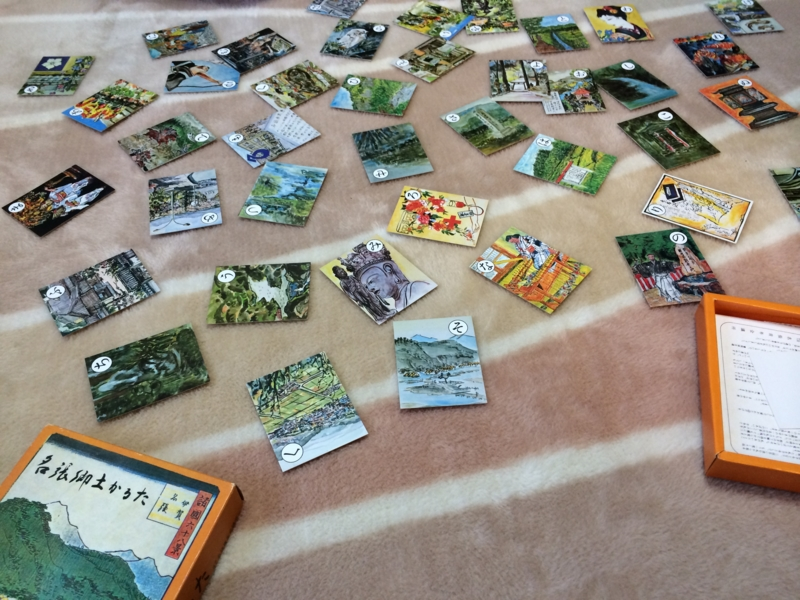
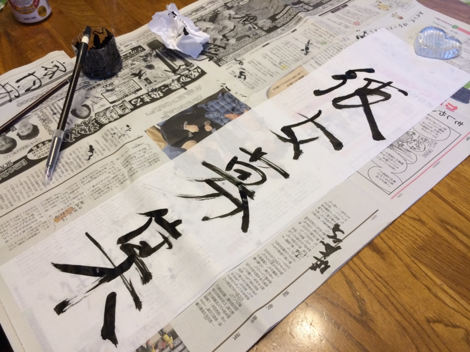
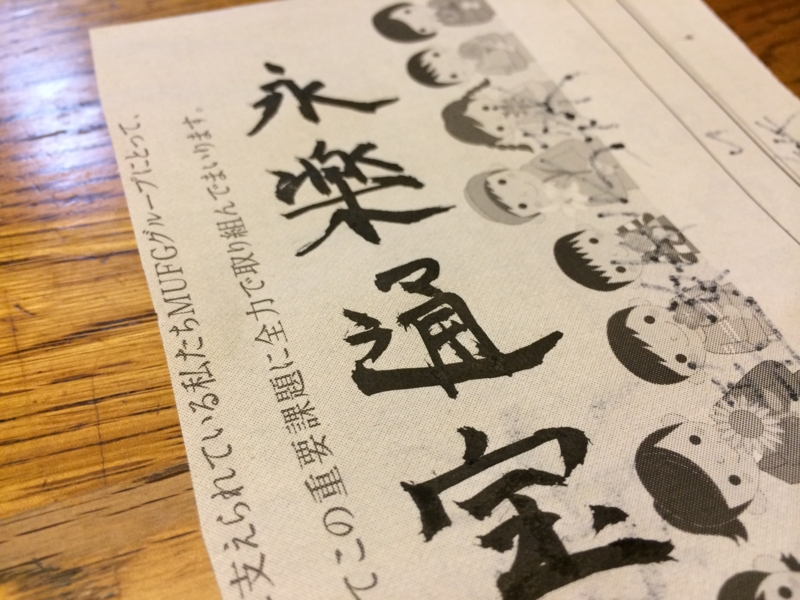

ばあちゃんと妹夫婦 with 姪っ子が遊びに来てるというので、自分もちょっと実家に顔出してみた。

割と人数がそろったので、カルタをやろうという流れに。『百人一首』もあったのだけど、昔懐かしい『名張郷土かるた』を発見したのでそれをやることになった。

このカルタは三重県名張市の小学校に通っていた子だったら1回はやったことがあると思う。名張市にちなんだ（数少ない）歴史や文化などの事柄を集めてカルタにしたもので、年始には学校で大会などもやっていたように記憶している。

<ul>
<li><a href="http://www14.plala.or.jp/hpmsmiki/">&#x7279;&#x5B9A;&#x975E;&#x55B6;&#x5229;&#x6D3B;&#x52D5;&#x6CD5;&#x4EBA;&#x65E5;&#x672C;&#x90F7;&#x571F;&#x304B;&#x308B;&#x305F;&#x5354;&#x4F1A;</a></li>
</ul>
僕は小学校4年生のころに転入したので、このカルタに馴染みがなく、カルタ大会も割りと苦手だった。弟2号と妹は小学校一年生から名張の小学校に通っているのでかなり強い。ガチで戦えば負けは目に見えているので、読み上げ役を買って出た。結果は、妹の圧勝。

あとは、なぜかおかんが書き初めをやりたがっていたので、一筆書いてみた。

書道とかやったことないのでうまく書けない。筆でうまい字が書ける人はカッコいいと思うので、今年は折を見て練習しようかと思った。

