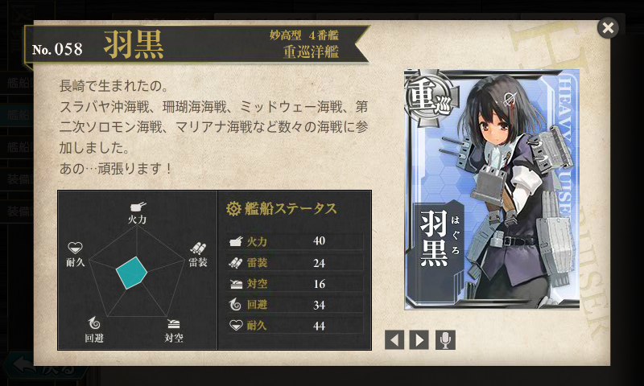
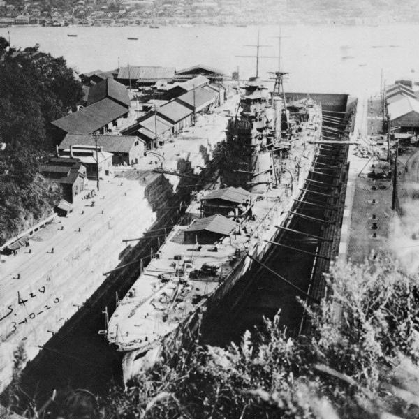
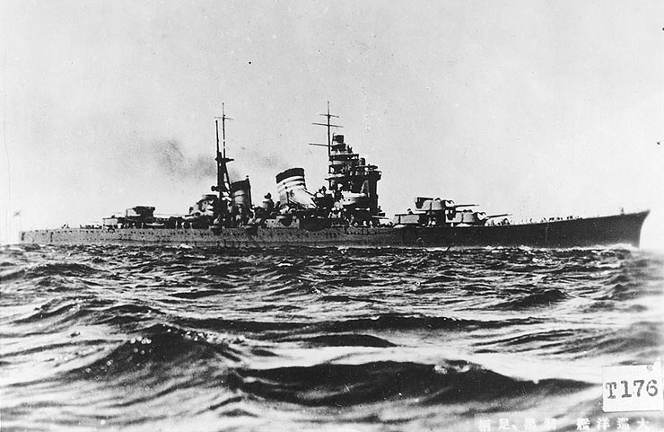
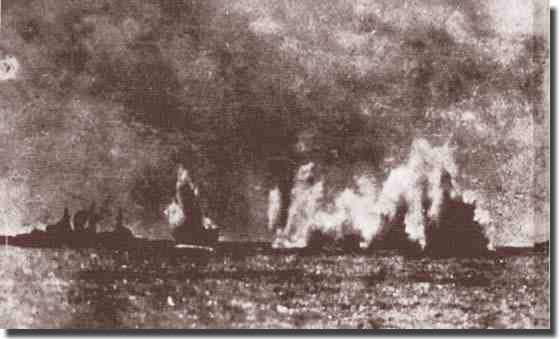
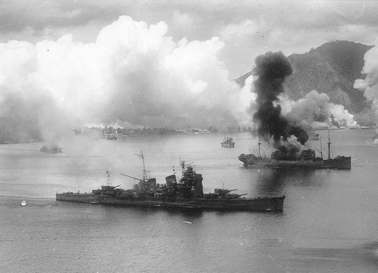

艦これでは「おしとやか＝武勲艦」と相場が決まってますよね。神通しかり、綾波しかり、時雨しかり……。けれど、艦これ屈指の“おしとやか”な艦娘・羽黒の武勲ってあんまり知られていないような。

今回は <a href="http://atnd.org/events/45245">&#x8266;&#x3053;&#x308C;Advent Calendar 2013 : ATND</a> の一環として、重巡洋艦・羽黒の生涯をカンタンに調べてみました。（公開がめちゃくちゃ遅れてごめんなさい！！）

<h3>妙高型重巡洋艦</h3>

 

三菱造船長崎造船所（現・三菱重工長崎造船所）にて建造され1929年（昭和4年）4月25日に竣工した。なお、羽黒は艦内の調度品や塗装、通風設備を同時期に長崎造船所で建造されていた客船浅間丸を参考にしたものとされ、イギリス海軍の影響が強かった艦内艤装を日本式に改めたものとなった

“飢えた狼”と呼ばれた上の姉よりは居住性もよかったという。

羽黒はレイテ海戦では２番砲塔大破、機銃弾約６００発を受け戦死者55名、戦傷者75名を出したが、幸運にも生還し

昼食 
砲身は灼け、ペンキは剥げ落ちる
 

ワシントン海軍軍縮条約 
大正十二年　艦艇補充計画 
10,000トン級の重巡洋艦
 

長い船体に短いバイタルパート 
防御力向上 
バイクで言えばマスの集中化、縦方向の慣性モーメントを改善して航行性を向上

水平甲板型船体
 

平賀造船大佐 
魚雷兵装の撤廃

誘爆したら大惨事 
居住性が悪化する

→　海外出張中に勝手に設計変更

結局はあまり当たらなかったのでなくてもよかったのではないか説 
改装によりちょっと改善
 

索敵

空気式カタパルト →　火薬式カタパルト 
青葉型（１）から水上偵察機２機運用に 
のちに３・４機に 
九五式複座水上偵察機×２・九四式三座水上偵察機 
零式水上観測機×２、零式水上偵察機×１ 
スラバヤ沖海戦ではこの偵察能力が大いにモノを言った
 

那智と羽黒のみ 
平時の艦隊旗艦設備が省略 
予算の関係で

那智選対ｗｗｗ 
その割には戦時には「戦隊」旗艦をやらされている 
無線兵装が弱い
 

おおむね優秀な設計 
重量オーバーしたものの、とくに不具合は認められず
 

主砲の散布絵画デカすぎry 
遅延発射装置

砲塔防御は重量の問題もあり比較的薄く、 
唯一の弱点か 
実際、のちに第三砲塔がピンチを迎える

航続距離は長くないが（スラバヤ沖海戦ではガス欠）、これは想定した決戦海域が小笠原沖だったことによるらしい 
まさか遠くフィリピン・インドネシアで運用されるとは思ってもみなかったろう

アウトレンジ

御召艦の経験あり 
昭和五年度特別大演習 
江田島海軍兵学校への行幸
 

h軍縮条約で経営不振になった長崎で振り分け建造 
４２０版艦 
建造 
予算の関係でスローテンポで建造 
３年 
起工から進水まで三年、竣工まで四年 
南山？ 
速力がでなかったが、深瀬での公司では両行。那智・妙高を上回る
 

<h3>歴戦の幸運艦・羽黒</h3>

<ul>
<li>スラバヤ沖海戦</li>
<li>珊瑚海海戦</li>
<li>ミッドウェー海戦</li>
<li>第二次ソロモン海海戦</li>
<li>マリアナ海戦</li>
</ul>
に参加。 
 
 

<h3>スラバヤ沖海戦 ―― エクセターの追跡</h3>

 

スラバヤ沖海戦（スラバヤおきかいせん）とは、太平洋戦争中の1942年（昭和17年）2月27日から3月1日にかけて、インドネシア・スラバヤ沖で日本軍のジャワ島攻略部隊を連合国軍が迎撃した海戦である。日本海軍が連合軍の艦隊を撃破し、これにより日本軍のジャワ島上陸・占領が進むこととなった。

日本軍第五戦隊の「那智」「羽黒」「山風」「江風」

主砲弾の残弾はゼロ

第一次昼戦から「ポープ」の沈没まで、46時間という長時間に及ぶ戦いとなったことであろう。この間に主要な戦闘は5つ行われているが、太平洋戦争の中で、これだけ長時間の海戦になったのは数えるほどしかない

例えば第五戦隊の重巡「那智」「羽黒」は主砲弾を1艦あたり定数2000発（200発/門）、魚雷を24本搭載していたが、戦闘終了時の残弾数は「那智」70発・4本、「羽黒」190発・4本とほぼ全弾撃ち尽くしている

この点「電」「雷」は、英国滞在歴があり親英的な感覚を持っていた高橋中将の直属で、当時単艦行動中であった幸運が重なり、艦長の決断と個性が遺憾なく発揮された。 「電」に乗艦していた岡田氏の回想を紹介すると「『サンキュウ』と、蒼白な顔の中にも救助された喜びの笑みをたたえ、敬礼して甲板に上がってくる敵兵、激しい戦闘によって大怪我をしている者、シャツは着ていてもパンツのない者等服装もまちまちだ。ズボン、靴下等彼らが身につけているのは純毛だった。『持てる国イギリス』の感を強くした。」となっている[116]。

<ul>
<li><a href="http://ja.wikipedia.org/wiki/%E3%82%B9%E3%83%A9%E3%83%90%E3%83%A4%E6%B2%96%E6%B5%B7%E6%88%A6">&#x30B9;&#x30E9;&#x30D0;&#x30E4;&#x6C96;&#x6D77;&#x6226; - Wikipedia</a></li>
</ul>
<ul>
<li><a href="http://ahoy.tk-jk.net/macslog/BattleoftheJavaSeainwhich.html">Ahoy - Mac&#39;s Web Log - Battle of the Java Sea, in which Exeter was sunk</a></li>
</ul>

<h3>レイテ沖海戦 ―― 空母の追跡と献身の2番砲塔</h3>

1944年（昭和19年）10月にはレイテ沖海戦に参加、10月25日のサマール沖海戦ではアメリカ護衛空母の艦載機によって2番砲塔に爆弾を受け損傷した 
 

<h3>羽黒の最後 ―― ペナン沖海戦</h3>

1945年（昭和20年）5月12日、陸軍の要請により、アンダマン諸島への輸送任務に駆逐艦「神風」とともに出撃。（ペナン沖海戦）1945年（昭和20年）5月16日、イギリス海軍機の攻撃を受け損傷する。翌17日マラッカ海峡にてイギリス駆逐艦「ソマーズ」「ヴィーナス」「ヴィラーゴ」「ヴェルラム」「ヴィジラアント」と交戦する。（ペナン沖海戦）。イギリス駆逐艦に主砲の命中弾を与えて先制するが英駆逐艦の雷撃を受けた。羽黒は損傷のために速度を制限せざる得ない状況であり、戦場からの離脱を断念。随伴する神風を離脱させた。羽黒には最終的に3本の魚雷が命中し、02:32に船首部分から沈没した。同乗していた橋本信太郎中将、艦長杉浦嘉十大佐以下400名あまりが戦没した。320名が引き返してきた神風に救助された。
 

71佐世保東公園(旧佐世保海軍墓地)内に軍艦羽黒戦没者慰霊碑を建立(2006.3ペナン島南西48nm深度64mから引揚げられた同艦の舷窓枠を.8同碑基部に設置).

<h3>眠りから覚める</h3>

<ul>
<li><a href="http://www.ijnwarship.com/IJN%20Wrecks/IJN%20Wrecks%20-%20Haguro.htm">Mechanisms of Imperial Japanese Navy Warships in 3-D</a></li>
</ul>

<h3>参考</h3>

<ul>
<li><a href="http://en.wikipedia.org/wiki/Japanese_cruiser_Haguro">Japanese cruiser Haguro - Wikipedia, the free encyclopedia</a></li>
<li><a href="http://ja.wikipedia.org/wiki/%E7%BE%BD%E9%BB%92_(%E9%87%8D%E5%B7%A1%E6%B4%8B%E8%89%A6)">&#x7FBD;&#x9ED2; (&#x91CD;&#x5DE1;&#x6D0B;&#x8266;) - Wikipedia</a></li>
<li><a href="http://www.history.navy.mil/photos/sh-fornv/japan/japsh-h/haguro.htm">Japanese Navy Ships--Haguro (Cruiser, 1929-1945)</a></li>
</ul>

