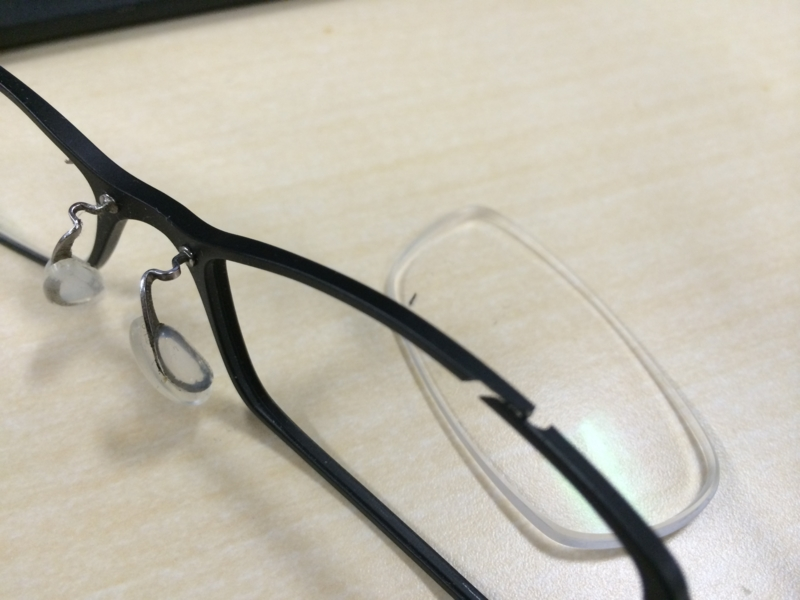
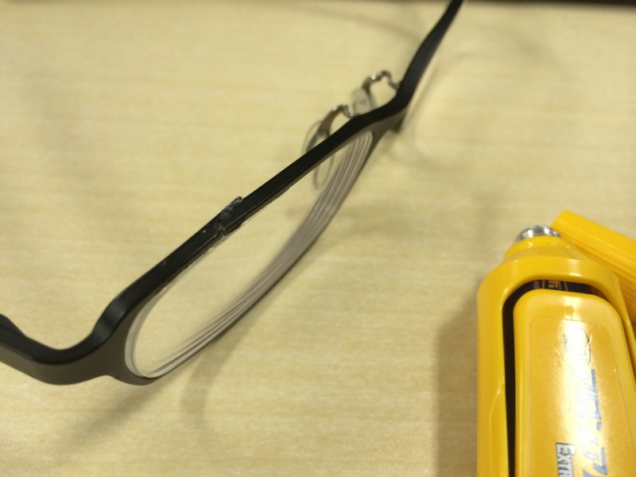
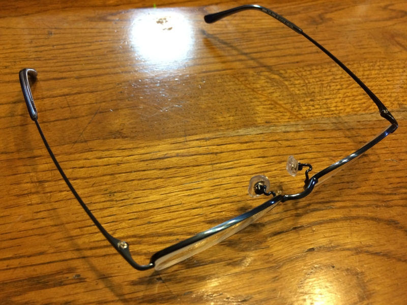

先週の水曜日あたりだったかな。

会社でシコシコと記事を書いていたら、眉毛の辺りから「パキッ」っていう音がした――ような気がした。当初はそんなこと気にも留めずにシコシコを続けていたのだけど、どうもメガネがいつもよりユルい。すると次第に右目のレンズがふわふわしだし、「あれっ？」と思って目に手をやると、そこにレンズが落ちてきた。

なんぞ。

メガネ氏、どないしたんや。なにがあったんや。

このメガネ、軽いのが売りで気に入っていたのだけど、どうも耐久性に難があるようだ。ブログを検索したところ、フレームを新調してから1年ちょいしか持たなかったらしい（<a href="https://blog.daruyanagi.jp/entry/2012/09/24/215346">&#x60B2;&#x5287;&#x306F;&#x3044;&#x3064;&#x3082;&#x7A81;&#x7136;&#x306B; - &#x3060;&#x308B;&#x308D;&#x3050;</a>）。ひ弱にもほどがあると思う。

とりあえずメガネがないと何も見えず、仕事にもならない。幸い、弊社はメガネ族が大半を占めるせいか、文具が入ったキャビネットにアロンアルファが鎮座している。レンズのふちにちょびっと塗ってフレームをムキュッと寄せると、見事ピッタリガチッとくっついた。さすが、アロンアルファさまやでぇ……。

けれど、これも所詮応急処置に過ぎない。第一、なんだか目に染みるし、鼻もおかしくなりそう。とういうわけで、会社帰りに JINS で新しい眼鏡を新調することにした。最近 PC ユーザーには必携とも言われる、あの JINS PC をだよ！

<blockquote cite="http://www.jins-jp.com/jins-pc/">

JINS PCは、PC・タブレット・スマホ・TV・ゲーム機などから発せられる 
ブルーライトから眼を守るメガネ。発売から2年で、販売累計本数300万本突破！ 
日本でいちばん選ばれているパソコン用メガネです。

<cite><a href="http://www.jins-jp.com/jins-pc/">http://www.jins-jp.com/jins-pc/</a></cite>
</blockquote>

意外に安かった（度入りで1万円ぐらいかな？）のと、ちょうどレンズの在庫があったらしく、1時間ぐらいで作ってもらえるとのことだった<a href="#f-a4ab138f" name="fn-a4ab138f" title="前の眼鏡屋さんは1週間かかった！">*1</a>ので、黒いフレームと青いフレームの2つを購入。

それがこれや。最初は冒険してもっと派手な色にしてみようかなと思ってたのだけど、ヘタレなのでやめた。

さて、目に優しいと評判のこのメガネだけど、数日使ってみた感想は――よくわからん。もともと PC を長時間使っても目が疲れると思ったことはあまりないし。ただ、長期的に使っていれば肩こりが少なくなるとか、そういうのがあるのかもしれない。もし効果がないとしても、お値段相応の付け心地だし、買い物としても悪くない。

まぁ、なんというか、遅ればせながら流行に乗ってみたって感じだ。

<a href="#fn-a4ab138f" name="f-a4ab138f" class="footnote-number">*1</a>:前の眼鏡屋さんは1週間かかった！

