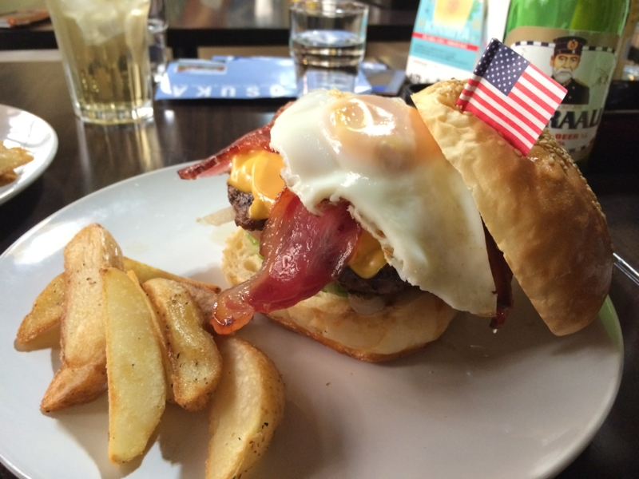
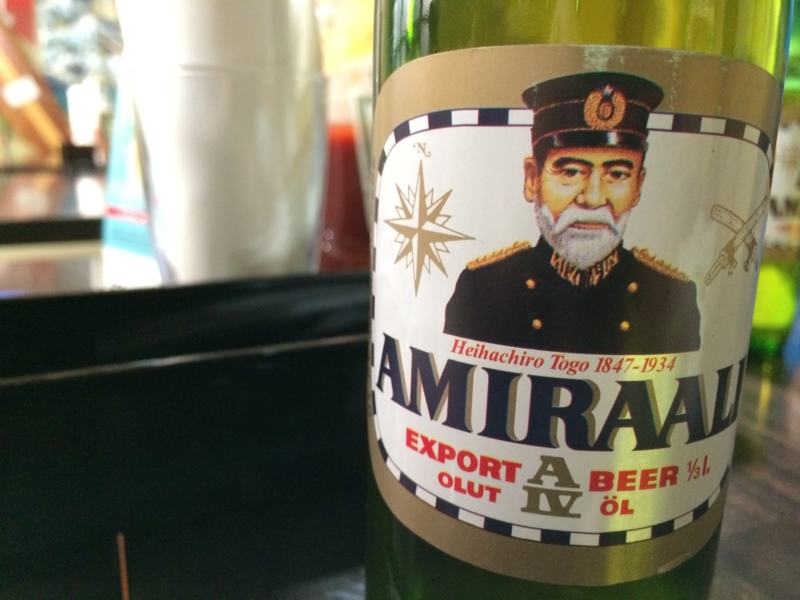
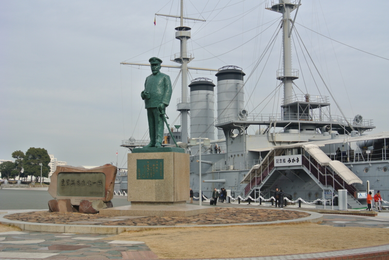
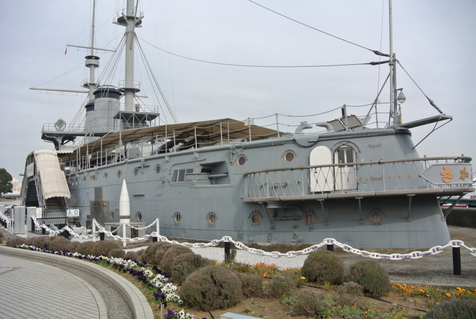
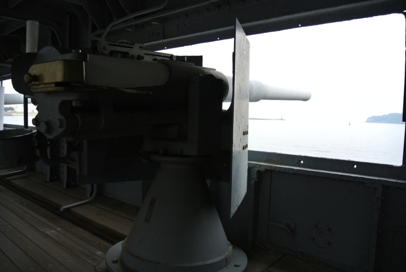
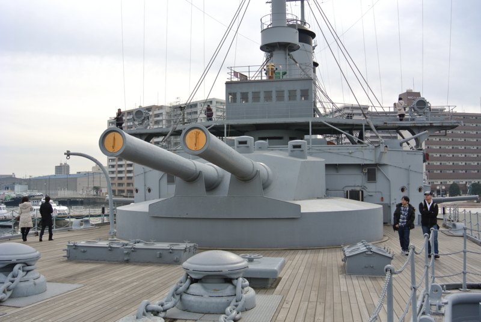
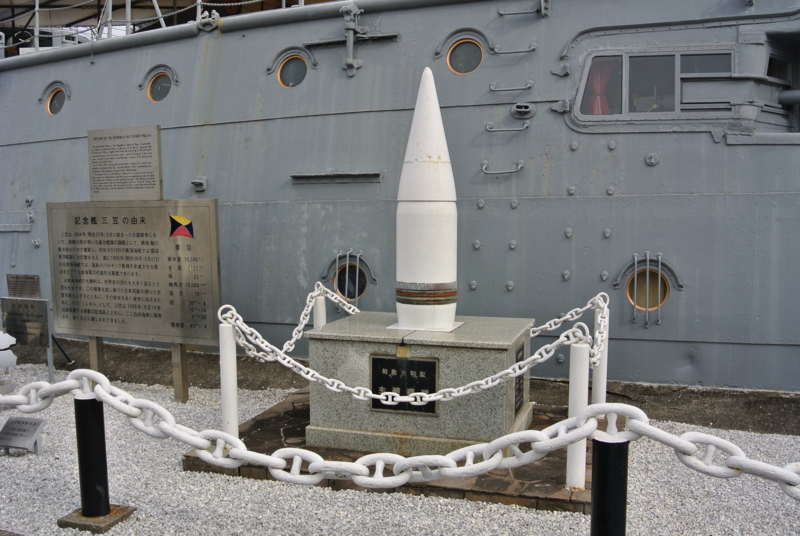

<a href="https://blog.daruyanagi.jp/entry/2014/01/28/122457">&#x300C;YOKOSUKA&#x8ECD;&#x6E2F;&#x3081;&#x3050;&#x308A;&#x300D;&#x306B;&#x884C;&#x3063;&#x3066;&#x304D;&#x305F;&#x3063;&#x305F;&#x3002; - &#x3060;&#x308B;&#x308D;&#x3050;</a> のあとはヨコスカネイビーバーガーを食べに行った。ほんとは<a href="http://nlab.itmedia.co.jp/nl/articles/1312/06/news137.html">&#x5CF6;&#x98A8;&#x30AB;&#x30EC;&#x30FC;</a>を食べに行きたかったが、まぁ、早めのお昼でハンバーガーをたべ、夕方にカレーを食えばよい――と思っていたのだけが！

調子に乗って<b>ジョージ・ワシントンバーガー</b>なんぞ頼んでしまったので、腹がいっぱいになってしまった。割りと大味でケチャップとマスタードをべちゃべちゃかけながら食う感じだったけれど、さすがに食べごたえはある。たったひとつで島風カレーを食べる余裕はおろか、その日の晩飯を食う意欲さえ奪い去られた。さすがネイビーやな。空母やな。

ちなみに、ポテトは軍港巡りのチケットの版権を持っていれば割引で提供してくれるようだ。大事にとっておくように！

もちろん（？）、ビールも飲んだ。東郷提督のラベルが貼ってある。

<blockquote cite="http://suomi.racco.mikeneko.jp/Elama/togo-j.html">

確かに，「東郷提督の肖像をラベルにしたビール」がフィンランドに存在したのは事実です．しかし，それは「東郷ビール」ではなく，「Amiraali（アミラーリ，「提督」の意味）ビール」という，世界各国の提督の肖像がラベルになったビールのひとつなのです．シリーズの中には，有名なイギリスのネルソン提督や，日本の山本五十六提督，それに，日露戦争時のロシア海軍の司令官であるマカロフ，ロジェストヴェンスキー両提督も入っていたそうです

<cite><a href="http://suomi.racco.mikeneko.jp/Elama/togo-j.html">Suomen kieli &minus; &#x30D5;&#x30A3;&#x30F3;&#x30E9;&#x30F3;&#x30C9;&#x8A9E;&#x30FB;&#x300C;&#x6771;&#x90F7;&#x30D3;&#x30FC;&#x30EB;&#x300D;&#x3068;&#x3044;&#x3046;&#x4F1D;&#x8AAC;</a></cite>
</blockquote>

フィンランドのビールなのだそうで、飲み口は非常にスッキリと軽く、油っぽいハンバーガーにはピッタリな感じだったかもしれない。

 

<blockquote>

製造が中止されたはずの「東郷提督のラベルのAmiraaliビール」ですが，実は日本では現在も売られています．これは，日本での要望に対応して，日本の輸入業者がオランダ製のビールにAmiraaliビールのラベルを貼って販売している「復刻版」だそうです．横須賀の三笠公園などの，旧日本海軍ゆかりの土地でおみやげとして売られているほか，ネット上にも売っている店があります

</blockquote>

それにあやかってというわけではないのだけど、三笠も観に行った。

割りと小さいな？　というのが最初の印象。でも、日露戦争のときは最新鋭で（旅順にいた艦隊のほうが艦齢の若い艦がいたようだけど）、これでバルチック艦隊を迎え撃ったんだよねぇ……。

こんな部署担当して、この先生き残る自信ないよ。

でも、さすがに30.5センチ連装砲は迫力があった。これでも大和に比べればおもちゃなんだろうけれど。

その大和さんの主砲弾だけど、何の脈絡もなく三笠の隣に飾られてた。なんぞ。

それにしても、牙を抜かれたライオンみたいで、この三笠、みていてちょっと痛々しいところある。totoBIG が 100 回ぐらい当たれば、もう少し当時の様子を再現した形に改修してあげたい……。

