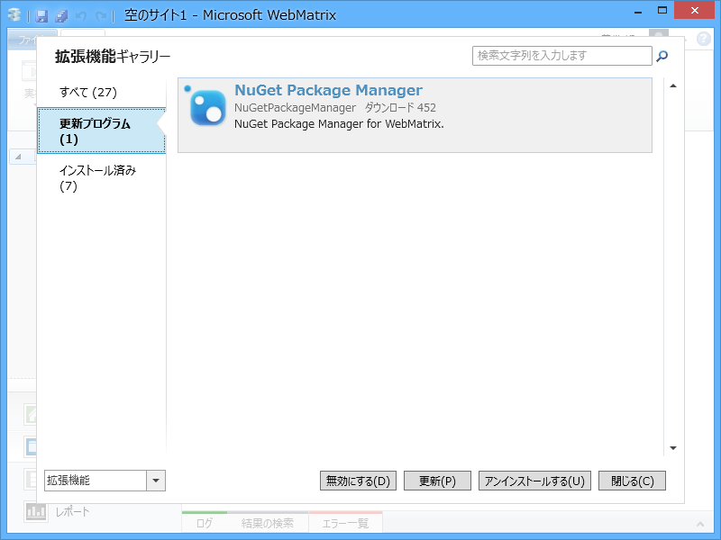
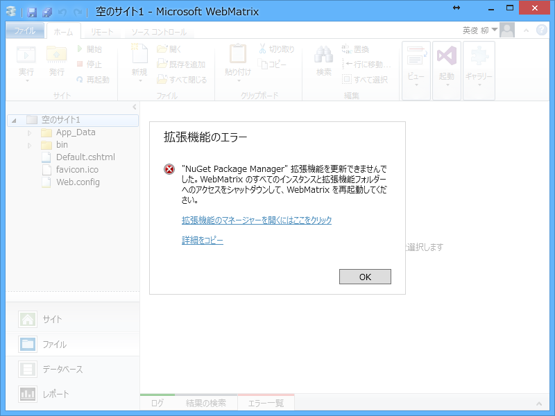
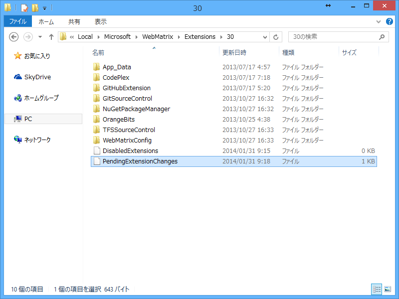
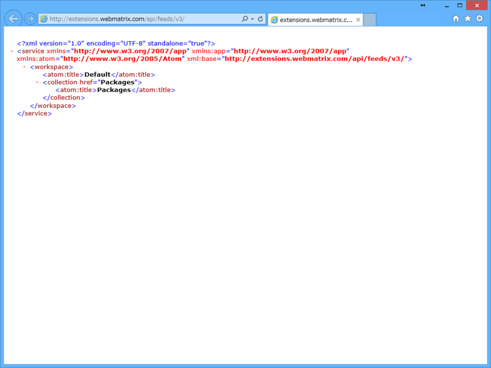
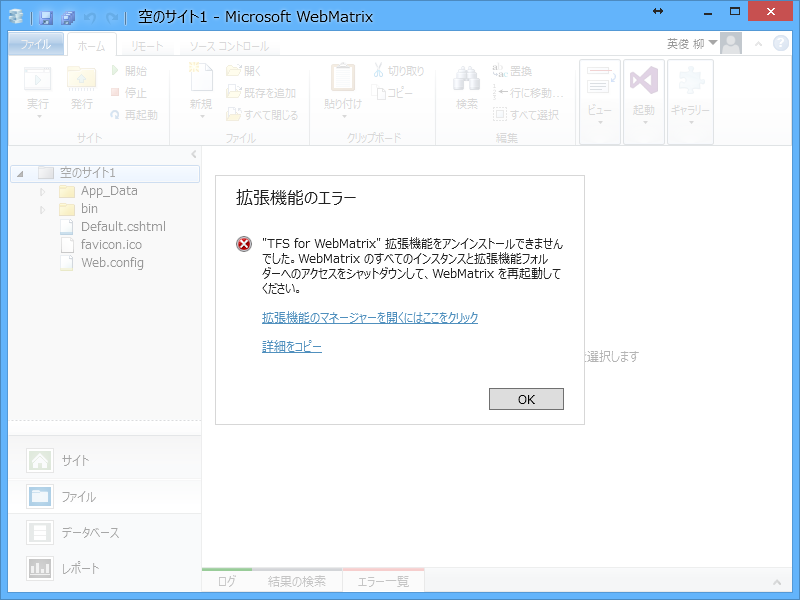

      The <a href="http://twitter.com/search?q=%23NuGet" target="_top">#NuGet</a> Package Manager for <a href="http://twitter.com/search?q=%23WebMatrix" target="_top">#WebMatrix</a> 3 is now open source! Its first update is available. Release notes updated: <a class="twitter-tweet-url" href="http://t.co/8IBnZgqpFR" target="_top">URL</a>

<a href="http://twitter.com/nuget/status/429028450024701953" class="twitter-detail-info-permalink">2014-01-31 08:08:48</a> via web

NuGet 2.8 がリリースされた。それにあわせて WebMatrix の NuGet Pakage Manager にも新しいバージョンが出たようなので（しかもオープンソースになったらしい！）、さっそくアップデートしてみた。それにしても、v1.3.0 からすごいバージョンが飛びましたな。

結果は失敗だった。管理者権限で起動しないといけないのかなと思ったのだけど、そういうことでもないらしい。WebMatrix の再インストールも試みたが、状況は改善されなかった。

しょうがないので、WebMatrix の拡張機能を管理していると思わしきフォルダー <code>%USERPROFILE%\AppData\Local\Microsoft\WebMatrix\Extensions\30</code> を開き、そこにあった PendingExtensionChanges の中身をのぞいてみた。

<pre class="code" data-unlink>update NuGetPackageManager 2.5.0 http://extensions.webmatrix.com/api/feeds/v3/</pre>
次に <a href="http://extensions.webmatrix.com/api/feeds/v3/">http://extensions.webmatrix.com/api/feeds/v3/</a> をブラウザーでみてみた。

空っぽのような気がする（本当は中身があるはずなんだよね？）。試しにほかの拡張機能のアンインストールなども試してみた。

Oh……。なんでかわかるひと、教えて！

結局原因がよくわからなかったけれど（サーバーがトラぶってる？　自分の環境が腐ってる？）、そろそろ OS の再インストールもしたいし、もう一度キレイな環境を作ってから再度チャレンジしたいと思う。

