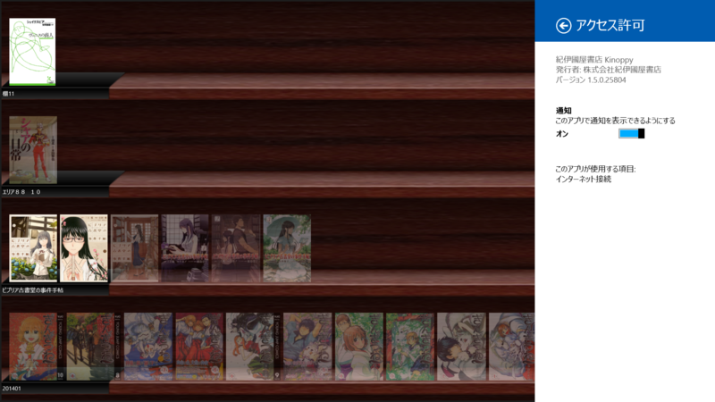
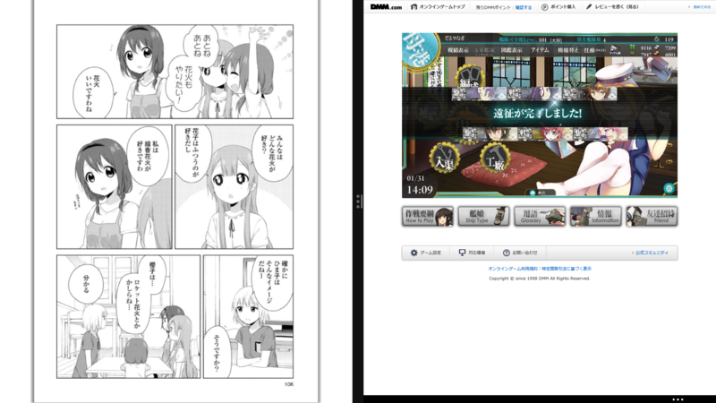

 

<blockquote cite="http://apps.microsoft.com/windows/ja-jp/app/kinoppy/1bd11767-3c28-4c05-a52f-2206126c5e85">

説明 
Kinoppyは紀伊國屋書店の電子書籍サービス「Kinoppy」で販売・配信する電子書籍をダウンロード・閲覧するためのアプリです。
 

機能 
•【ビューア】：購入した電子書籍を読む。（文字サイズを変更する、本の特定箇所をマークしコメントを付けたりする、本文全体を検索する、などの機能があります。） 
•【本棚】：購入した書籍を管理する。(本や棚の並び順を変える、棚の名前を付ける、などの機能があります。)

<cite><a href="http://apps.microsoft.com/windows/ja-jp/app/kinoppy/1bd11767-3c28-4c05-a52f-2206126c5e85">Windows &#x30B9;&#x30C8;&#x30A2; &#x306E; Windows &#x7528; &#x7D00;&#x4F0A;&#x570B;&#x5C4B;&#x66F8;&#x5E97; Kinoppy &#x30A2;&#x30D7;&#x30EA;</a></cite>
</blockquote>

満を持しての登場ですね！　心待ちにしていた人も多かったと思います。

      だるやなぎさんの期待に応える日が来たか・・・

<a href="http://twitter.com/Kinoppy_Dev/status/428735459183689728" class="twitter-detail-info-permalink">2014-01-30 12:44:33</a> via web

急かしてほんともうしわけない。

さっそく少し利用してみたのだけど――手元にある iPad 版と比べるとちょっと動作にもたつきを感じた。とくに画面の回転やトレースズームの ON/OFF でビューの再生成とスクロールをしている（？）のが見えるあたりがちょっと（Surface 2の場合）。けれど、本をめくるなどの通常の利用ではとくに不満は感じなかった。

あと、水平スクロールが棚単位ではなく、本棚全体につくのがあまりイケてないと感じた（iPad 版は棚ごとに水平スクロールする）。

でも、全体的にはなかなかよいデキといっていいと思う。複数書籍の選択対応＆セマンティックズームを使った棚の整理なんかは、iPad 版よりも使いやすいと感じる。ストアが内蔵されていないのは……まぁ、ウェブストアじゃないと買えない書籍もあるし、そこはあまり気にならないかな。できれば、間違って紙の本を買わないように、もうちょっとわかりやすいサイトになってくれたらうれしい。

それにしてもトレースズームまで対応してくれたのか……目玉機能だしね。個人的にはそこを省いてもいいからもっと早期のリリースを望んでいたのだけど、それももういいや。ただただ、ありがたい。

だって、これで艦これしながらマンガ読める！！

