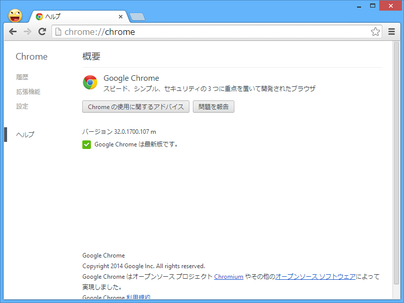
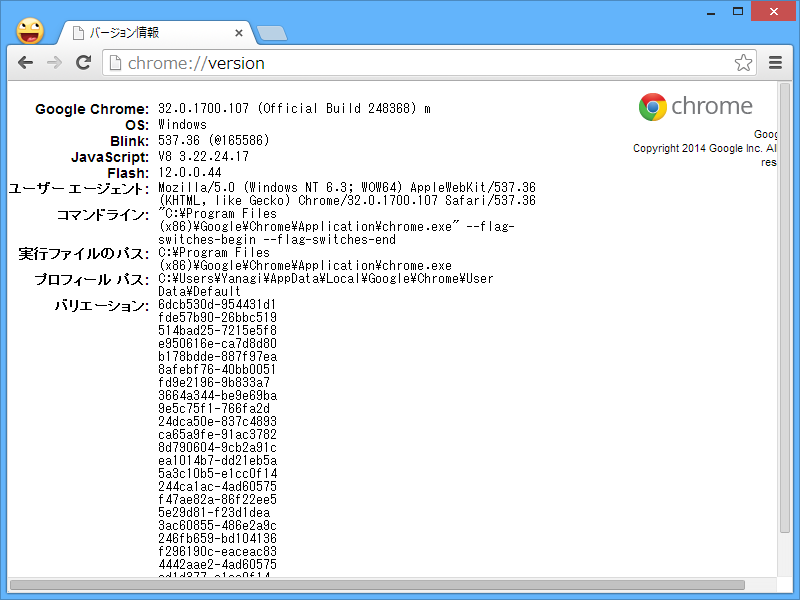

 

<ul>
<li><a href="http://googlechromereleases.blogspot.jp/2014/02/stable-channel-update.html">Chrome Releases: Stable Channel Update</a></li>
</ul>
<a href="http://build.chromium.org/f/chromium/perf/dashboard/ui/changelog.html?url=%2Fbranches%2F1700%2Fsrc&range=247602%3A246481&mode=html">&#x3044;&#x308D;&#x3044;&#x308D;&#x5909;&#x308F;&#x3063;&#x3066;&#x308B;&#x3063;&#x307D;&#x3044;</a>けど、特筆すべきことはなさそう。

