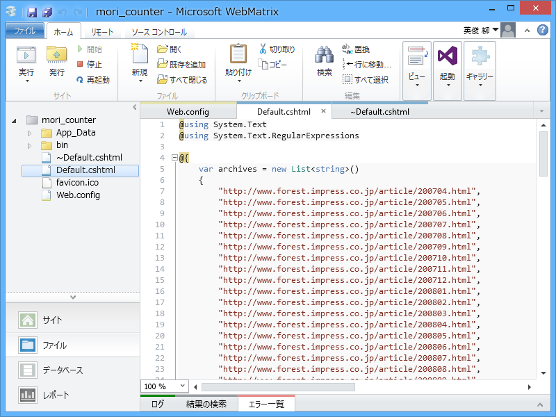

こういうのは別に WebMatrix でやる必要はないのだけど……慣れているので。あと、もっときれいに書き直そうかと思ったけど、面倒くさくなってやめた。

<pre class="code lang-cs" data-lang="cs" data-unlink>@using System.Text
@using System.Text.RegularExpressions

@{
// 2008年まではシステムが旧かったので、
// http://www.forest.impress.co.jp/article/ 以下に過去ログがある
var archives = new List&lt;string&gt;()
{
&quot;http://www.forest.impress.co.jp/article/200704.html&quot;,
&quot;http://www.forest.impress.co.jp/article/200705.html&quot;,
&quot;http://www.forest.impress.co.jp/article/200706.html&quot;,
&quot;http://www.forest.impress.co.jp/article/200707.html&quot;,
&quot;http://www.forest.impress.co.jp/article/200708.html&quot;,
&quot;http://www.forest.impress.co.jp/article/200709.html&quot;,
&quot;http://www.forest.impress.co.jp/article/200710.html&quot;,
&quot;http://www.forest.impress.co.jp/article/200711.html&quot;,
&quot;http://www.forest.impress.co.jp/article/200712.html&quot;,
&quot;http://www.forest.impress.co.jp/article/200801.html&quot;,
&quot;http://www.forest.impress.co.jp/article/200802.html&quot;,
&quot;http://www.forest.impress.co.jp/article/200803.html&quot;,
&quot;http://www.forest.impress.co.jp/article/200804.html&quot;,
&quot;http://www.forest.impress.co.jp/article/200805.html&quot;,
&quot;http://www.forest.impress.co.jp/article/200806.html&quot;,
&quot;http://www.forest.impress.co.jp/article/200807.html&quot;,
&quot;http://www.forest.impress.co.jp/article/200808.html&quot;,
&quot;http://www.forest.impress.co.jp/article/200809.html&quot;,
&quot;http://www.forest.impress.co.jp/article/200810.html&quot;,
&quot;http://www.forest.impress.co.jp/article/200811.html&quot;,
&quot;http://www.forest.impress.co.jp/article/200812.html&quot;,
};

// おニューなシステムの過去ログの URL を足す
var d = new DateTime(2009, 1, 1);
while (d &lt; DateTime.Today)
{
archives.Add(string.Format(&quot;http://www.forest.impress.co.jp/backno/top/index{0:0000}{1:00}.html&quot;, d.Year, d.Month));
d = d.AddMonths(1);
}

// システム変更時に UTF-8 にすべきって主張しておけばよかった
var encoding = Encoding.GetEncoding(&quot;Shift_JIS&quot;);

// 自分の記事を保持しておくリスト
var my_articles = new List&lt;string&gt;();
}

&lt;!DOCTYPE html&gt;

&lt;html lang=&quot;en&quot;&gt;
&lt;head&gt;
&lt;meta charset=&quot;utf-8&quot; /&gt;
&lt;title&gt;&lt;/title&gt;
&lt;/head&gt;
&lt;body&gt;
@foreach (var archive in archives)
{
// 過去ログページの解析
var month = new WebClient(){ Encoding = encoding, }.DownloadString(archive);
var regex = new Regex(@&quot;&quot;&quot;(\/[^&quot;&quot;]+\.html)&quot;&quot;&quot;);
var links = regex.Matches(month).Cast&lt;Match&gt;();

foreach (var link in links)
{
var l = &quot;http://www.forest.impress.co.jp&quot; + link.Groups[1];

// ダイジェストニュース、アップデート、バックナンバーは読み飛ばす
if (l.IndexOf(&quot;digest&quot;) &gt;= 0)
{
continue;
}

if (l.IndexOf(&quot;update&quot;) &gt;= 0)
{
continue;
}

if (l.IndexOf(&quot;backno&quot;) &gt;= 0)
{
continue;
}

// ニュースやレビュー記事の場合、著者名を拾う
try
{
var article = new WebClient(){ Encoding = encoding, }.DownloadString(l);
if (article.IndexOf(&quot;柳 英俊&quot;) &gt;= 0)
{
my_articles.Add(l); // おれのだー！
}
}
catch
{
// リンク切れとかあるかもしれん
}
}
}

&lt;ul&gt;
@foreach(var my_article in my_articles.Distinct())
{
&lt;li&gt;&lt;a href=&quot;@my_article&quot;&gt;@my_article&lt;/a&gt;&lt;/li&gt;
}
&lt;/ul&gt;

&lt;p&gt;@my_articles.Distinct().Count() 件の記事が見つかりました。&lt;/p&gt;
&lt;/body&gt;
&lt;/html&gt;
</pre>
Distinct() 2回呼んでたりするし、見る人が見たら殺されかねないコードだけど、まぁ、使い捨てだし！　たぶんちゃんとカウントできてる気がする。

ただ、時間は割とかかる。ローカルで動かすだけなら問題ないみたいだけど。

<h3>追記</h3>

なかじ様が面白いことをしていた。

<ul>
<li><a href="http://nakaji.hatenablog.com/entry/2014/02/06/013046">PowerShell&#xFF1A;&#x3060;&#x308B;&#x3084;&#x306A;&#x304E;&#x69D8;&#x304C;&#x66F8;&#x3044;&#x305F;&#x8A18;&#x4E8B;&#x306E;&#x6570;&#x3092;&#x6570;&#x3048;&#x3066;&#x307F;&#x305F; - &#x306A;&#x304B;&#x65E5;&#x8A18;</a></li>
</ul>

