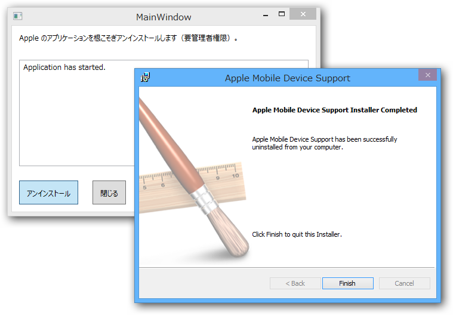

急に <a href="http://d.hatena.ne.jp/asin/B0001DD238/bestylesnet-22">メロディック・ハード・キュア</a> が聞きたくなったので、Amazon から中古の CD を取り寄せた。で、これを iTunes でリッピングして iPhone に転送しようとしたのだけど……

      なんで全部同期されないの……もういやんなる。iTunes……

<a href="http://twitter.com/daruyanagi/status/431704721003274240" class="twitter-detail-info-permalink">2014-02-07 17:23:20</a> via <a href="http://www.metrotwit.com/" rel="nofollow">MetroTwit</a>

      iTunes の再インストールだと……ほんまマジで死ね。なにが UX じゃバカ

<a href="http://twitter.com/daruyanagi/status/431698966573355008" class="twitter-detail-info-permalink">2014-02-07 17:00:28</a> via <a href="http://www.metrotwit.com/" rel="nofollow">MetroTwit</a>

      つうか iPhone と iTunes の同期とか糞メンドイ

<a href="http://twitter.com/daruyanagi/status/431696546795507712" class="twitter-detail-info-permalink">2014-02-07 16:50:51</a> via <a href="http://www.metrotwit.com/" rel="nofollow">MetroTwit</a>

      iTunes に怒り狂っている

<a href="http://twitter.com/daruyanagi/status/431696251973672960" class="twitter-detail-info-permalink">2014-02-07 16:49:41</a> via <a href="http://www.metrotwit.com/" rel="nofollow">MetroTwit</a>

      iTunes まじむかつく。アップデートごときで OS 再起動させんなよクソが

<a href="http://twitter.com/daruyanagi/status/431694823578292224" class="twitter-detail-info-permalink">2014-02-07 16:44:01</a> via <a href="http://www.metrotwit.com/" rel="nofollow">MetroTwit</a>

結局、iTunes の音楽ライブラリを抹消したり同期したり一部だけ同期させたり消したり全部同期してみたり iTunes を再インストールしたり iPhone を初期化しようと悩んだりダメモトでもう一回だけ同期したりしてみたところ、やっとお目当ての楽曲が無事転送された。<b>途中で何回も死にたくなった。</b>

そういえば最近 <a href="http://www.forest.impress.co.jp/docs/news/20140206_634223.html">&#x3053;&#x3093;&#x306A;&#x3053;&#x3068;</a>もあったので、根こそぎアンインストールアプリがあれば便利かなと思い、艦これしながら作ってみた。Windows 8.1 の 64bit 版 iTunes でしか試してないので、ほかの環境でうまく動くのかどうかは分からない<a href="#f1" name="fn1" title="自分だったら怖くて試さないと思う">*1</a>。アプリケーションの GUID ってどの環境でも一緒だよね？　アンインストールするアプリを GUID で決め打ちにしちゃったけど、ほんとはインストールリストを全部ナメて DisplayName が一致するかみた方がよかったのかもしれない。

<iframe src="https://skydrive.live.com/embed?cid=8D890D7855B010BC&resid=8D890D7855B010BC%2125717&authkey=AB7XN21lellgmPI" width="98" height="120" frameborder="0" scrolling="no"></iframe>

UI フリーズするからイケていないな……。

<h3>この子がやること</h3>

<ul>
<li>「iTunes」</li>
<li>「Apple Software Update」</li>
<li>「Apple Mobile Device Support」</li>
<li>「Bonjour」</li>
<li>「Apple Application Support」</li>
</ul>
の順にアプリケーションをアンインストール（インストーラーを呼び出すだけ）。

<ul>
<li>C:\Program Files\Bonjour</li>
<li>C:\Program Files\Common Files\Apple\Mobile Device Support</li>
<li>C:\Program Files\Common Files\Apple\Apple Application Support</li>
<li>C:\Program Files\Common Files\Apple\CoreFP</li>
<li>C:\Program Files\iTunes\</li>
<li>C:\Program Files\iPod\</li>
<li>C:\Program Files (x86)\Bonjour</li>
<li>C:\Program Files (x86)\Common Files\Apple\Apple Application Support</li>
<li>C:\Program Files (x86)\Common Files\Apple\Mobile Device Support</li>
<li>C:\Program Files (x86)\Common Files\Apple\CoreFP</li>
<li>C:\Program Files (x86)\iTunes\</li>
<li>C:\Program Files (x86)\iPod\</li>
</ul>
を消そうと頑張ってみる。消せなかったらフォルダをエクスプローラーで開く（自分で消せ）。

名前の由来は <a href="http://d.hatena.ne.jp/asin/4063616533/bestylesnet-22">みなみけ(5) (ヤングマガジンコミックス)</a>。

<a href="#fn1" name="f1" class="footnote-number">*1</a>:自分だったら怖くて試さないと思う

