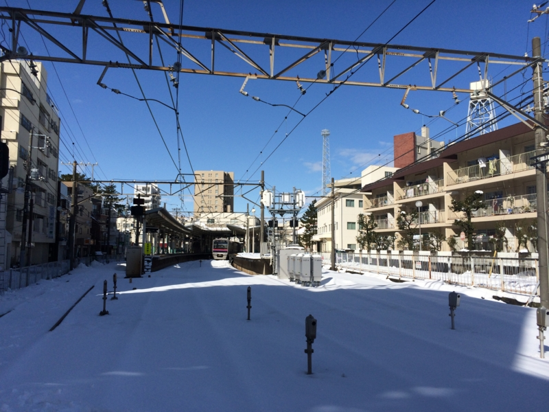
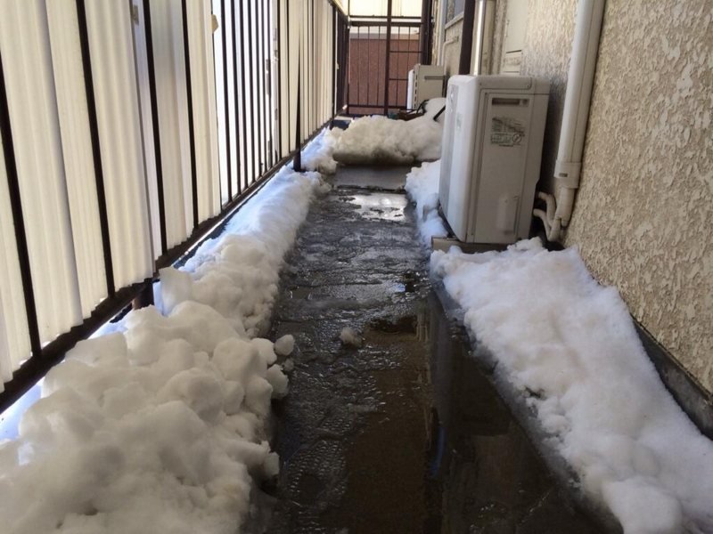
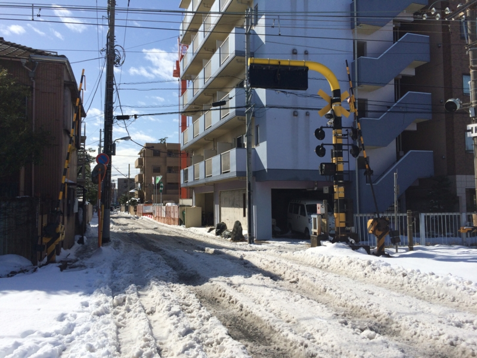
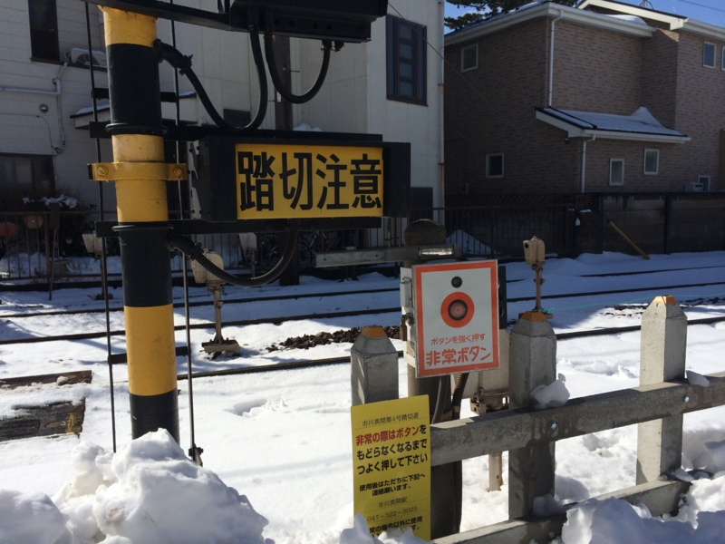

おなかが減ったのだけど、引っ越し前なので冷蔵庫になにもない。しかたなく、コンビニまでお弁当でも買いに行こうと思ったら……すっごい雪が積もってた。

部屋の前の廊下は、大家さんがすでに雪かきをしてくれていた。ここの大家さんはとてもいいひとで、前回の管理費だけ取って何もしないところとは大違い。いつも気を使ってくれている。それにしても、雪かきまでさせてしまうとは……不覚。

千葉街道（国道14号線）は渋滞で、クルマがまったく動かない状態。その一方で、少しそこから外れるとスカスカ。いつもは踏切があがるのを待つクルマでごった返している道も、深く轍が刻まれているだけ。どうやら京成電車も走ってないみたいで、踏切が下りることもない。線路には雪が綿のように敷き詰められていて、ダイブしたい気分だった。

街ではみんなスコップをもちだし、除雪に精を出している。自分もちょっと加わってみたかったけれど、いかんせん、道具もないし、知っている顔もない。実家に行けばスコップぐらいあるかと思って、少し散歩がてら寄ってみたのだけど、そっちにもなかった。

新しい家には、ちゃんとスコップを買って、置いておこうと思った。降らないかもしれないけど。

