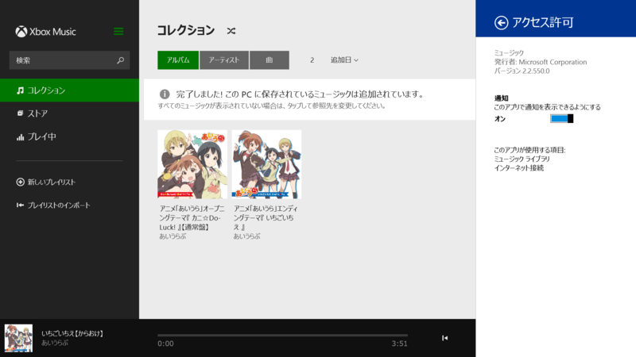
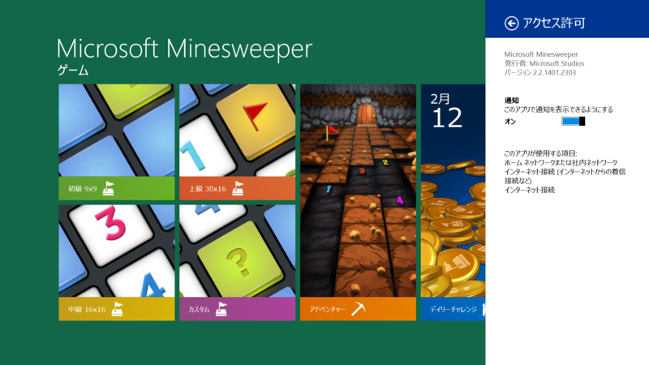
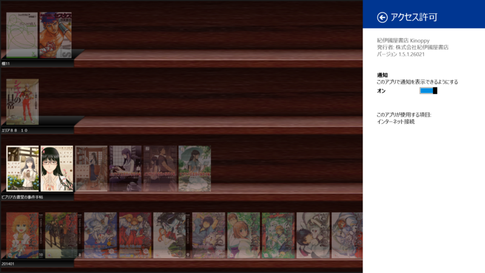

2か月ぐらい休んでたけど、またぼちぼちメモることにした。更新チェック面倒なのでスクリプトのお勉強中。

<h3>ミュージック 2.2.550.0</h3>

2.2.444.0 からの変更点

<blockquote>

その他の修正

</blockquote>

<ul>
<li><a href="http://apps.microsoft.com/windows/ja-jp/app/music/16db93bf-8748-449a-96ba-e9ed3a5f872d">Windows &#x30B9;&#x30C8;&#x30A2; &#x306E; Windows &#x7528; &#x30DF;&#x30E5;&#x30FC;&#x30B8;&#x30C3;&#x30AF; &#x30A2;&#x30D7;&#x30EA;</a></li>
</ul>

<h3>ビデオ 2.2.550.0</h3>

2.2.338.0 からの変更点

<blockquote>

その他の修正

</blockquote>

<ul>
<li><a href="http://apps.microsoft.com/windows/ja-jp/app/video/64b22df1-5a9c-4c88-aa1f-42cefaf8b281/m/ROW">Windows &#x30B9;&#x30C8;&#x30A2; &#x306E; Windows &#x7528; &#x30D3;&#x30C7;&#x30AA; &#x30A2;&#x30D7;&#x30EA;</a></li>
</ul>

<h3>Microsoft Minesweeper 2.2.1401.2303</h3>

2.1.1312.2409 からの変更点

<blockquote>

バグの修正および最適化

</blockquote>

<ul>
<li><a href="http://apps.microsoft.com/windows/ja-jp/app/microsoft-minesweeper/45ac18d7-e742-494f-a1b1-009aa412a179">Windows &#x30B9;&#x30C8;&#x30A2; &#x306E; Windows &#x7528; Microsoft Minesweeper &#x30A2;&#x30D7;&#x30EA;</a></li>
</ul>

<h3>紀伊國屋書店 Kinoppy 1.5.1.26021</h3>

1.5.0.25804（<a href="http://www.forest.impress.co.jp/docs/news/20140131_633384.html">&#x7D00;&#x4F0A;&#x570B;&#x5C4B;&#x66F8;&#x5E97;&#x3001;&#x96FB;&#x5B50;&#x66F8;&#x7C4D;&#x30EA;&#x30FC;&#x30C0;&#x30FC;&#x300C;Kinoppy&#x300D;&#x306E;Windows &#x30B9;&#x30C8;&#x30A2;&#x30A2;&#x30D7;&#x30EA;&#x7248;&#x3092;&#x7121;&#x511F;&#x516C;&#x958B; - &#x7A93;&#x306E;&#x675C;</a>）からの変更点

<blockquote>

削除した書籍をアプリから再同期できる「クラウド本棚」機能を追加しました。 
書籍のダウンロードが正常に行われない障害を修正しました。 
一部書籍でページが重複して表示される障害を修正しました。 
その他不具合を修正しました。

</blockquote>

あれ、なかったんだっけ？　お疲れ様です！

<ul>
<li><a href="http://apps.microsoft.com/windows/ja-jp/app/kinoppy/1bd11767-3c28-4c05-a52f-2206126c5e85">Windows &#x30B9;&#x30C8;&#x30A2; &#x306E; Windows &#x7528; &#x7D00;&#x4F0A;&#x570B;&#x5C4B;&#x66F8;&#x5E97; Kinoppy &#x30A2;&#x30D7;&#x30EA;</a></li>
</ul>

