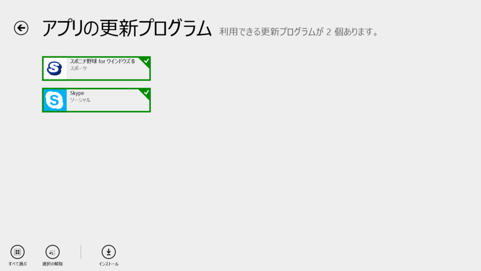
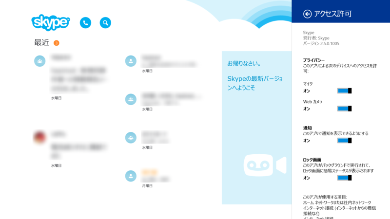
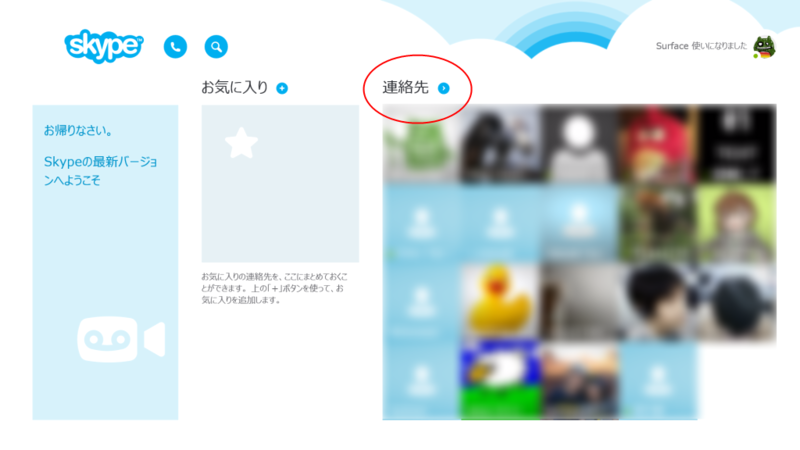
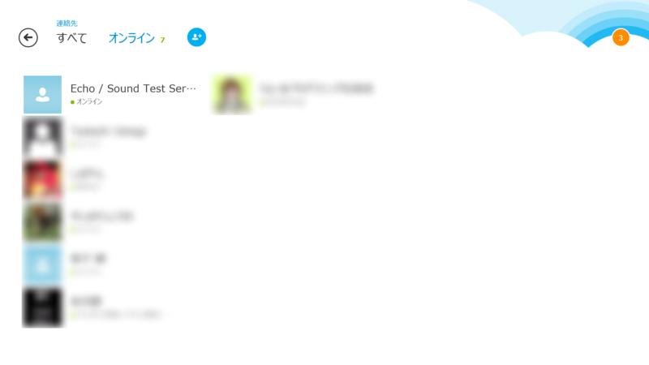
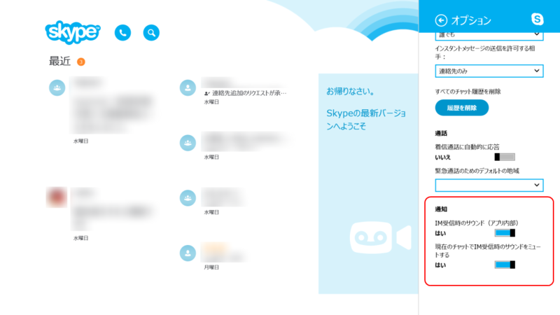

 

<h3>Skype for Modern Windows 2.5</h3>

2.4.0.1007 からの変更点（<a href="http://www.forest.impress.co.jp/docs/news/20131023_620660.html">&#x300C;Windows 8.1&#x300D;&#x306B;&#x3074;&#x3063;&#x305F;&#x308A;&#x306E;&#x300C;Skype&#x300D;&#x3001;&#x300C;Skype for Windows 8.1&#x300D;&#x304C;&#x6B63;&#x5F0F;&#x306B;&#x30EA;&#x30EA;&#x30FC;&#x30B9; - &#x7A93;&#x306E;&#x675C;</a> は 2.2.0.1009）

<blockquote>

新機能： － 全般的な修正

</blockquote>

<ul>
<li><a href="http://apps.microsoft.com/windows/ja-JP/app/skype/5e19cc61-8994-4797-bdc7-c21263f6282b">Windows &#x30B9;&#x30C8;&#x30A2; &#x306E; Windows &#x7528; Skype &#x30A2;&#x30D7;&#x30EA;</a></li>
</ul>
これだけだとさっぱりわからないのだけど、幸いなことに <a href="http://blogs.skype.com/2014/02/12/skype-for-modern-windows-2-5-get-closer-to-people-and-hear-less-noise/">Skype for Modern Windows 2.5: Get Closer to People and Hear Less Noise &ndash; - Skype Blogs</a> に詳細が書いてある。関係ないけど、<i>「Skype for Windows 8.1」</i>っていうのやめて、<i>「Skype for Modern Windows」</i>って呼ぶようにしたのかな。<b>“for Windows”</b>だの（デスクトップと違うん？）<b>“for Windows 8”</b>だの（8.1 でも使えんの？ 8.2 は？）<b>“for Metro”</b>だの（禁止―――ッ！）、テンでバラバラに呼ばれている Windows ストア アプリ。そろそろ統一された呼び方が普及してほしいのだけど、“for Modern Windows”はなかなかいいんじゃないかと思うのです。

<h3>People（連絡先）画面の追加</h3>

メイン画面の“連絡先”ラベルの右にあるボタンを押すと、新設の“連絡先”画面に遷移する。

ここでは、

<ul>
<li>ユーザーの追加（アプリバーまたは“オンライン”ラベル右隣のボタンから）</li>
<li>オンラインユーザーのフィルタリング</li>
</ul>
などが可能。まぁ、ユーザーが多くなってくると便利なのかな。

<h3>チャットサウンドのミュート</h3>

（一番下のオプションが追加）

会話中に他のユーザーからチャットがあっても、通知音が鳴らないように設定できるようになった。彼女とラブラブ会話中に愛人から IM が飛んできてもバレない？　バレンタインデーにぴったりのアップデートやな（棒読み

