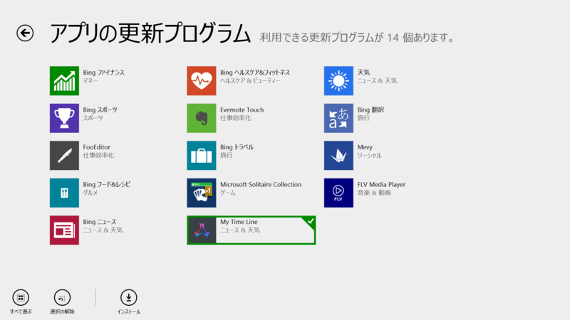
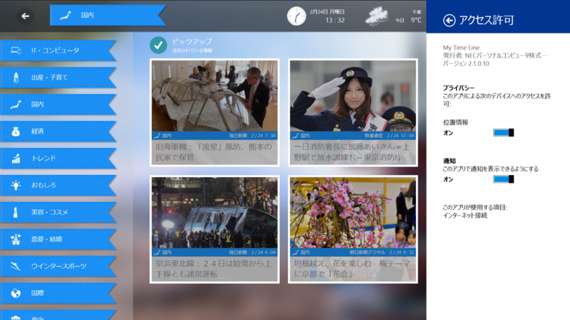

引っ越しやらなんやらで1週間あけたらこのざまだよ！

<h3>OneNote 16.0.1929.1133 → 16.0.1929.1156</h3>

 

<blockquote>

サポートされる言語の追加。[最近のノート] ビューからページの場所に移動する機能。インクと罫線の改善。パフォーマンスの向上。 アクセシビリティの向上。バグ修正。

</blockquote>

Microsoft OneNote - ノート作成ソフトウェア - Office.com 
<a href="http://office.microsoft.com/ja-jp/onenote/">http://office.microsoft.com/ja-jp/onenote/</a> 
OneNote and OneDrive: One happy family | Office Blogs 
<a href="http://blogs.office.com/2014/02/21/onenote-and-onedrive-one-happy-family/">http://blogs.office.com/2014/02/21/onenote-and-onedrive-one-happy-family/</a> 
Windows ストア の Windows 用 OneNote アプリ 
<a href="http://apps.microsoft.com/windows/ja-jp/app/onenote/f022389f-f3a6-417e-ad23-704fbdf57117">http://apps.microsoft.com/windows/ja-jp/app/onenote/f022389f-f3a6-417e-ad23-704fbdf57117</a> 
Microsoft、ストアアプリ版「OneNote」をアップデート - 窓の杜 
<a href="http://www.forest.impress.co.jp/docs/news/20140224_636643.html">http://www.forest.impress.co.jp/docs/news/20140224_636643.html</a> 

<h3>My Time Line 2.0.0.2 → 2.1.0.10</h3>

 

<blockquote>

[バージョン:2.1] 
・興味を分析するAIプログラムを一新し、ニュース本文を解析して記事をおススメするようになりました。 
・情報提供元サイトとしてR25、スポーツナビ、映画.com、All About FOOTBALL、All About Tips+を追加しました。 
・読みやすいMy Time Line専用モードのデザインを改善し、対応サイトを3サイトから26サイトに拡充しました。 
・共有やトースト通知・ライブタイルに対応し、プッシュで情報更新をお知らせするようになりました。 
・UI・インタラクションを改善し、操作性を大幅に改善しました。

</blockquote>

欲しい情報が手に入る、自分だけの情報リーダー My Time Line 
<a href="http://121ware.com/mtl/">http://121ware.com/mtl/</a> 
121ware.com > サービス＆サポート > お知らせ 
<a href="http://121ware.com/navigate/support/info/20140218/">http://121ware.com/navigate/support/info/20140218/</a> 
Windows ストア の Windows 用 My Time Line アプリ 
<a href="http://apps.microsoft.com/windows/ja-jp/app/54aef069-78f4-45b0-9eb1-dde330f8678e">http://apps.microsoft.com/windows/ja-jp/app/54aef069-78f4-45b0-9eb1-dde330f8678e</a> 
使えば使うほど馴染んでくるニュースリーダーアプリ「My Time Line」がアップデート - 窓の杜 
<a href="http://www.forest.impress.co.jp/docs/news/20140224_636685.html">http://www.forest.impress.co.jp/docs/news/20140224_636685.html</a>

専用の閲覧デザインで本文が飛んでしまっている現象に何件か遭遇。意図的なものなのかもしれないけど、タイトルと画像しか見られないのはちょっと。それ以外の改善はとてもいいと思った。

