
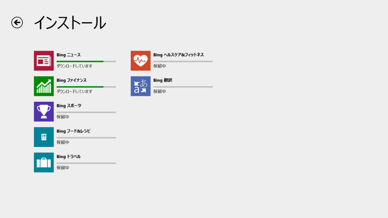

<a href="https://blog.daruyanagi.jp/entry/2014/02/25/121653">OneNote16.0.1929.1156&#x3001;My Time Line 2.1.0.10 - &#x3060;&#x308B;&#x308D;&#x3050;</a> の続き。Bing アプリの一斉アップデートが1週間前にぐらいにあったみたいだね。Windows Phone、iPhone、Android との絡みもあるのかな。よくわかんない。

<blockquote cite="http://blogs.windows.com/windows_phone/b/windowsphone/archive/2014/02/18/new-and-updated-bing-apps-for-windows-phone.aspx">

Along with fresh features, your personalized content from all 7 of the Bing apps will now roam across all your Windows devices (Windows PCs and Tablets running Windows 8.1)

<cite><a href="http://blogs.windows.com/windows_phone/b/windowsphone/archive/2014/02/18/new-and-updated-bing-apps-for-windows-phone.aspx">http://blogs.windows.com/windows_phone/b/windowsphone/archive/2014/02/18/new-and-updated-bing-apps-for-windows-phone.aspx</a></cite>
</blockquote>

<h3>Bing ファイナンス 3.0.1.299 → 3.0.2.229</h3>

リリースノートはないみたい。名前が微妙に変わった？　Bing というブランド名が冠されている。

<ul>
<li><a href="http://apps.microsoft.com/windows/ja-jp/app/finance/ffc158e5-74d6-4878-8ace-8f0df45083c1">MSN &#x30DE;&#x30CD;&#x30FC; &#x3092;&#x5165;&#x624B; - Microsoft Store ja-JP</a></li>
</ul>

<h3>Bing スポーツ 3.0.1.203 → 3.0.2.229</h3>

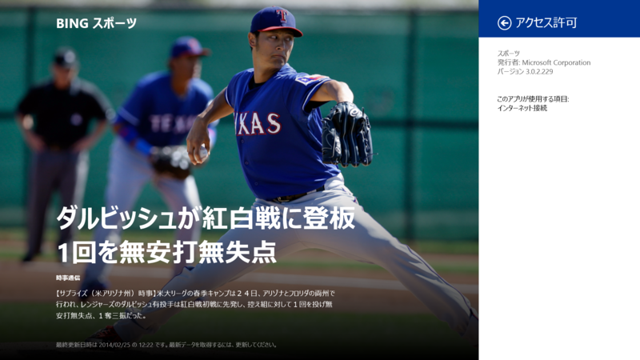

リリースノートなし。

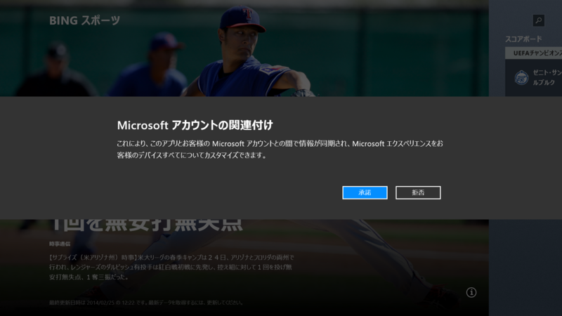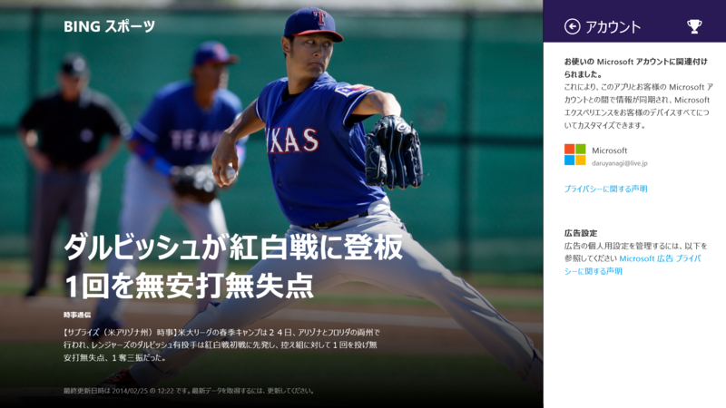

Microsoft アカウントによる同期に対応したようだ。「フード&レシピ」（スクリーンショットは 3.0.1.337）なんかはすでに対応していたように思うけれど。

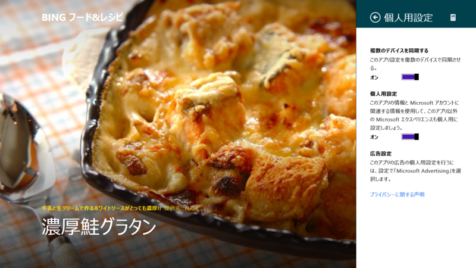 

<ul>
<li><a href="http://apps.microsoft.com/windows/ja-jp/app/bing-sports/d9a4d6fd-a65b-41a6-95ff-270b882ea5f1">MSN &#x30B9;&#x30DD;&#x30FC;&#x30C4; &#x3092;&#x5165;&#x624B; - Microsoft Store ja-JP</a></li>
</ul>

<h3>Bing フード&レシピ 3.0.1.337 → 3.0.2.229</h3>

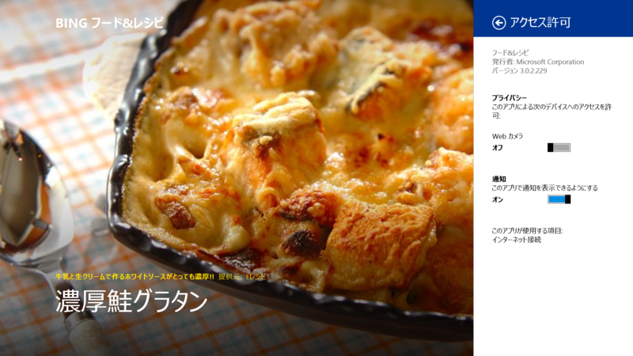

その「フード&レシピ」だが――やはり、リリースノートなし。

<ul>
<li><a href="http://apps.microsoft.com/windows/ja-jp/app/bing-food-drink/fa01a69f-eb9f-4f1c-a83c-5344200dc045">MSN &#x30D5;&#x30FC;&#x30C9;&amp;&#x30EC;&#x30B7;&#x30D4; &#x3092;&#x8CFC;&#x5165; - Microsoft Store ja-JP</a></li>
</ul>

<h3>Bing ニュース 3.0.1.321 → 3.0.2.229</h3>

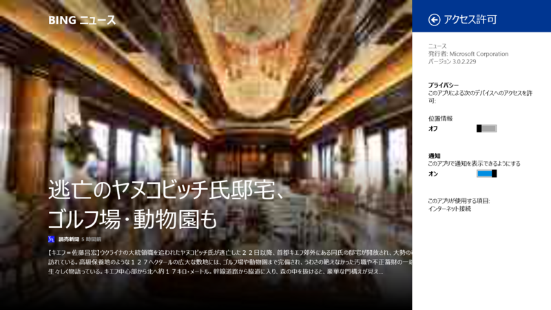

リリースノートなし。

アカウントの関連付け。

<ul>
<li><a href="http://apps.microsoft.com/windows/ja-jp/app/bing-news/eaaf2ce3-d5a3-4a59-ae31-276fbc44a7cd">Microsoft &#x30CB;&#x30E5;&#x30FC;&#x30B9; &#x3092;&#x5165;&#x624B; - Microsoft Store ja-JP</a></li>
</ul>

<h3>Bing ヘルスケア&フィットネス 3.0.1.335 → 3.0.2.230</h3>

リリースノートなし。このこだけなぜかリビジョンが違う。

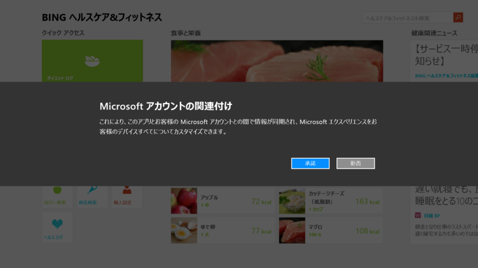

アカウントの関連付け。

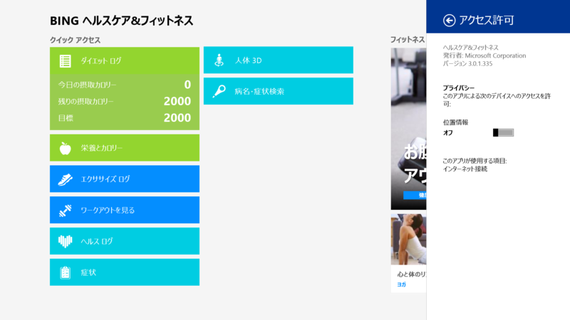

前バージョンのスタート画面と比べると若干デザインが違うようだ。

<ul>
<li><a href="http://apps.microsoft.com/windows/ja-jp/app/bing-health-fitness/54c27690-1f6b-40b0-b561-72dc76e67d02">MSN &#x30D8;&#x30EB;&#x30B9;&#x30B1;&#x30A2; &#x3092;&#x8CFC;&#x5165; - Microsoft Store ja-JP</a></li>
</ul>

<h3>Bing トラベル 3.0.1.202 → 3.0.2.229</h3>

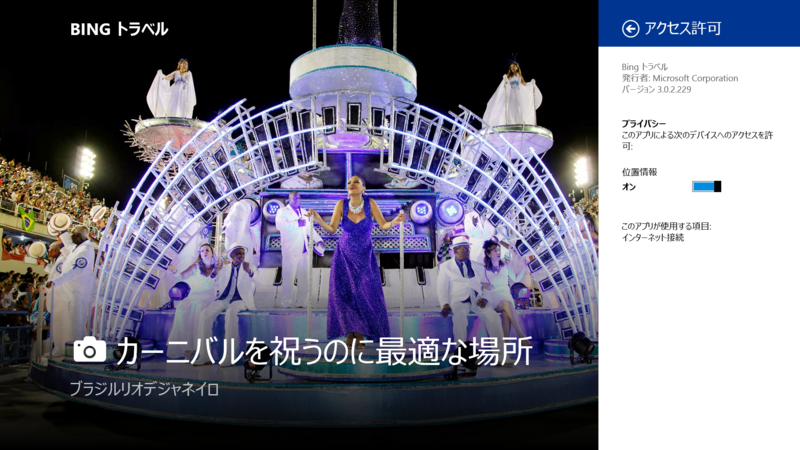

リリースノートなし。

<ul>
<li><a href="http://apps.microsoft.com/windows/ja-jp/app/bing-travel/9e2610f3-bad2-41cd-b793-a712b055089f">MSN &#x30C8;&#x30E9;&#x30D9;&#x30EB; &#x3092;&#x8CFC;&#x5165; - Microsoft Store ja-JP</a></li>
</ul>

<h3>Bing 翻訳 1.6.0.0 → 1.7.0.0</h3>

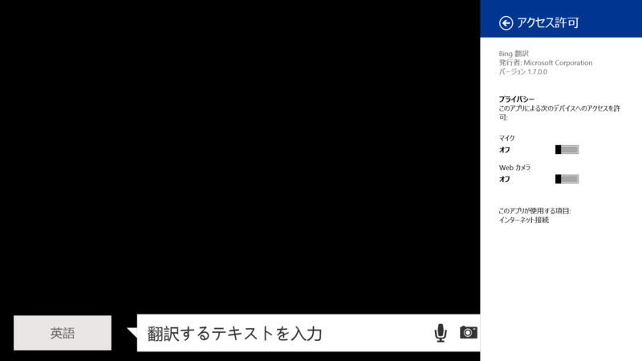

このこを Bing アプリに含めるのはちょっとお門違いな気もするが。

<a href="https://blog.daruyanagi.jp/entry/2013/12/09/213354">FooEditor 1.8.0.0&#x3001;LINE 1.0.8.89&#x3001;Bing &#x7FFB;&#x8A33;&#x5BB6; 1.5.1.0&#x3001;Bing &#x30D8;&#x30EB;&#x30B9;&#x30B1;&#x30A2;&amp;&#x30D5;&#x30A3;&#x30C3;&#x30C8;&#x30CD;&#x30B9; 3.0.1.335 - &#x3060;&#x308B;&#x308D;&#x3050;</a> 以降、1.6.0.0 のリリースを見逃していたようだ（？ 
おそらくこのアップデートでアプリ名も「Bing 翻訳家」から「Bing 翻訳」になったのだろう。知らんけど。

リリースノートはとくにないみたい。

1.6.0.0 を起動すると、プライバシーポリシーに同意させられる。カメラ翻訳機能で撮影したり、音声翻訳機能で録音したデータは Microsoft へ送信されるとの由。まぁ、そりゃそうだろうな。

<ul>
<li><a href="http://apps.microsoft.com/windows/ja-jp/app/bing-translator/1489bb69-3e78-4085-96f5-2a9a6f303559">&#x7FFB;&#x8A33; &#x3092;&#x5165;&#x624B; - Microsoft Store ja-JP</a></li>
</ul>

