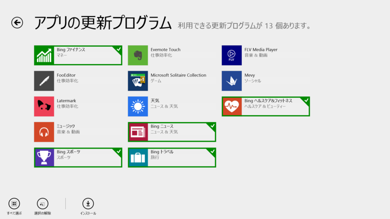
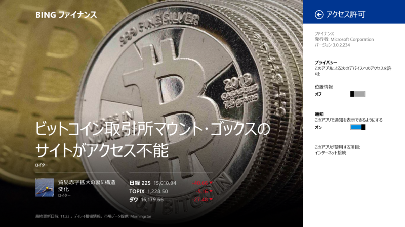
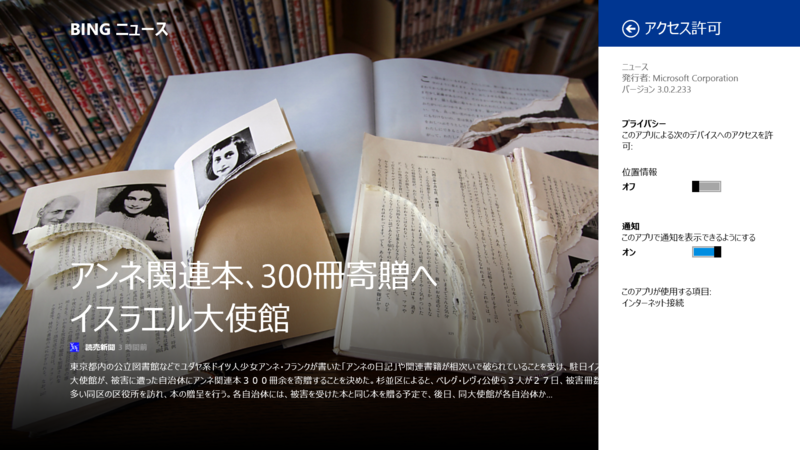
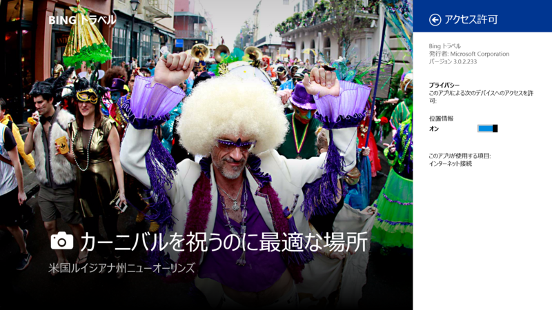
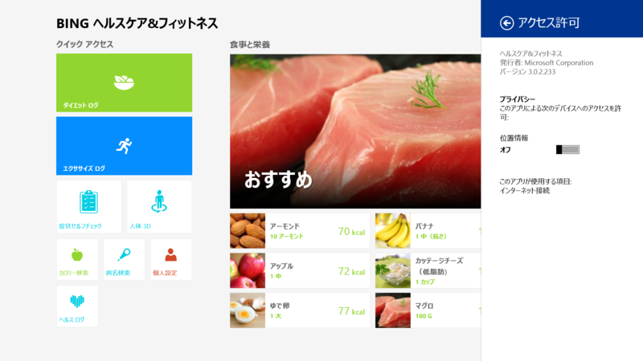
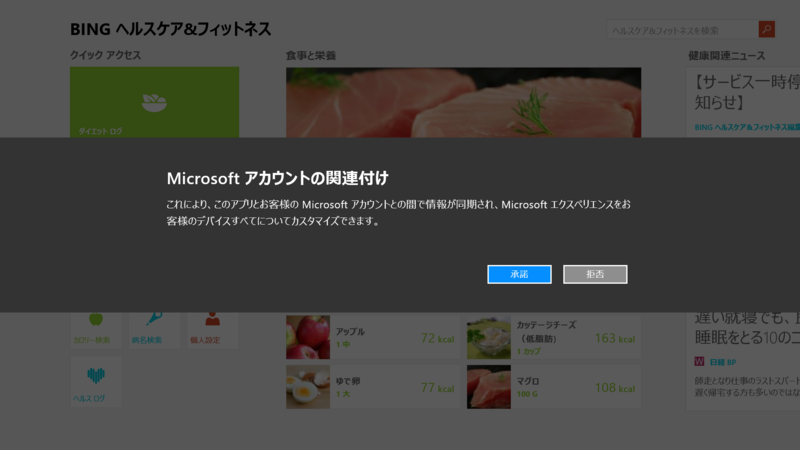

またアップデートしていた。

<h3>Bing ファイナンス 3.0.2.229 → 3.0.2.234</h3>

このこだけリビジョンが違う。

<ul>
<li><a href="http://apps.microsoft.com/windows/ja-jp/app/finance/ffc158e5-74d6-4878-8ace-8f0df45083c1">Windows &#x30B9;&#x30C8;&#x30A2; &#x306E; Windows &#x7528; Bing &#x30D5;&#x30A1;&#x30A4;&#x30CA;&#x30F3;&#x30B9; &#x30A2;&#x30D7;&#x30EA;</a></li>
</ul>

<h3>Bing スポーツ 3.0.2.229 → 3.0.2.233</h3>

 

<ul>
<li><a href="http://apps.microsoft.com/windows/ja-jp/app/bing-sports/d9a4d6fd-a65b-41a6-95ff-270b882ea5f1">Windows &#x30B9;&#x30C8;&#x30A2; &#x306E; Windows &#x7528; Bing &#x30B9;&#x30DD;&#x30FC;&#x30C4; &#x30A2;&#x30D7;&#x30EA;</a></li>
</ul>

例の関連付け。前回やったような気がするんだけど。

<h3>Bing ニュース 3.0.2.229 → 3.0.2.233</h3>

 

<ul>
<li><a href="http://apps.microsoft.com/windows/ja-jp/app/bing-news/eaaf2ce3-d5a3-4a59-ae31-276fbc44a7cd">Windows &#x30B9;&#x30C8;&#x30A2; &#x306E; Windows &#x7528; Bing &#x30CB;&#x30E5;&#x30FC;&#x30B9; &#x30A2;&#x30D7;&#x30EA;</a></li>
</ul>

<h3>Bing ニュース 3.0.2.229 → 3.0.2.233</h3>

 

<ul>
<li><a href="http://apps.microsoft.com/windows/ja-jp/app/bing-travel/9e2610f3-bad2-41cd-b793-a712b055089f">Windows &#x30B9;&#x30C8;&#x30A2; &#x306E; Windows &#x7528; Bing &#x30C8;&#x30E9;&#x30D9;&#x30EB; &#x30A2;&#x30D7;&#x30EA;</a></li>
</ul>

<h3>Bing ヘルスケア&フィットネス 3.0.2.230 → 3.0.2.233</h3>

 

<ul>
<li><a href="http://apps.microsoft.com/windows/ja-jp/app/bing-health-fitness/54c27690-1f6b-40b0-b561-72dc76e67d02">Windows &#x30B9;&#x30C8;&#x30A2; &#x306E; Windows &#x7528; Bing &#x30D8;&#x30EB;&#x30B9;&#x30B1;&#x30A2;&amp;&#x30D5;&#x30A3;&#x30C3;&#x30C8;&#x30CD;&#x30B9; &#x30A2;&#x30D7;&#x30EA;</a></li>
</ul>

例の関連付け。

