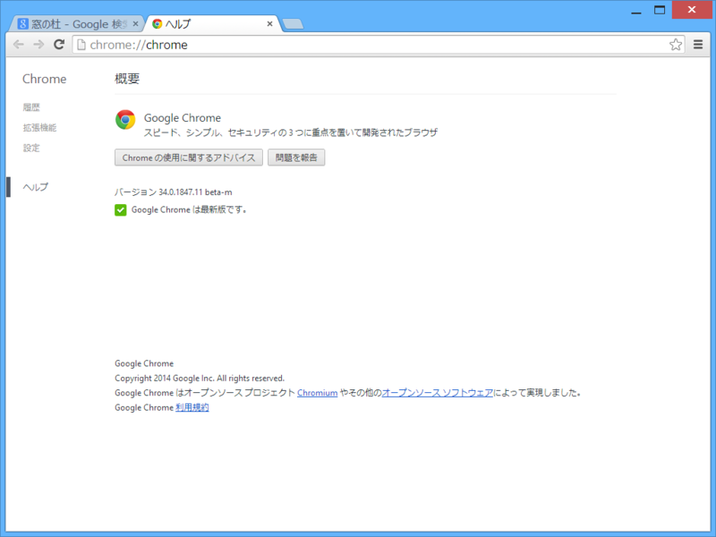
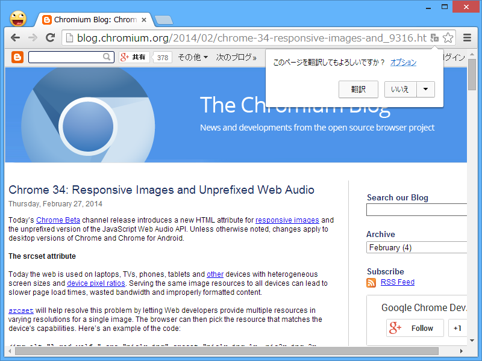
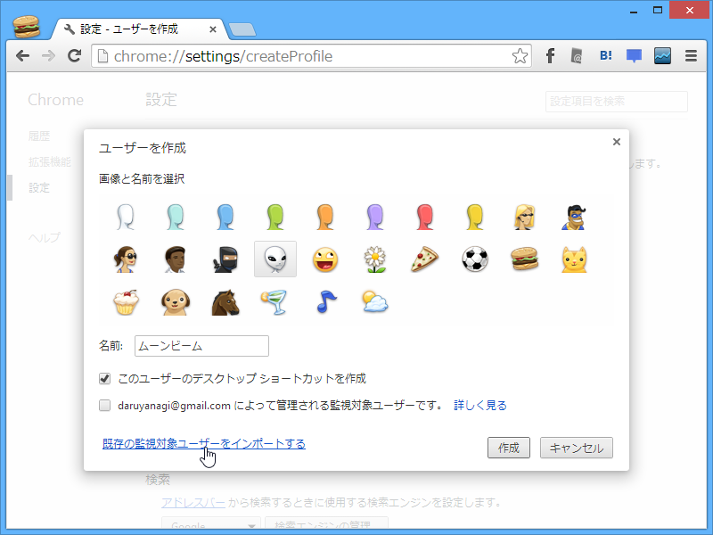
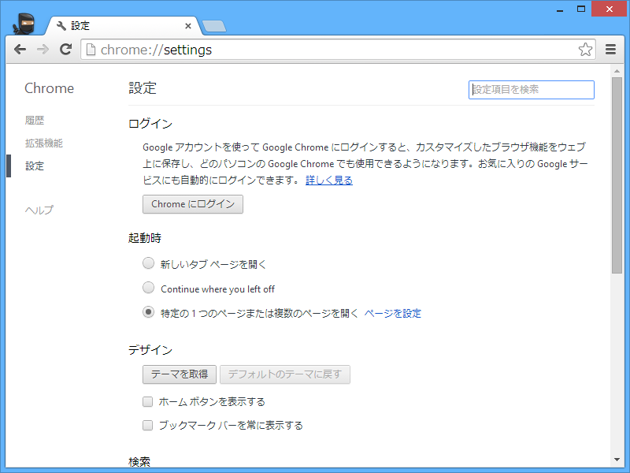

 

<ul>
<li><a href="http://www.google.com/intl/ja/chrome/browser/beta.html">Chrome &#x30D6;&#x30E9;&#x30A6;&#x30B6;</a></li>
<li><a href="http://blog.chromium.org/2014/02/chrome-34-responsive-images-and_9316.html">Chromium Blog: Chrome 34: Responsive Images and Unprefixed Web Audio</a></li>
<li><a href="http://googlechromereleases.blogspot.jp/2014/02/beta-channel-update_27.html">Chrome Releases: Beta Channel Update</a></li>
</ul>

翻訳ツールバーがポップアップになってた。あと、スクロールバーに矢印が復活したのかな。

監視対象ユーザーのインポート。

あと、今まで気づいてなかったのだけど“Continue where you left off”ってなんだろ。あとで調べよう。

