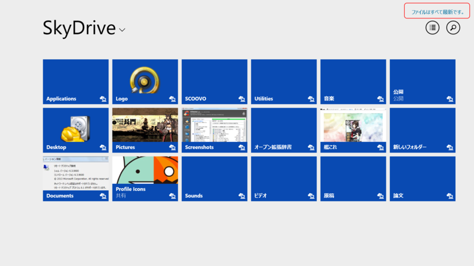
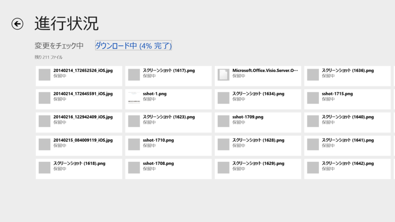
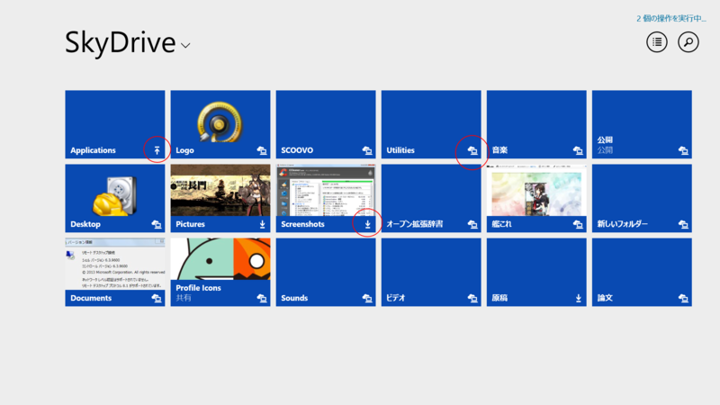

ストアアプリを起動して画面右上のリンクをクリック。

［同期］ボタンを押す。

SkyDrive……じゃなくて、OneDrive にファイルの変更がないかチェックされる。

変更があれば同期が始まるはず。

アップロード中のフォルダ（↑アイコン）、ダウンロード中のフォルダ（↓アイコン）、同期されたフォルダ（雲とコンピュータのアイコン）。オンラインで利用するフォルダーにはアイコンがつかない。

ちなみに、うちの環境だとまだ SkyDrive って表示されてるんだけど……引っ越しで昨日やっと PC をセットアップできたところなので、この2週間程度の間に公開された Update とかあてていけば OneDrive になるのかな。SkyDrive の名前が変わるというのでちょっと心配していたのだけど、そんなにダサい名前じゃなくて安心した。

