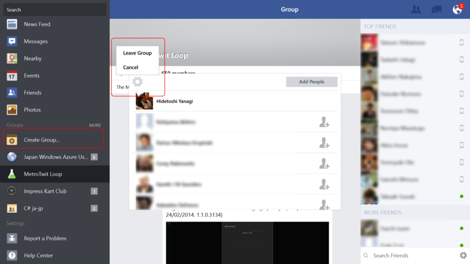

 

<h3>Facebook 1.2.0.12 → 1.3.0.9</h3>

 

<blockquote>

New features: 

<ul>
<li>Turn off chat</li>
<li>Narrower margins for snap view to show more content</li>
<li>Create/join/leave groups</li>
<li>Black and white high contrast modes</li>
<li>Edit privacy when editing posts</li>
<li>Double-tap to zoom photos full res</li>
<li>Accessibility enhancements</li>
<li>Bugfixes</li>
</ul>
Note: Windows 8.1 is required to run this app.

</blockquote>

<h4>Turn off chat</h4>

チャットのコンタクトリスト下部に設定ボタンが追加されている。

チャットをオフにした状態。

<h4>Create/join/leave groups</h4>

「あ、なかったんだー」って感じの機能。作成は左ペインで、参加と退会はグループ画面で参加人数の欄をタップ。参加者一覧の左上にある設定ボタンから。これはとても分かりにくいと思った。

<h4>Edit privacy when editing posts</h4>

これはないと困る人も多いのじゃないかな。

<ul>
<li><a href="http://apps.microsoft.com/windows/ja-jp/app/facebook/add3d66a-358d-4fe2-be68-8a3f934e9ea1">Windows &#x30B9;&#x30C8;&#x30A2; &#x306E; Windows &#x7528; Facebook &#x30A2;&#x30D7;&#x30EA;</a></li>
<li><a href="http://darulog.azurewebsites.net/archives/121">Facebook 1.2.0.6 for Windows 8.1 | &#x3060;&#x308B;&#x308D;&#x3050;&#xFF08;&#x907F;&#x96E3;&#x6240;&#xFF09;</a></li>
</ul>

