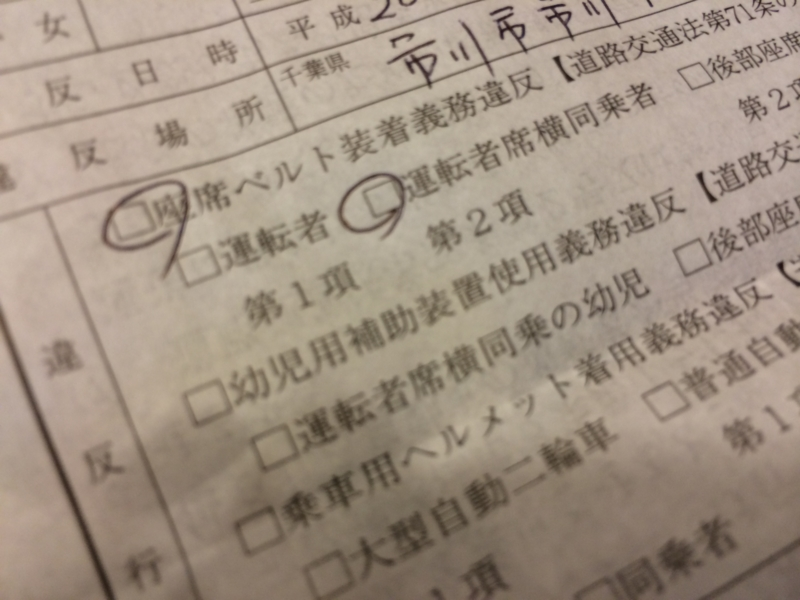

親父をクルマで市川駅へ送る途中に、シートベルト義務違反の違反切符をいただきました。ちょっとだけ助手席の同乗者さまがシートベルトを外すタイミングが早かった……あと30秒我慢していれば、駅についたのに。

まぁ、しょうがない。せっかくのゴールド免許だったのだけど。

<ul>
<li><a href="https://blog.daruyanagi.jp/entry/2013/05/02/212421">&#x305D;&#x306E; &#x9EC4;&#x91D1;&#x306E;&#x4E00;&#x679A;&#x306F;&hellip;&hellip; - &#x3060;&#x308B;&#x308D;&#x3050;</a>（一年もたなかったヨ！！）</li>
</ul>