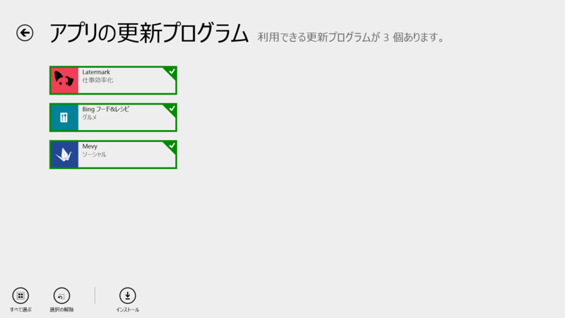
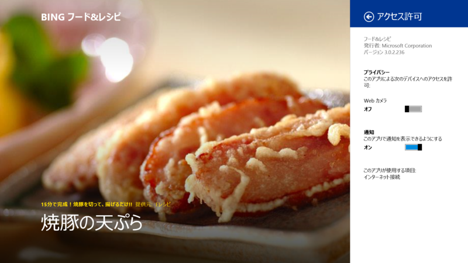
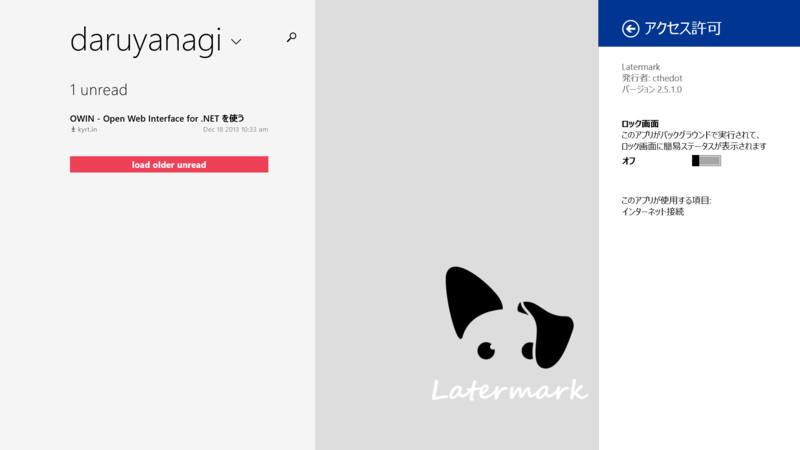
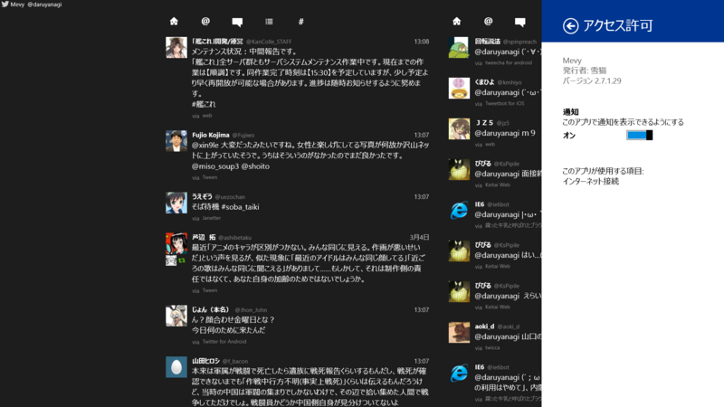
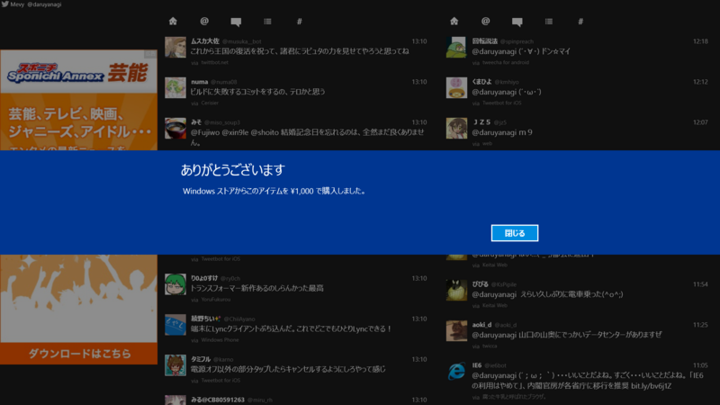

 

<h3>Bing フード&レシピ 3.0.2.229 → 3.0.2.236</h3>

Surface 2 を親父に売ったのだけど、今のところこのアプリが一番気に入っているようだ。この前、これを見ながら煮魚を作っていた。

<ul>
<li><a href="http://apps.microsoft.com/windows/ja-jp/app/bing-food-drink/fa01a69f-eb9f-4f1c-a83c-5344200dc045">Windows &#x30B9;&#x30C8;&#x30A2; &#x306E; Windows &#x7528; Bing &#x30D5;&#x30FC;&#x30C9;&amp;&#x30EC;&#x30B7;&#x30D4; &#x30A2;&#x30D7;&#x30EA;</a></li>
</ul>

<h3>Latermark 2.5.0.0 → 2.5.1.0</h3>

 

<blockquote>

v2.5.1

<ul>
<li>fix for some bookmarks crashing the app (thanks @furuki328 for the example links!)</li>
</ul>
</blockquote>

言うほど Read it later 系を使いこなしていないマン。

<ul>
<li><a href="http://apps.microsoft.com/windows/ja-jp/app/latermark/db1d9e9d-5e8b-48e8-affd-172d99dacdb9">Windows &#x30B9;&#x30C8;&#x30A2; &#x306E; Windows &#x7528; Latermark &#x30A2;&#x30D7;&#x30EA;</a></li>
</ul>

<h3>Mevy 2.6.1.27 → 2.7.1.29</h3>

 

<blockquote>

[2014/03/04] v2.7.1.29 
プロフィール画面で中断した際にタイムラインの取得ができない場合がある問題の修正 
プライバシーポリシーのURL変更 
公開国追加（韓国、台湾、香港）

</blockquote>

Twitter クライアントを論じると宗教戦争に発展するので苦手なのだけど、このクライアントは Metro アプリの中では最良のものの一つかなって思う。

<ul>
<li><a href="http://apps.microsoft.com/windows/ja-jp/app/mevy/31760b9c-38fb-4d95-a471-d2ee8d920ee5">Windows &#x30B9;&#x30C8;&#x30A2; &#x306E; Windows &#x7528; Mevy &#x30A2;&#x30D7;&#x30EA;</a></li>
</ul>

頑張ってね （ゝω・）vｷｬﾋﾟ

