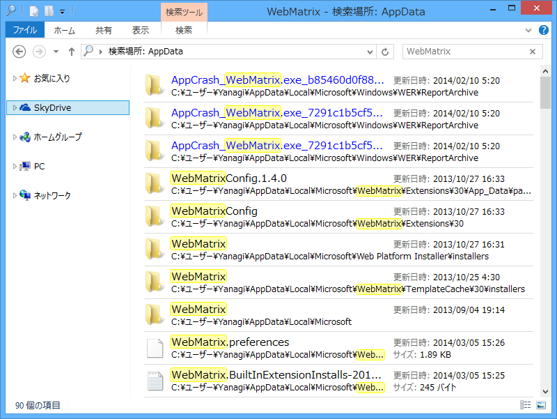
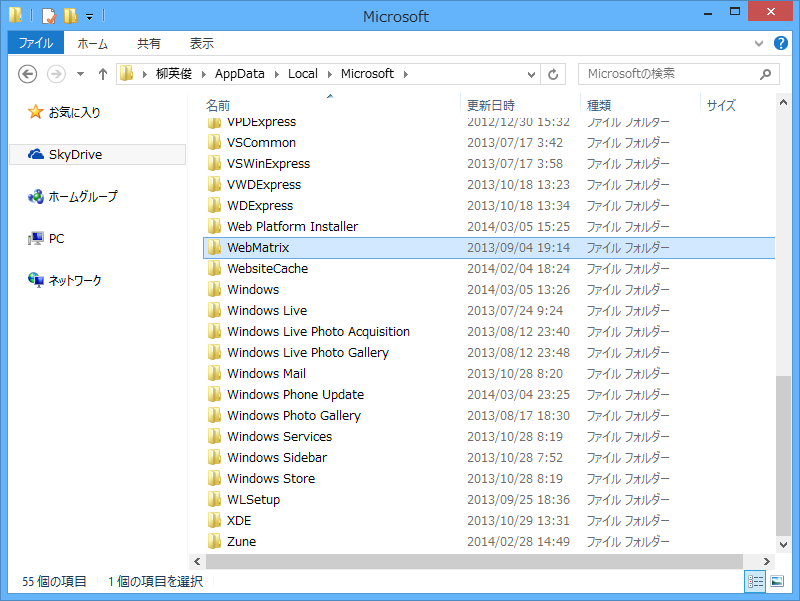
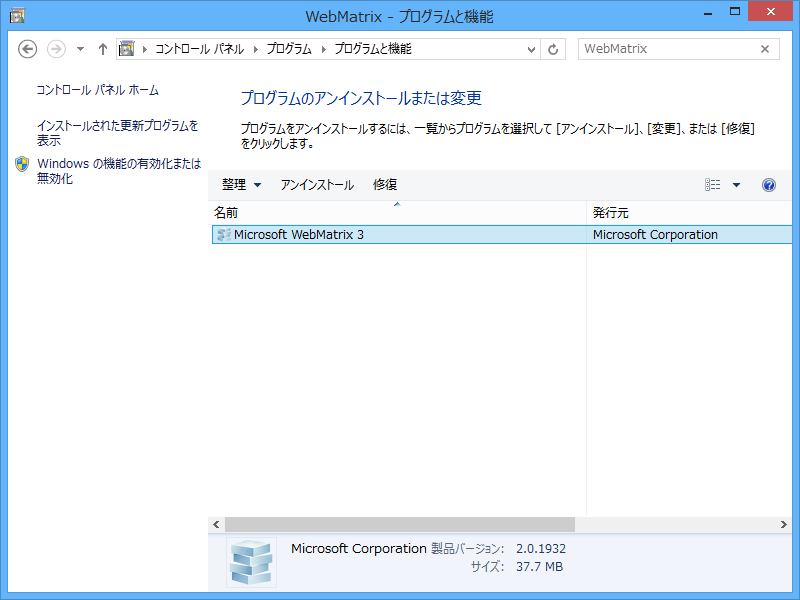
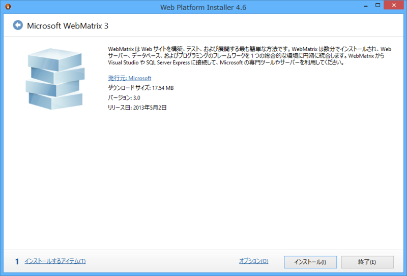
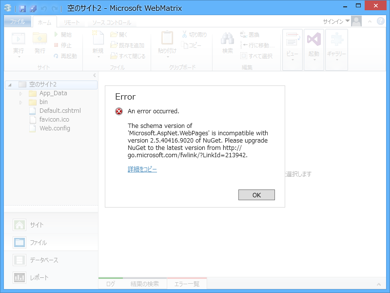
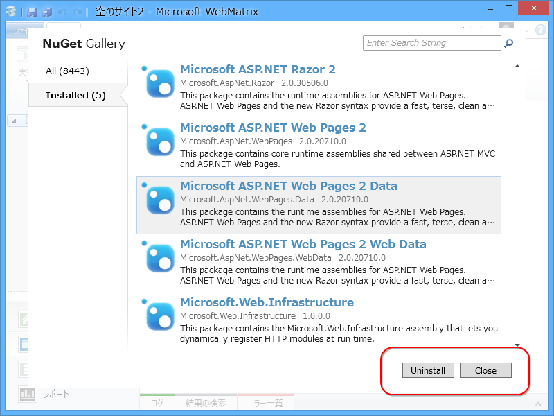
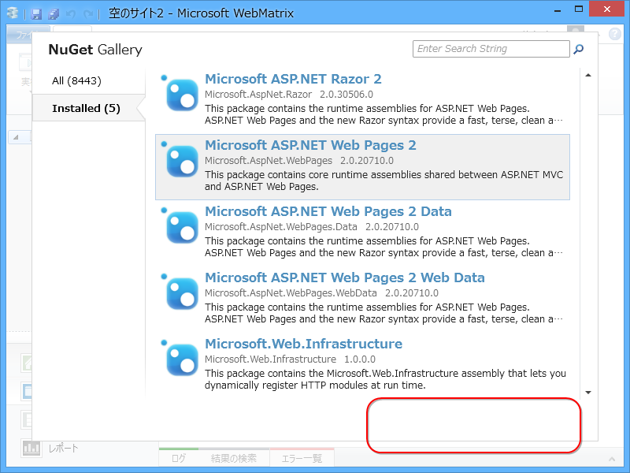

<a href="https://blog.daruyanagi.jp/entry/2014/01/31/094422">NuGet Pakage Manager 2.5.0 for WebMatrix - &#x3060;&#x308B;&#x308D;&#x3050;</a> を解決せずに放置していたのだけど、@ishisaka さんのツイートを見てもう一回チャレンジしようと思った。

とりあえず AppData 以下の関連フォルダを削除すればいいのね。

%USERPROFILE%\AppData\Local\Microsoft\WebMatrix が関係ありそうなので（これ意外にもある？）……

これをを削除して……

一度アンインストール。

んでもう一回 WebMatrix をインストールして……

NuGet Pakage Manager を更新。そして WebMatrix を再起動させると……どうやら今回は成功したみたい！

<blockquote cite="http://docs.nuget.org/docs/release-notes/nuget-2.8">

New capabilities include those such as 'Update All', 'Minimum NuGet Version', and allowing for overwriting of content files.

<cite><a href="http://docs.nuget.org/docs/release-notes/nuget-2.8">NuGet 2.8 Release Notes | Microsoft Docs</a></cite>
</blockquote>

とのことなので、活用していきたいですね。

<h4>追記</h4>

ただ、こんなエラーがでるようになってしまった。

<pre class="code" data-lang="" data-unlink>An error occurred.

The schema version of &#39;Microsoft.AspNet.WebPages&#39; is incompatible with version 2.5.40416.9020 of NuGet. Please upgrade NuGet to the latest version from http://go.microsoft.com/fwlink/?LinkId=213942.

System.InvalidOperationException: The schema version of &#39;Microsoft.AspNet.WebPages&#39; is incompatible with version 2.5.40416.9020 of NuGet. Please upgrade NuGet to the latest version from http://go.microsoft.com/fwlink/?LinkId=213942.
場所 NuGet.Manifest.CheckSchemaVersion(XDocument document)
場所 NuGet.Manifest.ReadFrom(Stream stream, IPropertyProvider propertyProvider, Boolean validateSchema)
場所 NuGet.LocalPackage.ReadManifest(Stream manifestStream)
場所 NuGet.OptimizedZipPackage.EnsureManifest()
場所 NuGet.OptimizedZipPackage..ctor(IFileSystem fileSystem, String packagePath)
場所 NuGet.LocalPackageRepository.OpenPackage(String path)
場所 NuGet.LocalPackageRepository.GetPackage(Func`2 openPackage, String path)
場所 NuGet.LocalPackageRepository.&lt;&gt;c__DisplayClass9.&lt;FindPackage&gt;b__5(String path)
場所 System.Linq.Enumerable.WhereSelectEnumerableIterator`2.MoveNext()
場所 System.Linq.Enumerable.WhereSelectEnumerableIterator`2.MoveNext()
場所 System.Linq.Enumerable.FirstOrDefault[TSource](IEnumerable`1 source)
場所 NuGet.LocalPackageRepository.FindPackage(Func`2 openPackage, String packageId, SemanticVersion version)
場所 NuGet.LocalPackageRepository.FindPackage(String packageId, SemanticVersion version)
場所 NuGet.PackageRepositoryExtensions.FindPackage(IPackageRepository repository, String packageId, SemanticVersion version, IPackageConstraintProvider constraintProvider, Boolean allowPrereleaseVersions, Boolean allowUnlisted)
場所 NuGet.DataServicePackage.EnsurePackage(IPackageCacheRepository cacheRepository)
場所 NuGet.DataServicePackage.GetSupportedFrameworks()
場所 NuGet.PackageRepositoryExtensions.&lt;&gt;c__DisplayClass2a.&lt;SupportsTargetFrameworks&gt;b__29(FrameworkName t)
場所 System.Linq.Enumerable.Any[TSource](IEnumerable`1 source, Func`2 predicate)
場所 NuGet.PackageRepositoryExtensions.SupportsTargetFrameworks(IEnumerable`1 targetFramework, IPackage package)
場所 NuGet.PackageRepositoryExtensions.&lt;&gt;c__DisplayClass27.&lt;GetUpdatesCore&gt;b__23(IPackage candidate)
場所 System.Linq.Enumerable.WhereEnumerableIterator`1.MoveNext()
場所 System.Collections.Generic.List`1.InsertRange(Int32 index, IEnumerable`1 collection)
場所 NuGet.PackageRepositoryExtensions.GetUpdatesCore(IPackageRepository repository, IEnumerable`1 packages, Boolean includePrerelease, Boolean includeAllVersions, IEnumerable`1 targetFramework, IEnumerable`1 versionConstraints)
場所 NuGet.DataServicePackageRepository.GetUpdates(IEnumerable`1 packages, Boolean includePrerelease, Boolean includeAllVersions, IEnumerable`1 targetFrameworks, IEnumerable`1 versionConstraints)
場所 NuGet.PackageRepositoryExtensions.GetUpdates(IPackageRepository repository, IEnumerable`1 packages, Boolean includePrerelease, Boolean includeAllVersions, IEnumerable`1 targetFrameworks, IEnumerable`1 versionConstraints)
場所 NuGet.WebMatrix.WebProjectManager.GetPackagesWithUpdates(String searchTerms, Boolean filterPreferredPackages)
場所 NuGet.WebMatrix.NuGetPackageManager.GetPackagesWithUpdates()
場所 NuGet.WebMatrix.NuGetModel.GetPackagesWithUpdates()
場所 NuGet.WebMatrix.FilterManager.GetUpdatePackages()
場所 System.Threading.Tasks.Task`1.InnerInvoke()
場所 System.Threading.Tasks.Task.Execute()</pre>

ほんとはあるはずのボタンが……

Microsoft.AspNet.WebPages のときだけない。

まぁ、このままでも使えるみたいだけど、毎回エラーダイアログがでるのは精神的によろしくないなぁ。

少しお門違いかなと思いつつも（WebMatrix/NuGet ではなく、パッケージの方の問題だと思う）、<a href="http://webmatrix.uservoice.com/forums/128313-webmatrix-suggestions">WebMatrix &#x306E; UserVoice</a> に似たようなバグフィックスの要望が上がっていたので、それに Vote しておいた。

