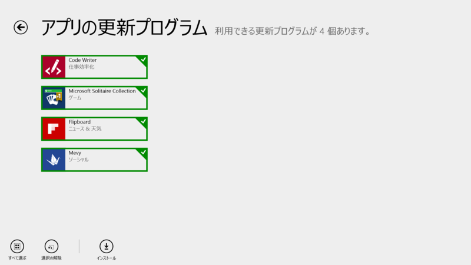
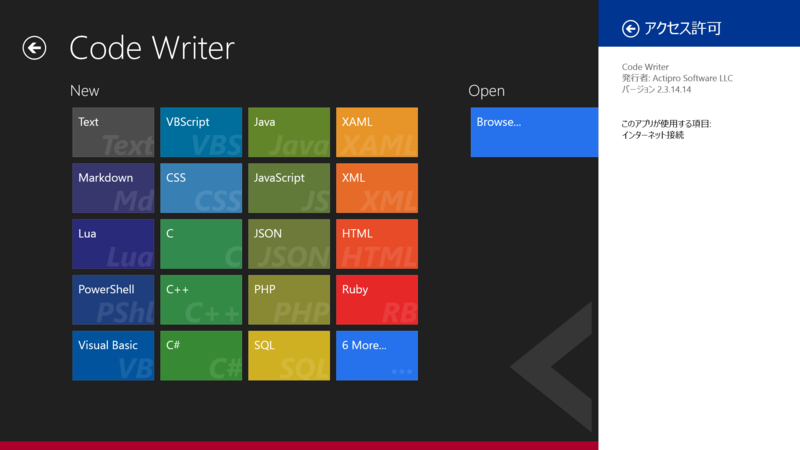
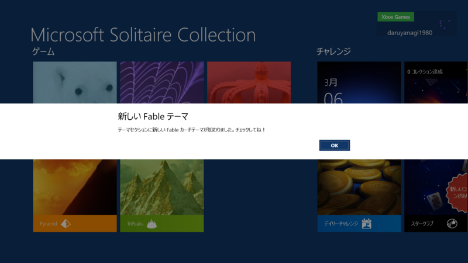
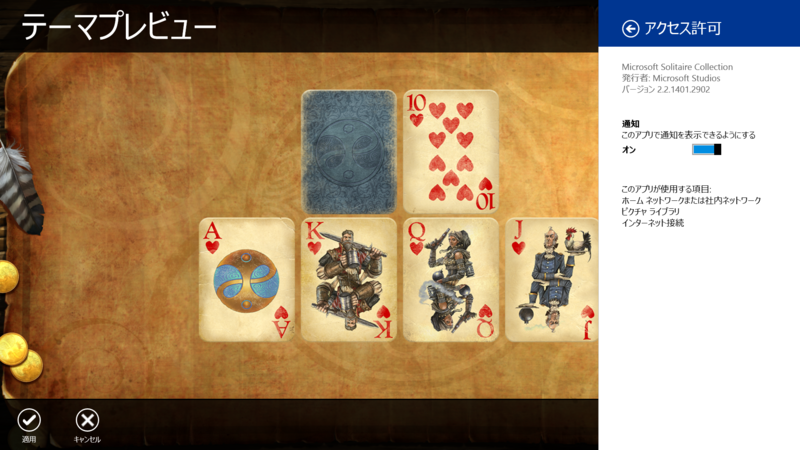

 

<h3>Code Writer 2.2.14.14 → 2.3.14.14</h3>

 

<blockquote>

Version 2.3 adds more user-requested features to Code Writer: 
CHANGED: Right-clicking mouse over code editor now shows a context menu. Right-click at top/bottom of screen, or left-click status bar to show app bars with mouse. 
ADDED: Editor settings option for whether context menus are enabled (instead of showing app bars on mouse right-click). 
ADDED: JSON file type. 
ADDED: Completion lists via Ctrl+Space to the JavaScript file type. 
ADDED: Improved delimiter auto-completion logic. 
ADDED: Block indent mode retains whitespace after the caret when Enter is pressed. 
ADDED: Ability to change character encoding for the current document via the Document Properties pane. 
ADDED: General settings option for analytics (error/anonymous usage stats) reporting. 
ADDED: .log and .srt files open with text file type. 
ADDED: .ass and .ssa files open with INI file type. 
FIXED: Documents saved with char encodings may not completely clear old file contents.

</blockquote>

日本語が入力できたらなぁ……。

<ul>
<li><a href="http://apps.microsoft.com/windows/ja-jp/app/code-writer/5149f454-94a7-40bc-90ef-eafd38355079">Windows &#x30B9;&#x30C8;&#x30A2; &#x306E; Windows &#x7528; Code Writer &#x30A2;&#x30D7;&#x30EA;</a></li>
</ul>

<h4>追記</h4>

<ul>
<li><a href="http://blog.actiprosoftware.com/post/2014/03/06/Code-Writer-v23-Released">Code Writer v2.3 Released</a></li>
</ul>

<h3>Microsoft Solitaire Collection 2.2.1401.2720 → 2.2.1401.2902</h3>

<blockquote>

<ul>
<li>Windows 8.1 に対応!</li>
<li>バグの修正および最適化</li>
<li>ご意見、ご感想をお聞かせください。Xbox フォーラムにて募集しております。 </li>
</ul>
<a href="http://aka.ms/SolitaireSupport">http://aka.ms/SolitaireSupport</a>

</blockquote>

リリースノートはテンプレだけど……

今回のアップデートで Fable カードテーマが追加されたらしい。

 

<blockquote cite="http://ejje.weblio.jp/content/fable">

fable 
【名詞】【可算名詞】 
1(動物などを擬人化して教訓を含んだ)寓話(ぐうわ) 《★【類語】 fairy tale [story] は子供のための妖精・魔法などの話》. 
用例		 
Aesop's Fables イソップ物語. 
2【不可算名詞】 [具体的には 【可算名詞】] 作り話，作り事. 
3[集合的には 【不可算名詞】] 伝説，説話，神話. 
【語源】 
ラテン語「話されること」の意; 【形容詞】 fabulous

<cite><a href="http://ejje.weblio.jp/content/fable">fable&#x306E;&#x610F;&#x5473; - &#x82F1;&#x548C;&#x8F9E;&#x5178; Weblio&#x8F9E;&#x66F8;</a></cite>
</blockquote>

なるほど。中世の革本のようなイメージ。

<ul>
<li><a href="http://apps.microsoft.com/windows/ja-jp/app/microsoft-solitaire-collection/1a36fd17-5161-4651-ae2d-13384e427ea8">Windows &#x30B9;&#x30C8;&#x30A2; &#x306E; Windows &#x7528; Microsoft Solitaire Collection &#x30A2;&#x30D7;&#x30EA;</a></li>
</ul>

<h3>Flipboard 2.0.6.0 → 2.0.7.0</h3>

リリースノートはないっぽい。多分今回のアップデートとは関係ないけど、<a href="http://inside.flipboard.com/2014/03/05/flipboard-acquires-zite/">Flipboard Acquires Zite | Inside Flipboard</a> なのだそうだ。

<ul>
<li><a href="http://apps.microsoft.com/windows/ja-jp/app/flipboard/e62e393a-acc9-40d9-a34a-13a41f2eeef0">Windows &#x30B9;&#x30C8;&#x30A2; &#x306E; Windows &#x7528; Flipboard &#x30A2;&#x30D7;&#x30EA;</a></li>
</ul>

<h3>Mevy 2.7.1.29 → 2.7.2.30</h3>

 

<blockquote>

[2014/03/05] v2.7.2.30 
認証と認証情報削除のボタンを設定コントラクトへ移動

</blockquote>

<ul>
<li><a href="http://apps.microsoft.com/windows/ja-jp/app/mevy/31760b9c-38fb-4d95-a471-d2ee8d920ee5">Windows &#x30B9;&#x30C8;&#x30A2; &#x306E; Windows &#x7528; Mevy &#x30A2;&#x30D7;&#x30EA;</a></li>
</ul>
 

<blockquote>

<a href="http://www.forest.impress.co.jp/docs/news/20140306_638359.html">&#x300C;MetroTwit&#x300D;&#x4EA1;&#x304D;</a>今、君の Twitter クライアントとしての立場は重要性を増している。

</blockquote>

