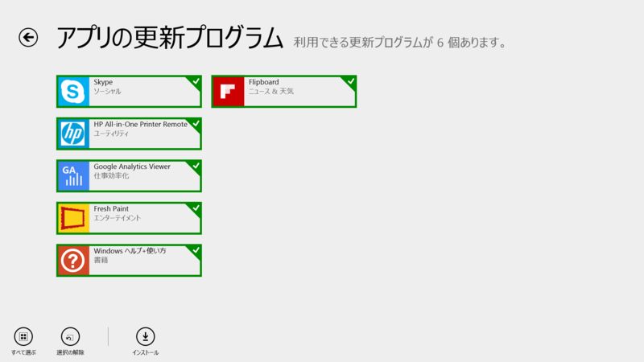
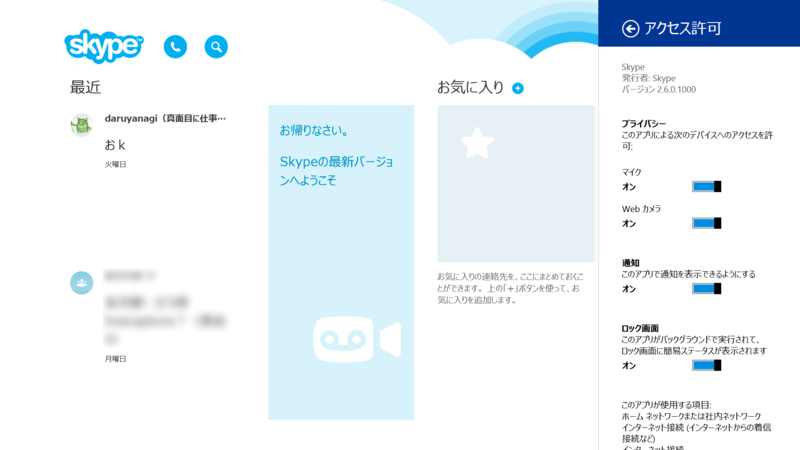
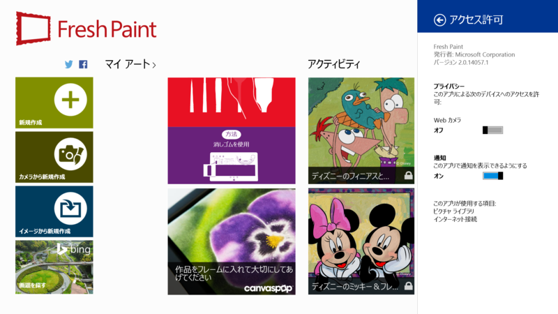
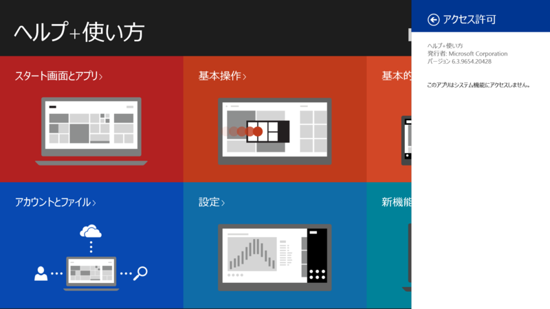
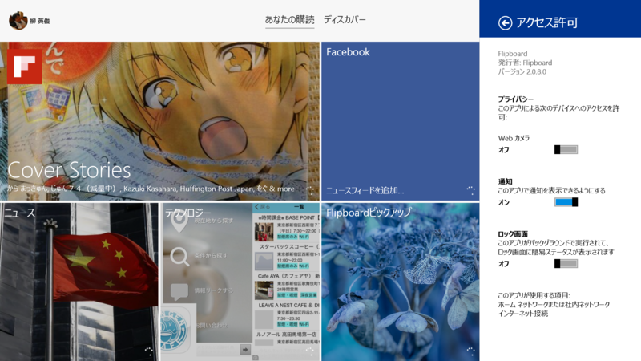

 

<h3>Skype 2.6.0.1000</h3>

 

<blockquote>

新機能：

<ul>
<li>別の場所で通話に応答した場合、Skypeの呼び出しは停止されます。</li>
</ul>
</blockquote>

そりゃいい機能だ。

<ul>
<li><a href="http://apps.microsoft.com/windows/ja-JP/app/skype/5e19cc61-8994-4797-bdc7-c21263f6282b">Windows &#x30B9;&#x30C8;&#x30A2; &#x306E; Windows &#x7528; Skype &#x30A2;&#x30D7;&#x30EA;</a></li>
</ul>

<h4>追記</h4>

<ul>
<li><a href="http://www.forest.impress.co.jp/docs/news/20140311_639013.html">Windows &#x30B9;&#x30C8;&#x30A2;&#x30A2;&#x30D7;&#x30EA;&#x7248;&#x300C;Skype&#x300D;&#x306E;&#x6700;&#x65B0;&#x7248;&#x300C;Skype for Modern Windows 2.6&#x300D;&#x304C;&#x516C;&#x958B; - &#x7A93;&#x306E;&#x675C;</a></li>
</ul>

<h3>Fresh Paint 2.0.14057.1</h3>

 

<blockquote>

バグ修正

</blockquote>

2.0.13345.1 からのマイナーアップデート。

<ul>
<li><a href="http://apps.microsoft.com/windows/ja-jp/app/fresh-paint/1926e0a0-5e41-48e1-ba68-be35f2266a03">Windows &#x30B9;&#x30C8;&#x30A2; &#x306E; Windows &#x7528; Fresh Paint &#x30A2;&#x30D7;&#x30EA;</a></li>
</ul>

<h3>Windows ヘルプ+使い方 アプリ 6.3.9654.20428</h3>

6.3.9600.20274 からの小幅アップデート。ちょっと思ったんだけど、このバージョンナンバーって Windows 8.1 のバージョン（6.3.9600）と関係あるのだろうか。

<ul>
<li><a href="http://apps.microsoft.com/windows/ja-jp/app/windows-help-tips/b577cb15-0f79-48c7-b3d9-cf350d74735f">Windows &#x30B9;&#x30C8;&#x30A2; &#x306E; Windows &#x7528; Windows &#x30D8;&#x30EB;&#x30D7;+&#x4F7F;&#x3044;&#x65B9; &#x30A2;&#x30D7;&#x30EA;</a></li>
</ul>

<h3>Flipboard 2.0.8.0</h3>

2.0.7.0 からのアップデート。最近ちょっと頻度高め。

<ul>
<li><a href="http://apps.microsoft.com/windows/ja-jp/app/flipboard/e62e393a-acc9-40d9-a34a-13a41f2eeef0">Windows &#x30B9;&#x30C8;&#x30A2; &#x306E; Windows &#x7528; Flipboard &#x30A2;&#x30D7;&#x30EA;</a></li>
</ul>

