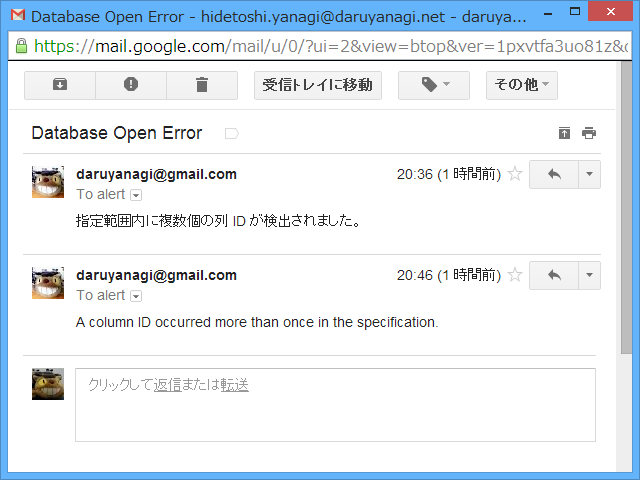

<a href="https://twitter.com/YanagiHidetoshi">Hidetoshi Yanagi&#xFF08;&#x7121;&#x8077;&#xFF09; (YanagiHidetoshi) on Twitter</a> に仕掛けておいた Twitter Bot が少しおかしいことに気が付いた。このブログのフィードだけ配信されていない。アプリが吐いたログを見ると、どうやらツイートが長すぎたようだ。修正、修正っと。

で、この問題は解決したのだけど、こういうことはメールでお知らせしてほしいなと思う。WebMatrix/ASP.NET Web Pages では簡単にメールが遅れるので、使わないなんて損だ。

以下は Gmail の SMTP サーバーを利用する場合。最初に WebMail クラスの設定をしておく。

<pre class="code lang-cs" data-lang="cs" data-unlink>// _AppStart.cshtml

@{
WebMail.SmtpServer=&quot;smtp.gmail.com&quot;;
WebMail.SmtpPort = 587;
WebMail.EnableSsl=true;
WebMail.UserName=&quot;***&quot;;
WebMail.From=&quot;***@gmail.com&quot;;
WebMail.Password=&quot;***&quot;;
}
</pre>
使い方はこんな感じ。

<pre class="code lang-cs" data-lang="cs" data-unlink>@{
try
{
（なんかエラーの起こりそうな処理）
}
catch (Exception e)
{
WebMail.Send(
             to: &quot;***@***.**&quot;,
             subject: &quot;Error が起こったで！&quot;,
             body: e.Message
);
}
}
</pre>

さっそく ALTER TABLE が失敗したメールが来た ／(＾o＾)＼

