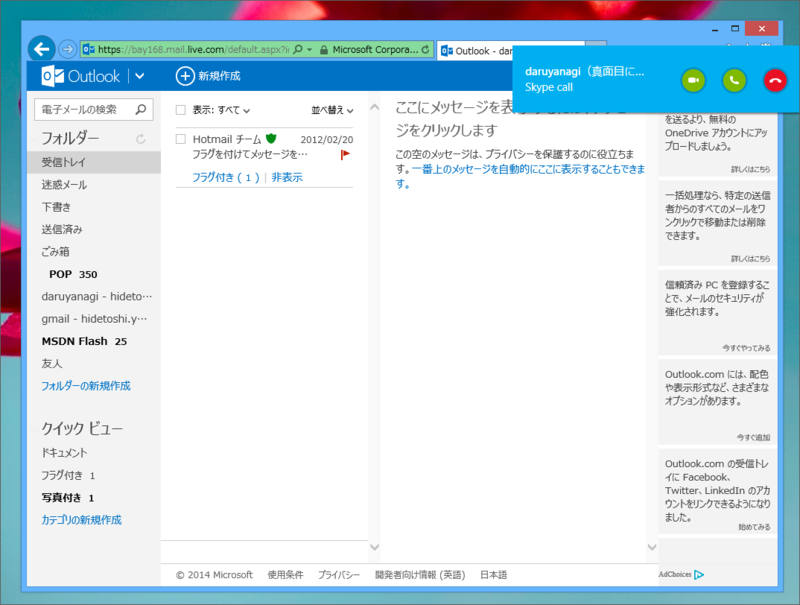

出た当初も試していたはずなんだけど、ちゃんと動いていなかったみたいで、気が付いていなかった。

<ul>
<li><a href="http://www.forest.impress.co.jp/docs/news/20140305_638114.html">&ldquo;Outlook.com&rdquo;&#x304B;&#x3089;&#x76F4;&#x63A5;&#x8A71;&#x305B;&#x308B;&#x300C;Skype for Outlook.com&#x300D;&#x304C;&#x5168;&#x4E16;&#x754C;&#x3067;&#x5229;&#x7528;&#x53EF;&#x80FD;&#x306B; - &#x7A93;&#x306E;&#x675C;</a></li>
</ul>
でも、“Outlook.com”で「Skype」ができるのが便利だなって思えるシチュエーションには、まだ出会えていない。

