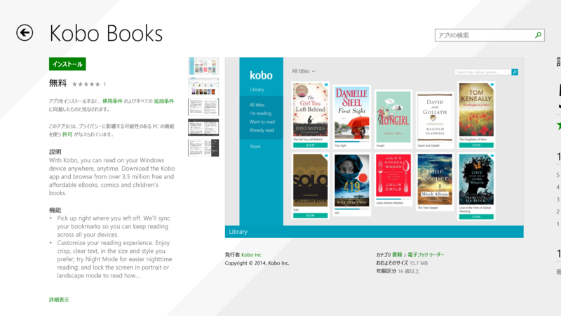
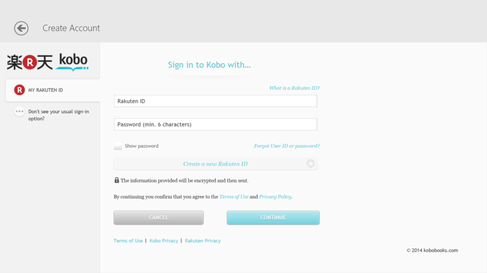
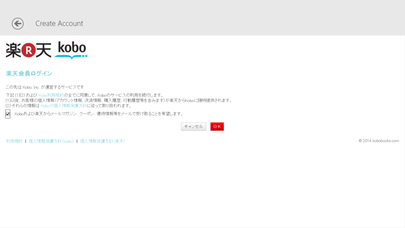
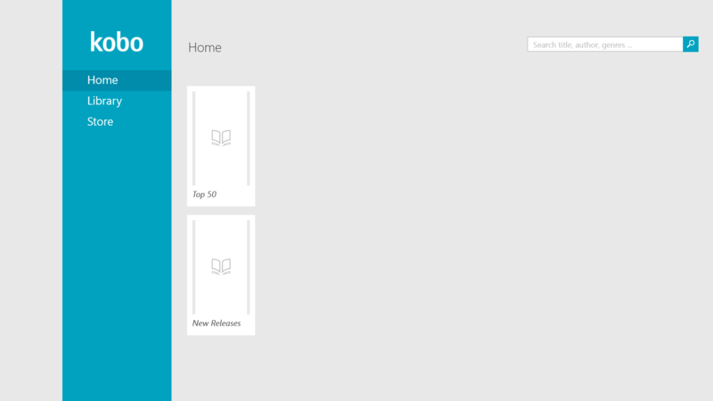
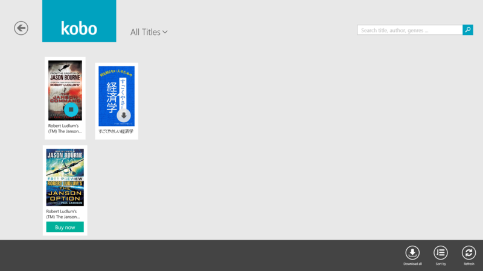
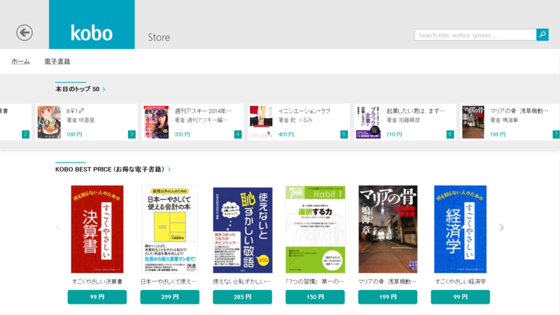
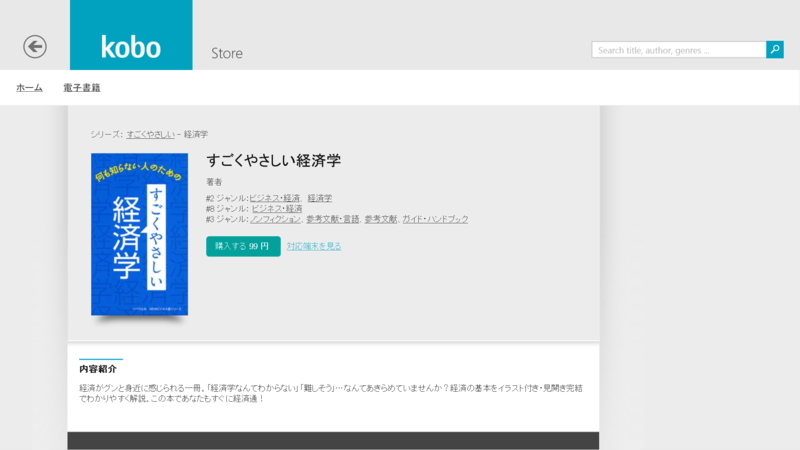
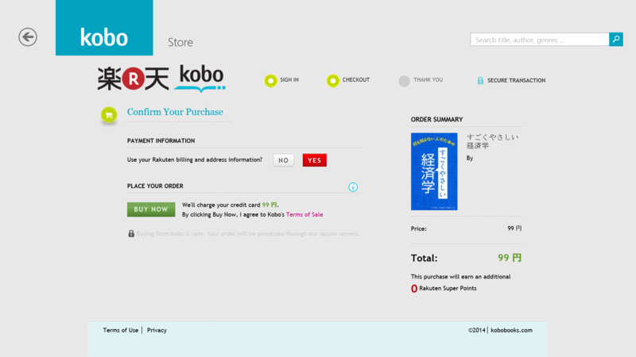
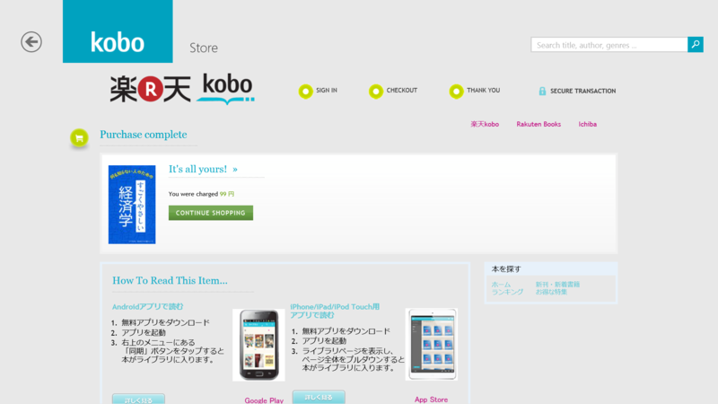
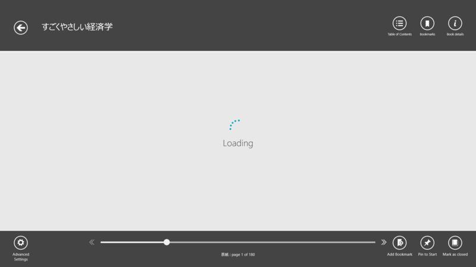

 

<blockquote cite="http://hon.jp/news/1.0/0/5309/">

楽天グループのKobo社（本社：カナダ・オンタリオ州）は現地時間3月7日、北米圏のWindows 8/RTユーザー向けにKobo電子書籍ビューワアプリをWindows Store上で公開した。

<cite><a href="http://hon.jp/news/1.0/0/5309/">hon.jp DayWatch - &#x697D;&#x5929;&#x30B0;&#x30EB;&#x30FC;&#x30D7;&#x306E;&#x52A0;Kobo&#x793E;&#x3001;&#x6B27;&#x7C73;&#x7248;Windows Store&#x3067;&#x65B0;Kobo&#x30D3;&#x30E5;&#x30FC;&#x30EF;&#x30A2;&#x30D7;&#x30EA;&#x3092;&#x516C;&#x958B;&#x3001;Windows RT&#x306B;&#x3082;&#x5BFE;&#x5FDC;</a></cite>
</blockquote>

“なお、今回公開されたのはあくまでも欧米版で、日本版Windows Storeではまだ公開されていない。”との由だが、試してみるとフツーにインストールできた<a href="#f1" name="fn1" title="“主に使用する言語のアプリをみつけやすくする”というオプションを有効化しておく必要があると思う。知らんけど">*1</a>ので、ちょっとだけ使ってみた。

<h3>Kobo Books 2.0.0.1224</h3>

スタートアップ。

楽天アカウント（ふぁーーー！）でログイン。メールマガジン送り付けようとするの、そろそろやめてほしいな<a href="#f2" name="fn2" title="あとで500円のクーポンもらったけどｗ">*2</a>。

<h4>Home</h4>

 

<h4>Library</h4>

（1冊買ってみた後の様子）

<h4>Store</h4>

ストアが内蔵なのは個人的には好感触。ブラウザー開くとかメンドイもんね。タッチで使いやすいデザインとも言えないし。

適当に1冊買ってみたった。

ところどころ UI が英語だけど……

フツーに買えた。

<h4>Viewer</h4>

ちょっと泣いた。なんだこれ。まぁ、日本での正式リリースに期待かな。

電子書籍を買ってすごくガッカリするのは、リフローだと思ったらそうじゃなかったりってこと。いろいろ大人の事情はあるんだろうけど、購入者側からしたらフォーマットがどうのこうのって話はどうでもいい話で、買ったデバイスでちゃんと読めなければダメなんだ。

アプリバーを展開。割りとオーソドックスな作りだと思った。ずっとローディング中だったけど、今日の実験はもうこれでいいやと思った次第。

<a href="#fn1" name="f1" class="footnote-number">*1</a>:“主に使用する言語のアプリをみつけやすくする”というオプションを有効化しておく必要があると思う。知らんけど

<a href="#fn2" name="f2" class="footnote-number">*2</a>:あとで500円のクーポンもらったけどｗ

