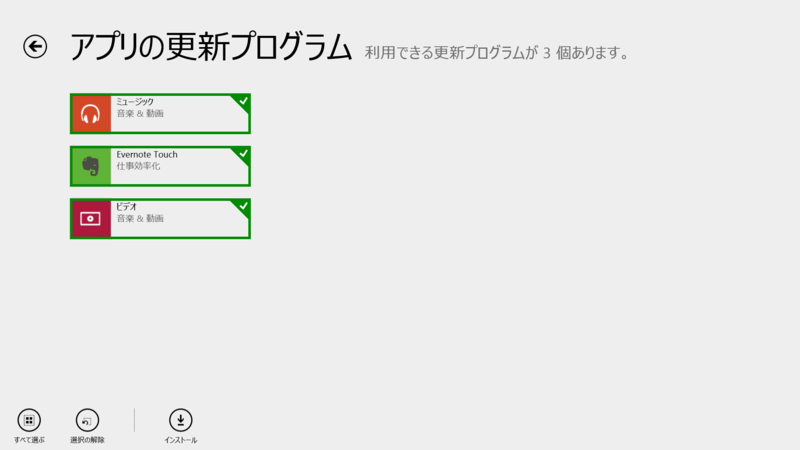
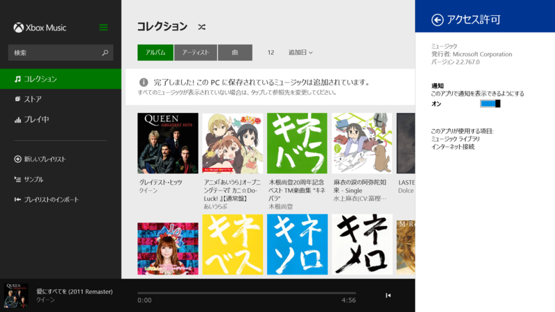
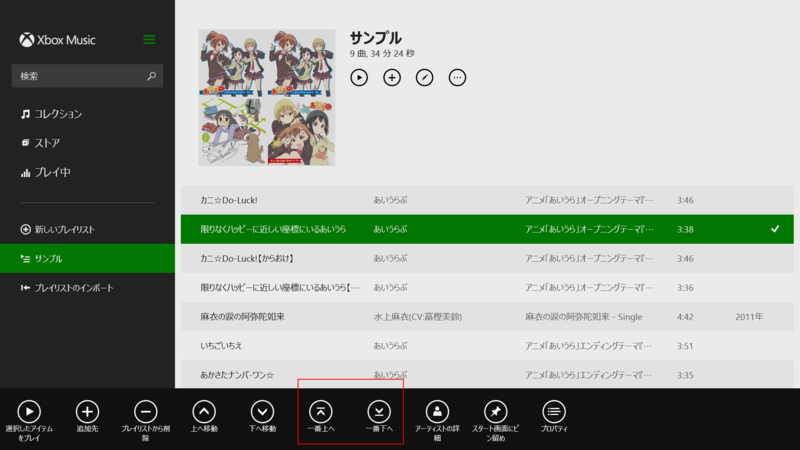
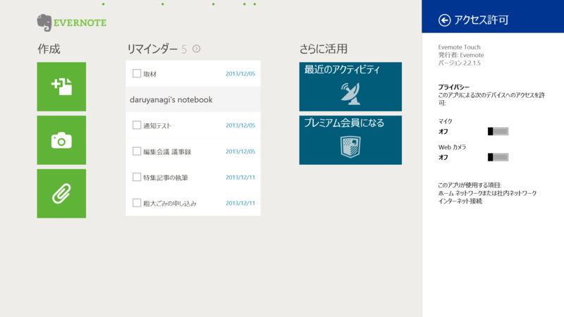
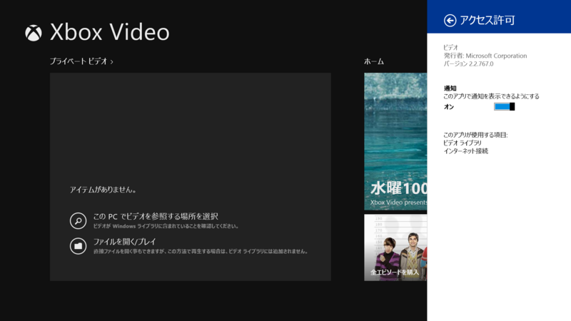

 

<h3>ミュージック 2.2.767.0</h3>

 

<blockquote>

アップデート内容: 

<ul>
<li>プレイリストに曲を追加してもコレクションには自動的に追加されなくなったため、別々に管理できるようになりました</li>
<li>プレイリストの並べ替えが簡単にできるようになりました。</li>
<li>曲を選択し、1 回のクリックで一番上または一番下に移動できます</li>
<li>アプリの信頼性とパフォーマンスの向上</li>
</ul>
お住まいの国や地域で利用できる機能は、Xbox Music の機能リストをご確認ください。 <a href="http://support.xbox.com/apps/windows-8/xbox-on-windows-features">http://support.xbox.com/apps/windows-8/xbox-on-windows-features</a>

</blockquote>

2.2.705.0 からのアップデート。

ボタン増えたで！！ コレクションとプレイリストで曲が独立管理できるようになったメリットはよくわからないけど、iTunes からインポートしたプレイリストの曲が勝手にコレクションに追加されない、とかそういう効果はあるのかもしれない。

<ul>
<li><a href="http://apps.microsoft.com/windows/ja-jp/app/music/16db93bf-8748-449a-96ba-e9ed3a5f872d">Windows &#x30B9;&#x30C8;&#x30A2; &#x306E; Windows &#x7528; &#x30DF;&#x30E5;&#x30FC;&#x30B8;&#x30C3;&#x30AF; &#x30A2;&#x30D7;&#x30EA;</a></li>
</ul>

<h3>Evernote Touch 2.2.1.5</h3>

 

<blockquote>

重要なノートや作業中のノートを忘れないためのリマインダー機能

<ul>
<li>リマインダーをノートに追加して、ノート一覧の上に固定して表示 </li>
<li>期日を設定して、アプリ内およびメールでの通知を受信</li>
<li>完了したノートを「実行済み」にする</li>
<li>共有ノートブックにあるノートのリマインダーを表示・リマインダー通知を受信</li>
</ul>
</blockquote>

2.2.0.17 からの小規模アップデート。

<ul>
<li><a href="http://apps.microsoft.com/windows/ja-jp/app/evernote-touch/5aba7f8c-318f-42aa-9590-b1fc31e5cba6">Windows &#x30B9;&#x30C8;&#x30A2; &#x306E; Windows &#x7528; Evernote Touch &#x30A2;&#x30D7;&#x30EA;</a></li>
</ul>

<h3>ビデオ 2.2.767.0</h3>

 

<blockquote>

アップデート内容: 

<ul>
<li>注目のセット: 映画やテレビ番組の名作が並んだイチオシのリスト</li>
<li>その他の修正 Xbox の映画ストアが利用可能な国や地域のみ。</li>
</ul>
お住まいの国や地域で利用できる機能は、Xbox Video の機能リストをご確認ください。 <a href="http://support.xbox.com/apps/windows-8/xbox-on-windows-features">http://support.xbox.com/apps/windows-8/xbox-on-windows-features</a>

</blockquote>

2.2.705.0 からのアップデート。

<ul>
<li><a href="http://apps.microsoft.com/windows/ja-jp/app/video/64b22df1-5a9c-4c88-aa1f-42cefaf8b281">Windows &#x30B9;&#x30C8;&#x30A2; &#x306E; Windows &#x7528; &#x30D3;&#x30C7;&#x30AA; &#x30A2;&#x30D7;&#x30EA;</a></li>
</ul>

