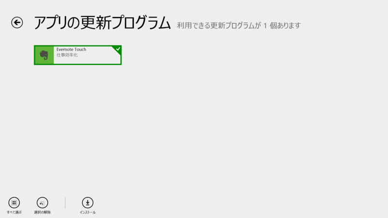
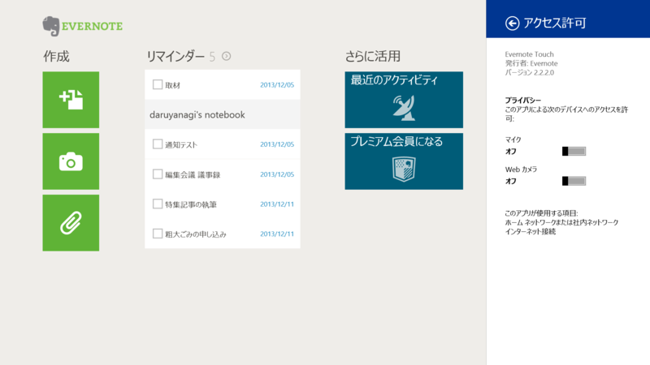

 

<h3>Evernote Touch 2.2.2.0</h3>

 

<blockquote>

重要なノートや作業中のノートを忘れないためのリマインダー機能

<ul>
<li>リマインダーをノートに追加して、ノート一覧の上に固定して表示 </li>
<li>期日を設定して、アプリ内およびメールでの通知を受信</li>
<li>完了したノートを「実行済み」にする</li>
<li>共有ノートブックにあるノートのリマインダーを表示・リマインダー通知を受信</li>
</ul>
</blockquote>

2.2.1.5 から。わりかし頻繁にアップデートしてくれるのはうれしい。

<ul>
<li><a href="http://apps.microsoft.com/windows/ja-jp/app/evernote-touch/5aba7f8c-318f-42aa-9590-b1fc31e5cba6">Windows &#x30B9;&#x30C8;&#x30A2; &#x306E; Windows &#x7528; Evernote Touch &#x30A2;&#x30D7;&#x30EA;</a></li>
</ul>

