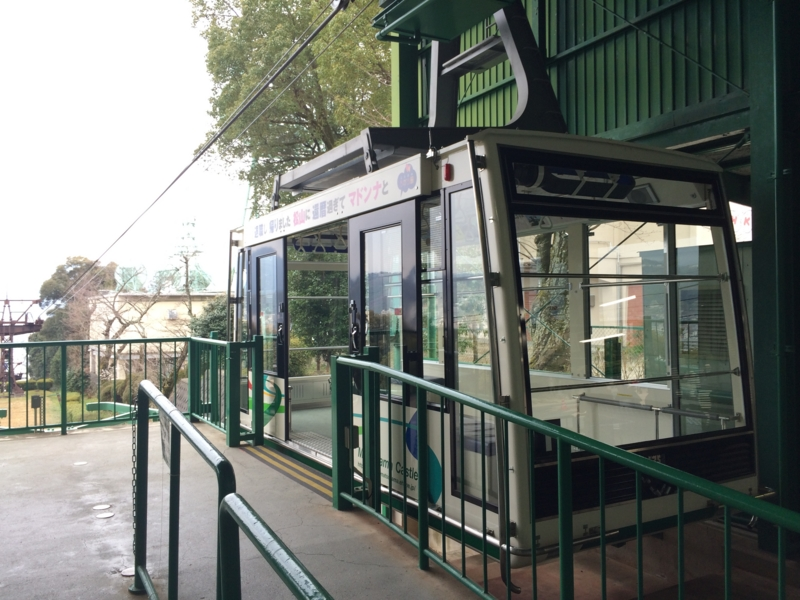
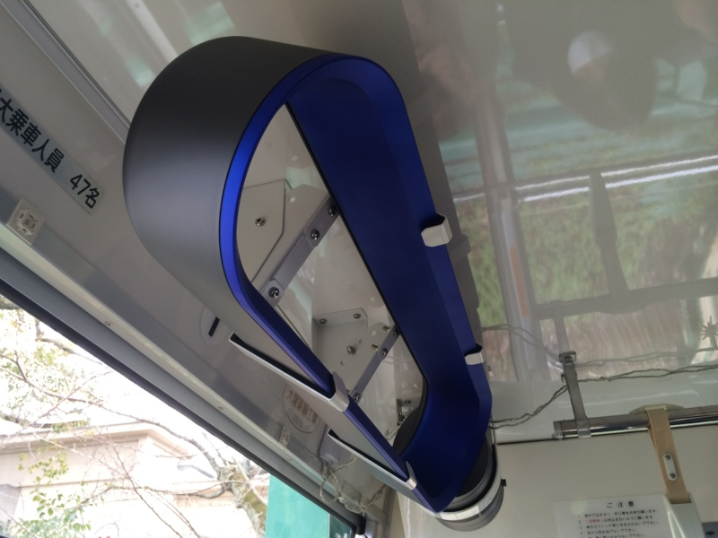

日曜日、親父を連れて松山城に登った。松山城に登るには、3つの方法がある。徒歩、リフト、そしてロープウェイだ。今回は行きにリフト、帰りにロープウェイを使った。ちなみに、リフトもロープウェイも料金は同じ。券売機にいるお姉さんにお願いすると、代わりに券を買ってくれる。値段は忘れた。

さて、このロープウェイなのだが。冷房（換気？）のために据え付けられている扇風機がダイソンなのだという話をネットで聞いたので、確認してみた。

マジだった。まぁ、これはこれでアリかも。

ロープウェイは割りと混むようで、少し肌寒いこの季節でも息苦しい感じだった。夏にはきっと活躍するに違いない。

<a href="http://www.amazon.co.jp/exec/obidos/ASIN/B007OQOWJI/bestylesnet-22/">dyson エアマルチプライアー AM02 タワーファン (アイアン/サテンブルー)</a>
<ul><li>出版社/メーカー: dyson(ダイソン)</li><li>発売日: 2012/04/20</li><li>メディア: ホーム&キッチン</li><li><a href="http://d.hatena.ne.jp/asin/B007OQOWJI/bestylesnet-22" target="_blank">この商品を含むブログを見る</a></li></ul>

<h4>追記</h4>

リフトもなかなかいいものですよ。自分はこっちのほうが好きだな、雨さえ降らなければ。

<ul>
<li><a href="https://blog.daruyanagi.jp/entry/2012/04/03/015810">&#x611B;&#x5A9B;&#x30FB;&#x677E;&#x5C71;&#x3067;&#x3060;&#x308B;&#x3060;&#x308B;&#x3057;&#x3066;&#x304D;&#x305F; - &#x3060;&#x308B;&#x308D;&#x3050;</a></li>
</ul>

