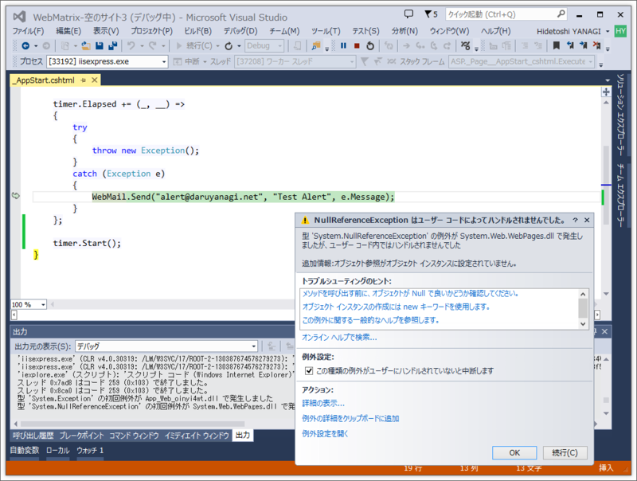
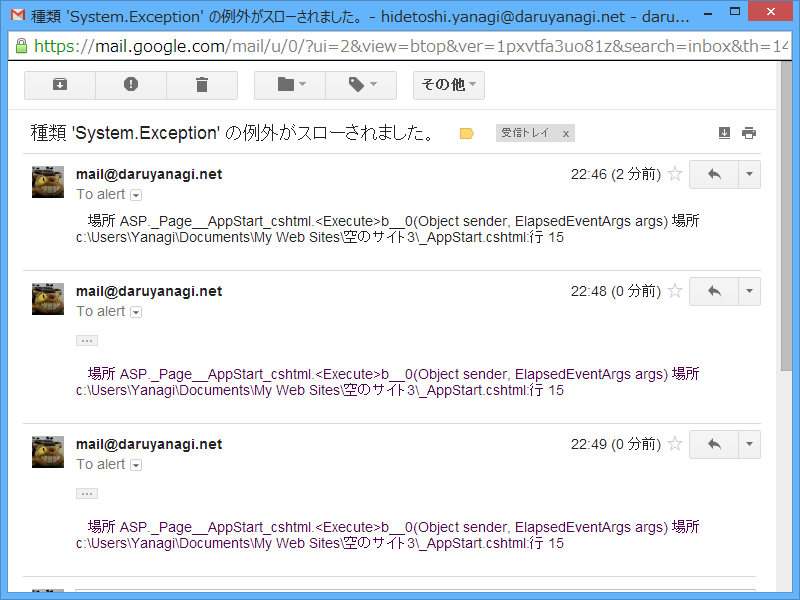

見事 WebMatrix で Gmail 経由のアラートメールが送れたわけだが（<a href="https://blog.daruyanagi.jp/entry/2014/03/08/220723">WebMatrix: Gmail &#x7D4C;&#x7531;&#x3067;&#x30A2;&#x30E9;&#x30FC;&#x30C8;&#x30E1;&#x30FC;&#x30EB;&#x3092;&#x9001;&#x308B; - &#x3060;&#x308B;&#x308D;&#x3050;</a>）、このやり方には一つ欠点（？　というか、仕様だな）があった。

たとえば、以下のようなコード。タイマーでとあるジョブ（必ず失敗する）を処理し、エラーが発生したらエラーメールを送る。

<pre class="code lang-cs" data-lang="cs" data-unlink>@{
WebMail.SmtpServer=&quot;smtp.gmail.com&quot;;
WebMail.SmtpPort = 587;
WebMail.EnableSsl=true;
WebMail.UserName=&quot;***&quot;;
WebMail.From=&quot;***@gmail.com&quot;;
WebMail.Password=&quot;***&quot;;

var timer = new System.Timers.Timer(1000 * 60);

timer.Elapsed += (sender, args) =&gt;
{
try
{
throw new Exception();
}
catch (Exception e)
{
WebMail.Send(&quot;***@***.com&quot;, e.Message, e.StackTrace);
}
};

timer.Start();
}
</pre>
これは失敗する。しかも、WebMatrix だと例外が捕捉できないので気づきにくい。

よくわからんけれど、WebMail は <a href="http://msdn.microsoft.com/ja-jp/library/system.web.helpers(v=vs.111).aspx">System.Web.Helpers Namespace () | Microsoft Docs</a> に属するみたいで、Page のスレッドじゃないと動作しないのかもしれない。そういえば昔、こういうシチュエーションで Server.MapPath() が使えなかった覚えがある。

<h3>解決策</h3>

System.Net.Mail.MailMessage と System.Net.Mail.SmtpClient を使ってみた。

<pre class="code lang-cs" data-lang="cs" data-unlink>@{
var timer = new System.Timers.Timer(1000 * 60);

timer.Elapsed += (sender, args) =&gt;
{
try
{
throw new Exception();
}
catch (Exception e)
{
SendMail(e.Message, e.StackTrace);
}
};

timer.Start();
}

@functions
{
public void SendMail(string title, string body)
{
using (var mail = new System.Net.Mail.MailMessage())
using (var smtp = new System.Net.Mail.SmtpClient())
{
try
{
mail.From = new System.Net.Mail.MailAddress(&quot;***@***.com&quot;);
mail.To.Add(new System.Net.Mail.MailAddress(&quot;***@***.com&quot;));
mail.Subject = title;
mail.Body = body;

smtp.Host = &quot;smtp.gmail.com&quot;;
smtp.Port = 587;
smtp.EnableSsl = true;
smtp.UseDefaultCredentials = false;
smtp.Credentials = new System.Net.NetworkCredential(&quot;***&quot;, &quot;***&quot;);
smtp.Send(mail);

System.Diagnostics.Debug.WriteLine(&quot;The mail has been sent successfully.&quot;);
}
catch(Exception e)
{
System.Diagnostics.Debug.WriteLine(e.Message);
}
}
}
}
</pre>
これは成功。

成功したのはいいけどアプリを止め忘れて、気が付いたら 100 通以上メールがきてた ／(＾o＾)＼

