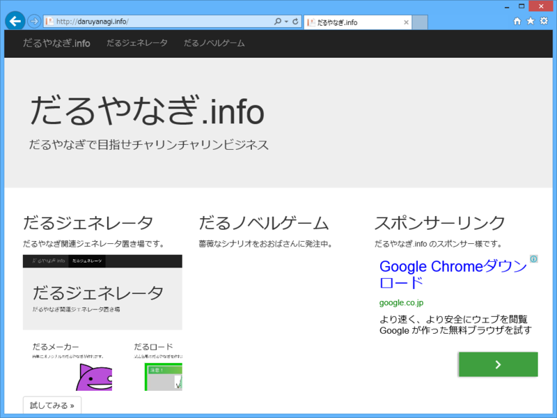

<a href="http://daruyanagi.info/">&#x3060;&#x308B;&#x3084;&#x306A;&#x304E;.info</a> は Twitter で女子高生を中心に幅広い人気を集める今話題のマスコットキャラクター“だるやなぎ”でチャリンチャリンリンビジネス（注: 小銭稼ぎの意と思われる）を計ろうとする不届きなサイトである。

この浅薄な Web サイトのメインコンテンツは今のところ<b>“だるジェネレータ”</b>のみとなっている。これは、Twitter などで利用できるオリジナルの“だるやなぎ”アイコンが畏れ多くもササッと作れる<b>“だるメーカー”</b>と、某広告風の“だるやなぎ”がパパッと作れる唾棄すべき<b>“だるロード”</b>で構成されている。この恥ずべきコンテンツは君たちが愛してやまない Windows Azure Web Sites（WAWS）<del>と君たちが全身全霊をこめて愛すべき ASP.NET Web Pages</del> で構築されているはずだ。

この天に唾を吐くがごとき不遜な Web サイトの運営は @shibayan によって行われている<a href="#f1" name="fn1" title="彼は小生から daruyanagi.azurewebsites.net を奪った怪しからぬ男である">*1</a>。小生は直接関わってはいないが、ここで得られたチャリンチャリンの一部はわたくしにも還元されるはず<a href="#f2" name="fn2" title="されなかったら、上野で襲撃するほかない">*2</a>なので、軽薄千万な資本主義に毒された皆さま方におかれては積極的に広告を踏み踏みしてほしいと願う次第である。

<blockquote class="twitter-tweet" lang="ja">
<a href="https://twitter.com/daruyanagi">@daruyanagi</a> 整えたから紹介してよ <a href="http://t.co/xpbdecpGTo">http://t.co/xpbdecpGTo</a>
&mdash; しばやん (@shibayan) <a href="https://twitter.com/shibayan/statuses/444692866086883328">2014, 3月 15</a></blockquote>

小生は @shibayan と異なり多忙を極めるため、なかなか Web サイトを更新する時間がとれないが、気が向いたときに <a href="http://daruyanagi.net/">http://daruyanagi.net/</a> からもリンクを張るつもりだ。

<h4>追記</h4>

<blockquote class="twitter-tweet">
<a href="http://t.co/9vTmtCdhhr">http://t.co/9vTmtCdhhr</a> Web Pages 使ってない。静的 html のみ
&mdash; しばやん (@shibayan) <a href="https://twitter.com/shibayan/statuses/444835156457553920">March 15, 2014</a></blockquote>

<blockquote class="twitter-tweet">
ちなみに <a href="http://t.co/ofHDuQqCB7">http://t.co/ofHDuQqCB7</a> は 100% Pure Visual Studio Online Monaco で開発しました
&mdash; しばやん (@shibayan) <a href="https://twitter.com/shibayan/statuses/444836187643969536">March 15, 2014</a></blockquote>

<a href="#fn1" name="f1" class="footnote-number">*1</a>:彼は小生から daruyanagi.azurewebsites.net を奪った怪しからぬ男である

<a href="#fn2" name="f2" class="footnote-number">*2</a>:されなかったら、上野で襲撃するほかない

