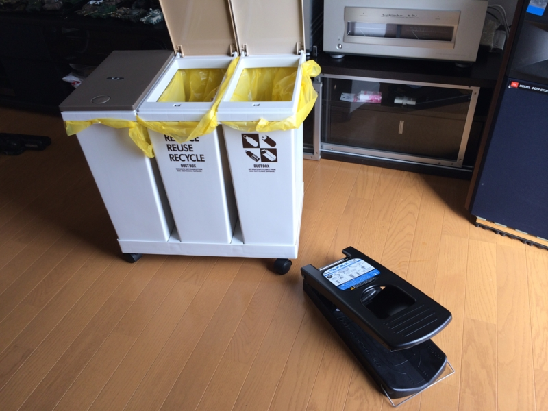

引っ越しを機会にいろいろなものを買ったのだけど、なかでもこれはかなり気に入った。

<a href="http://www.amazon.co.jp/exec/obidos/ASIN/B000FQOCC6/bestylesnet-22/">ぺんてる マルチプレス KPM1</a>
<ul><li>出版社/メーカー: ぺんてる</li><li>発売日: 2005/02/02</li><li>メディア: オフィス用品</li><li>購入: 2人 クリック: 3回</li><li><a href="http://d.hatena.ne.jp/asin/B000FQOCC6/bestylesnet-22" target="_blank">この商品を含むブログを見る</a></li></ul>

なんでぺんてるが缶つぶしなぞ作っているのかは知らぬが、さすがはぺんてる、なかなかよいクオリティだと思う。少しどっしり（約3Kg）としていて、剛性が高い……感じがする。噛み合わせ（？）もカッチリしていて、缶を潰すのがちょっと楽しい。350ml のビール缶から 2L の“お～いお茶”のペットボトルまで、我が家で消費される缶・ペットボトルの類はだいたいこれ一台でペチャンコにつぶせる。

この類の製品ではお値段が張る方だけど（4,000円弱）、しょうもないメーカのひ弱な缶つぶしを安く買って後悔するぐらいならば、こいつをお勧めしたいと思う。

ちなみに、一緒に写っているごみ箱はこれ。各20Lぐらいの容量で、缶・ペットボトルの分別に使っている。

<a href="http://www.amazon.co.jp/exec/obidos/ASIN/B0011F204W/bestylesnet-22/">アスベル 資源ゴミ横型3分別ワゴン</a>
<ul><li>出版社/メーカー: アスベル</li><li>メディア: ホーム&キッチン</li><li>購入: 2人 クリック: 33回</li><li><a href="http://d.hatena.ne.jp/asin/B0011F204W/bestylesnet-22" target="_blank">この商品を含むブログ (1件) を見る</a></li></ul>

キャスターがついているのが便利かと思ったが、それほど活用はしていない。

