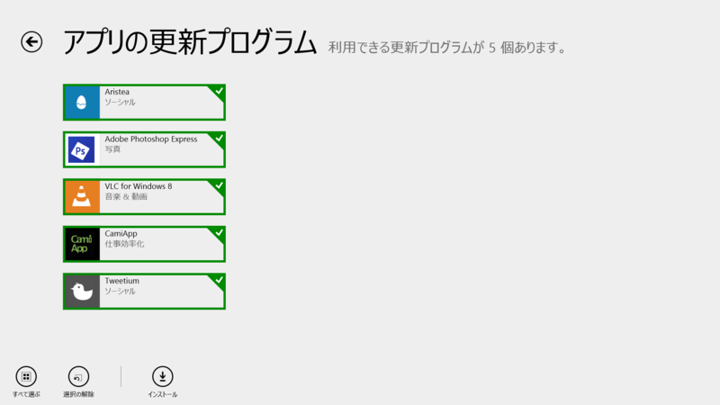
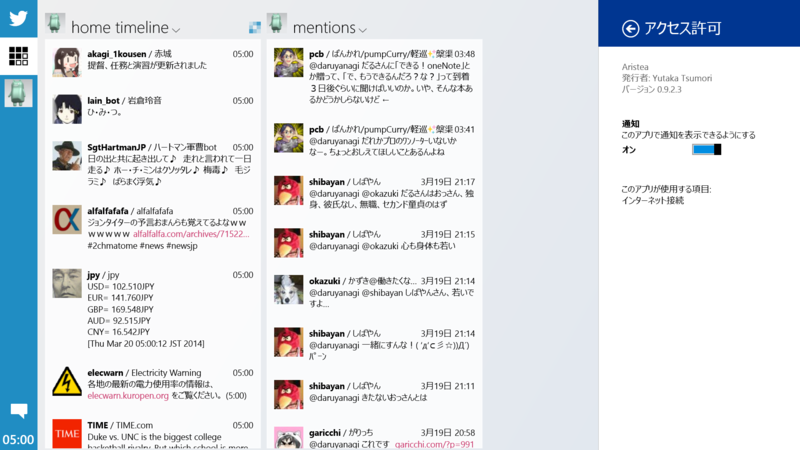
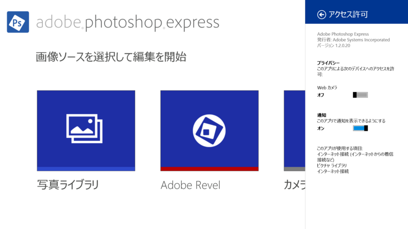
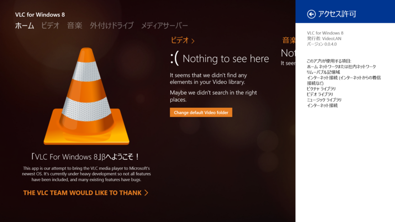
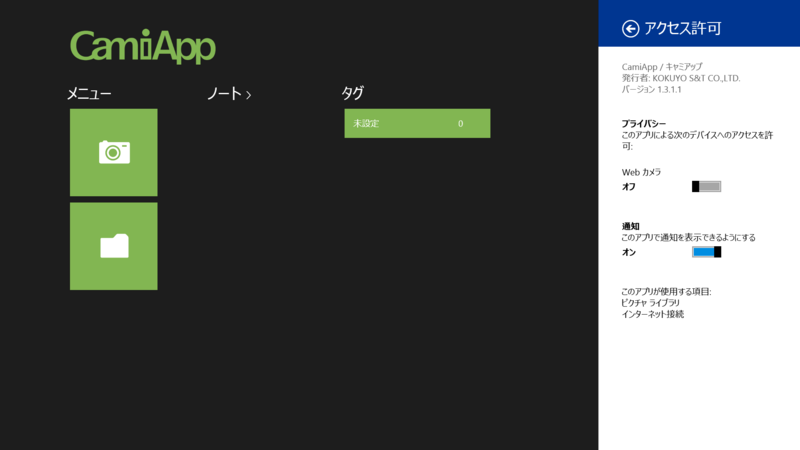
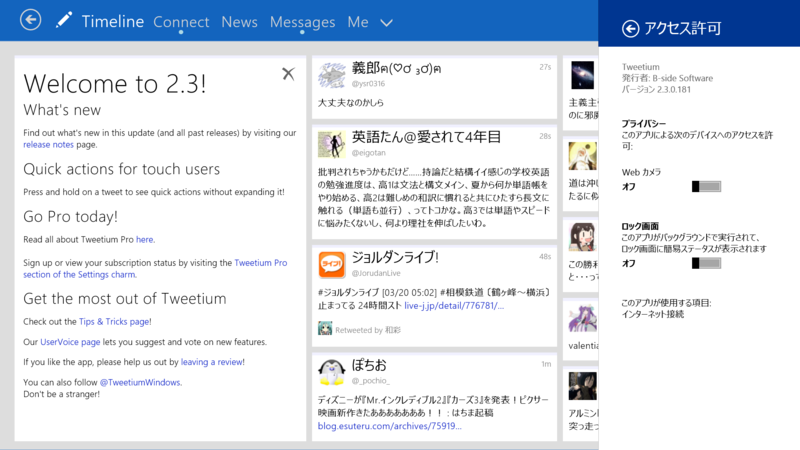
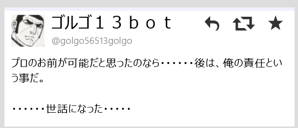
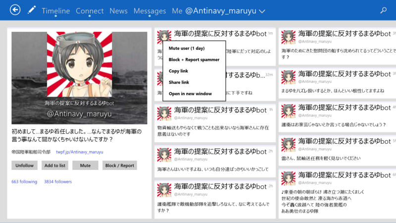

 

<h3>Aristea 0.9.2.3</h3>

 

<blockquote>

v0.9.2

<ul>
<li>幅320px のスナップ表示に対応しました</li>
<li>写真のアップロードに対応しました</li>
<li>カラムの並び替えに対応しました</li>
<li>使いやすさを向上しました</li>
<li>いくつかのショートカットキーを追加しました</li>
<li>細かい不具合を修正しました</li>
<li>画像のインラインプレビューを修正しました</li>
</ul>
</blockquote>

<s>0.9.3 の変更は書いてなかった。</s>そりゃそうだ。

<ul>
<li><a href="http://apps.microsoft.com/windows/ja-jp/app/88e09e92-fdc4-4510-96d9-649f20ad8ecf">Windows &#x30B9;&#x30C8;&#x30A2; &#x306E; Windows &#x7528; Aristea &#x30A2;&#x30D7;&#x30EA;</a></li>
</ul>

<h3>Adobe Photoshop Express 1.2.0.20</h3>

 

<blockquote>

<ul>
<li>バグ修正</li>
</ul>
</blockquote>

1.2.0.9 より。気付いてなかったけど、Adobe Photoshop Express って米国語と日本語しか出てなかったんだね。地味に日本が優遇されていた。

<ul>
<li><a href="http://apps.microsoft.com/windows/ja-jp/app/adobe-photoshop-express/c08a0d72-28a1-465a-9e70-6a5b80b44d60">Windows &#x30B9;&#x30C8;&#x30A2; &#x306E; Windows &#x7528; Adobe Photoshop Express &#x30A2;&#x30D7;&#x30EA;</a></li>
</ul>

<h3>VLC for Windows 8 0.0.4.0</h3>

 

<blockquote cite="http://www.jbkempf.com/blog/post/2014/Second-build-submitted-to-the-store">

It should notably fix the crash on start, on some machines, but other stability issues, on the music side too!

<cite><a href="http://www.jbkempf.com/blog/post/2014/Second-build-submitted-to-the-store">Second build submitted to the store - Yet another blog for JBKempf</a></cite>
</blockquote>

<a href="http://www.forest.impress.co.jp/docs/news/20140313_639404.html">VideoLAN&#x3001;&#x300C;VLC for Windows 8&#x300D;&#x30D9;&#x30FC;&#x30BF;&#x7248;&#x3092;&#x516C;&#x958B;&#x3002;&#x300C;VLC&#x300D;&#x304C;Windows &#x30B9;&#x30C8;&#x30A2;&#x30A2;&#x30D7;&#x30EA;&#x306B; - &#x7A93;&#x306E;&#x675C;</a> （0.0.2.0）からの初めてのアップデート……と思ったけど、0.0.3.0（Version 2）があったみたいだね。

<blockquote class="twitter-tweet" lang="ja">
Version 2 of the VLC for Windows 8 application is now on the store... It should fix the startup crash.&#10;Next release, during this week...
&mdash; VideoLAN (@videolan) <a href="https://twitter.com/videolan/statuses/445463059331821568">2014, 3月 17</a></blockquote>

なんか画面に違和感があると思ったら、<b>日本語がサポートされていた。</b>まずフランス語をサポートしろよ！

<ul>
<li><a href="http://apps.microsoft.com/windows/ja-jp/app/vlc-for-windows-8/c527ff2d-b5d0-45b6-bfc3-92fb7357ef72">Windows &#x30B9;&#x30C8;&#x30A2; &#x306E; Windows &#x7528; VLC for Windows 8 &#x30A2;&#x30D7;&#x30EA;</a></li>
</ul>

<h3>CamiApp 1.3.1.1</h3>

 

<blockquote>

――――――――――――――――――――――― 
【お知らせ】[V1.3.1] 
――――――――――――――――――――――― 
■アクションマーカー対応

<ul>
<li>アクションマーカーを使用すると、データ保存時に自動でタグ付けやクラウドサービスへのアップロードなどの動作を実行できます。</li>
</ul>
■対応クラウドサービス追加

<ul>
<li>「Evernote」に対応しました。</li>
</ul>
■タブレット端末対応

<ul>
<li>Lenovo Miix 2 8</li>
<li>Toshiba dynabook Tab VT484</li>
</ul>
※動作確認機種は随時更新予定

</blockquote>

1.2.0.1 より。そのうち試してみようと思っていてそのままなのだけど、まずノートを手に入れねばならぬ。

<ul>
<li><a href="http://apps.microsoft.com/windows/ja-jp/app/camiapp/f3166f41-79f2-4c04-b161-d1ab3f247e5e">Windows &#x30B9;&#x30C8;&#x30A2; &#x306E; Windows &#x7528; CamiApp &#x30A2;&#x30D7;&#x30EA;</a></li>
</ul>

<h3>Tweetium 2.3.0.181</h3>

 

<blockquote>

v2.3

<ul>
<li>Quick actions are now available to touch users by long-pressing on a tweet</li>
<li>Added reply and delete quick actions</li>
<li>RT and Favorite quick actions no longer appear on your own tweets</li>
<li>You can now report a user as a spammer by right-clicking or long-pressing on their username and selecting "Block + Report as spammer"</li>
<li>Quote Tweet now positions the caret at the start, rather than the end, of the text box</li>
<li>Welcome and What's New sections now stay in the default view until dismissed by the user</li>
<li>Fixed focus and scroll position loss in long DM threads after replying</li>
<li>Fixed a rare case where the view could be left faded out (transparent) if the first request fails after resuming the app</li>
<li>Fixed character count calculation for HTTPS URLs (was off by one)</li>
<li>Attempting to minimize impact of a Windows HttpClient bug which causes rare crashes</li>
<li>Improved handling of connection timeouts and service unavailable responses</li>
</ul>
</blockquote>

ツイートの長押しでクイックアクション。リプライやリツイート、ふぁぼなんかができるみたい。あと、自分のツイートにクイックアクションが表示されなくなった。

スクリーンネームのコンテキストメニューからスパブロも。

<ul>
<li><a href="http://apps.microsoft.com/windows/ja-jp/app/tweetium/4071d364-44bf-47ce-9eb7-d527e6f182a2">Windows &#x30B9;&#x30C8;&#x30A2; &#x306E; Windows &#x7528; Tweetium &#x30A2;&#x30D7;&#x30EA;</a></li>
</ul>

