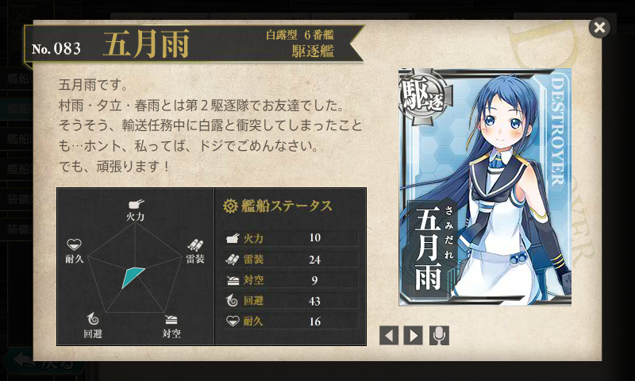

<a href="http://www.amazon.co.jp/exec/obidos/ASIN/4769826303/bestylesnet-22/">駆逐艦「五月雨」出撃す―ソロモン海の火柱 (光人社NF文庫)</a>
<ul><li>作者: 須藤幸助</li><li>出版社/メーカー: 光人社</li><li>発売日: 2009/12/30</li><li>メディア: 文庫</li><li> クリック: 2回</li><li><a href="http://d.hatena.ne.jp/asin/4769826303/bestylesnet-22" target="_blank">この商品を含むブログを見る</a></li></ul>

<a href="http://www.amazon.co.jp/registry/wishlist/17CIQBD4FKZQW/ref=cm_sw_r_tw_ws_Q3R9pb1CR9H37">Amazon.co.jp: &#x67F3;&#x82F1;&#x4FCA;: &#x30A6;&#x30A3;&#x30C3;&#x30B7;&#x30E5;&#x30EA;&#x30B9;&#x30C8;</a> に登録しておいたら、とある五月雨教徒から送られてきた。

<blockquote class="twitter-tweet">
<a href="https://twitter.com/daruyanagi">@daruyanagi</a> 五月雨推し提督のステマです。読み終えたらしっかり育てたまえよ。
&mdash; 友次郎（Yujiro.N） (@finalbeta) <a href="https://twitter.com/finalbeta/statuses/443663704408596480">March 12, 2014</a></blockquote>

五月雨教、恐ろしい。

ちなみに、この娘が駆逐艦・五月雨である。白露型駆逐艦は長女から

<ul>
<li><a href="http://ja.wikipedia.org/wiki/%E7%99%BD%E9%9C%B2_(%E7%99%BD%E9%9C%B2%E5%9E%8B%E9%A7%86%E9%80%90%E8%89%A6)">&#x767D;&#x9732; (&#x767D;&#x9732;&#x578B;&#x99C6;&#x9010;&#x8266;) - Wikipedia</a> : 一番艦！</li>
<li><a href="http://ja.wikipedia.org/wiki/%E6%99%82%E9%9B%A8_(%E7%99%BD%E9%9C%B2%E5%9E%8B%E9%A7%86%E9%80%90%E8%89%A6)">&#x6642;&#x96E8; (&#x767D;&#x9732;&#x578B;&#x99C6;&#x9010;&#x8266;) - Wikipedia</a> : サバイバル能力が異常に高い</li>
<li><a href="http://ja.wikipedia.org/wiki/%E6%9D%91%E9%9B%A8_(%E7%99%BD%E9%9C%B2%E5%9E%8B%E9%A7%86%E9%80%90%E8%89%A6)">&#x6751;&#x96E8; (&#x767D;&#x9732;&#x578B;&#x99C6;&#x9010;&#x8266;) - Wikipedia</a> : 影薄い。五月雨の同僚</li>
<li><a href="http://ja.wikipedia.org/wiki/%E5%A4%95%E7%AB%8B_(%E7%99%BD%E9%9C%B2%E5%9E%8B%E9%A7%86%E9%80%90%E8%89%A6)">&#x5915;&#x7ACB; (&#x767D;&#x9732;&#x578B;&#x99C6;&#x9010;&#x8266;) - Wikipedia</a> : ソロモンの悪夢。怖い</li>
<li><a href="http://ja.wikipedia.org/wiki/%E6%98%A5%E9%9B%A8_(%E7%99%BD%E9%9C%B2%E5%9E%8B%E9%A7%86%E9%80%90%E8%89%A6)">&#x6625;&#x96E8; (&#x767D;&#x9732;&#x578B;&#x99C6;&#x9010;&#x8266;) - Wikipedia</a> : 五月雨の同僚。艦これ未登場</li>
<li><a href="http://ja.wikipedia.org/wiki/%E4%BA%94%E6%9C%88%E9%9B%A8_(%E9%A7%86%E9%80%90%E8%89%A6)">&#x4E94;&#x6708;&#x96E8; (&#x99C6;&#x9010;&#x8266;) - Wikipedia</a></li>
<li><a href="http://ja.wikipedia.org/wiki/%E6%B5%B7%E9%A2%A8_(%E7%99%BD%E9%9C%B2%E5%9E%8B%E9%A7%86%E9%80%90%E8%89%A6)">&#x6D77;&#x98A8; (&#x767D;&#x9732;&#x578B;&#x99C6;&#x9010;&#x8266;) - Wikipedia</a> : 艦これ未登場</li>
<li><a href="http://ja.wikipedia.org/wiki/%E5%B1%B1%E9%A2%A8_(%E7%99%BD%E9%9C%B2%E5%9E%8B%E9%A7%86%E9%80%90%E8%89%A6)">&#x5C71;&#x98A8; (&#x767D;&#x9732;&#x578B;&#x99C6;&#x9010;&#x8266;) - Wikipedia</a> : 艦これ未登場</li>
<li><a href="http://ja.wikipedia.org/wiki/%E6%B1%9F%E9%A2%A8_(%E7%99%BD%E9%9C%B2%E5%9E%8B%E9%A7%86%E9%80%90%E8%89%A6)">&#x6C5F;&#x98A8; (&#x767D;&#x9732;&#x578B;&#x99C6;&#x9010;&#x8266;) - Wikipedia</a> : 艦これ未登場</li>
<li><a href="http://ja.wikipedia.org/wiki/%E6%B6%BC%E9%A2%A8_(%E9%A7%86%E9%80%90%E8%89%A6)">&#x6DBC;&#x98A8; (&#x99C6;&#x9010;&#x8266;) - Wikipedia</a> : なぜか下町言葉の娘。なぜそういう設定なのかは知らない</li>
</ul>
となっていて、海風以下は「改白露型」とも呼ばれる（艦橋のエッジがとれて丸くなってるのが外見上の大きな特徴）。

本書は簡単な日記の体裁になっているが、戦闘のあったときは記述が記述が時刻単位になり、否が応にも切迫した雰囲気が伝わってくる。以下は、簡単な感想の羅列。

<ul>
<li>最初の上司は「那珂」ちゃん。割りとちゃんと仕事をしていて、意外に感じる。川内型では「神通」がちょっとだけ出てくるほか、最後の方で「川内」とも少し関わりをもつ。</li>
<li>その「川内」ちゃんと組んだ輸送作戦で <a href="http://ja.wikipedia.org/wiki/%E3%83%96%E3%83%BC%E3%82%B2%E3%83%B3%E3%83%93%E3%83%AB%E5%B3%B6%E6%B2%96%E6%B5%B7%E6%88%A6">&#x30D6;&#x30FC;&#x30B2;&#x30F3;&#x30D3;&#x30EB;&#x5CF6;&#x6C96;&#x6D77;&#x6226; - Wikipedia</a> に遭遇。「白露」と衝突して損傷するも、辛うじてラバウル港に退避する。航行不能と言っていた「白露」さんがちゃっかり先に到着しているのが笑どころ。</li>
<li>「時雨」さんは異次元の強さ。</li>
<li>この海戦で「五月雨」さんは誘爆の危険がある魚雷を廃棄ついでに目暗撃ち。敵艦を撃沈したと誤認している。</li>
<li>第二駆逐隊のうち、「夕立」さんは隊を離れて無双。「村雨」「五月雨」「春雨」で組むことが長かったみたい。読んでてこのトリオに愛着わきすぎて、「村雨」「春雨」が失われて第二駆逐隊が事実上解体状態になったときは悲しかった。</li>
<li>「由良」の最期に立ち会う。ここでも「夕立」さんが有能で、生存者を多く助けていた。</li>
<li>一番のドジは <a href="http://ja.wikipedia.org/wiki/%E7%AC%AC%E4%B8%89%E6%AC%A1%E3%82%BD%E3%83%AD%E3%83%A2%E3%83%B3%E6%B5%B7%E6%88%A6">&#x7B2C;&#x4E09;&#x6B21;&#x30BD;&#x30ED;&#x30E2;&#x30F3;&#x6D77;&#x6226; - Wikipedia</a> で敵と交戦中の戦艦「比叡」さんに機銃弾をぶち込んだことだと思う。ちなみに、「比叡」さんも「五月雨」に反撃している。「比叡」の直衛が気まずくて、「霧島」姐さんの直衛についているところは可愛い。</li>
<li>この海戦で異次元の活躍をして戦闘不能になった「夕立」さんの艦長・乗組員を救助している。「夕立」の艦長は優秀だが、「駆逐艦を二隻乗り潰した有能だがちょっと冷たい男」として描かれている。</li>
<li>「夕立」艦長が「頼めんかな」と「夕立」の処分を頼むシーンは心に残った。しかし、状況がそれを許さなかった。</li>
<li>その「夕立」さんから郵便物を受け取ったりしている。怖いばかりじゃないっポイ。</li>
<li>「長良」ともちょっと組んだ。気のせいか「那珂」ちゃんより「神通」「長良」がボスのときの方が戦闘がキビキビしている。</li>
<li>対空戦闘が苦手っぽい。新鋭駆逐艦「秋月」の対空装備を興味深く描いている。</li>
<li>奇跡の <a href="http://ja.wikipedia.org/wiki/%E3%82%AD%E3%82%B9%E3%82%AB%E5%B3%B6%E6%92%A4%E9%80%80%E4%BD%9C%E6%88%A6">&#x30AD;&#x30B9;&#x30AB;&#x5CF6;&#x64A4;&#x9000;&#x4F5C;&#x6226; - Wikipedia</a> にも参加。南方との温度差がヤバい</li>
<li>戦闘以外にも港内の掃海や潜水艦の掃討、大型艦の直衛と、割と忙しい日々を送っている。</li>
<li>敵の電探うらやましい。</li>
<li>艦内の人間関係は割りとめんどくさいな。</li>
</ul>
最期は座礁……このドジっ子！　けれど「『五月雨』という艦だけは戦争が終わるまで残しておきたい、たとえ沈んだとしてもマストだけでも海面から出しておきたい」という松原艦長の願いだけは叶えられた。日記だけど妙に伏線が回収してあって、割りといいストーリーになっている。

