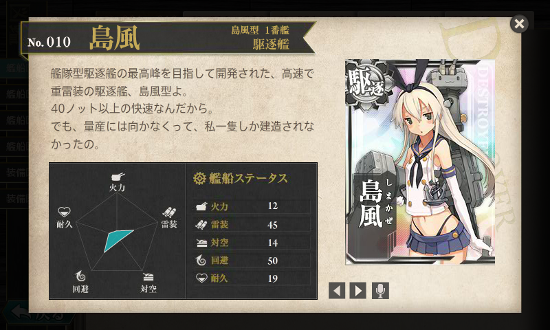

<a href="https://blog.daruyanagi.jp/entry/2014/01/31/180755">&#x682A;&#x5F0F;&#x4F1A;&#x793E; Impress Watch&#x30FB;&#x7A93;&#x306E;&#x675C;&#x7DE8;&#x96C6;&#x90E8;&#x3092;&#x9000;&#x8077;&#x3057;&#x307E;&#x3057;&#x305F;&#x3002; - &#x3060;&#x308B;&#x308D;&#x3050;</a> 経由でオファーを受けたので、頑張ってみることにしました。もともと歴史は好きなんですけど、世界史のひとだったので日本史はそれほど詳しくもなく。読んでてわりと面白いです。歴史のウンチク好きな人には割りとお勧めできるサイトだと思うので、もし気が向いたらフィードを購読してみてくださいね。

<ul>
<li><a href="http://bushoojapan.com/">&#x6B74;&#x53F2;&#x6226;&#x56FD;&#x3067;&#x30EF;&#x30AF;&#x30EF;&#x30AF;&#x3057;&#x305F;&#x3044;&#xFF01; - BUSHOO!JAPAN&#xFF08;&#x6B66;&#x5C06;&#x30B8;&#x30E3;&#x30D1;&#x30F3;&#xFF09;</a></li>
</ul>
連載のタイトルは編集部のひとにお願いしたのですけど、<b>艦これブログ～島風に恋をして♪</b>って！　33歳独身男性でゼカマシに恋するって危ない人じゃないですかやだぁ！

まぁ、<b>「それはそれで美味しいキャラかな」</b>って思ってしまう関西人のサガが恐ろしい。

こっちは自分も第二次大戦のことを勉強しながら、あまり無理せずのんびり続けていけたらいいなっていうスタンスですので、今から艦これはじめるよっていう人がいれば読んでいただければ嬉しいです。

<h4>P.S.</h4>

原稿塩漬けにし過ぎて、新しいサーバーができてしまった ／(＾o＾)＼

