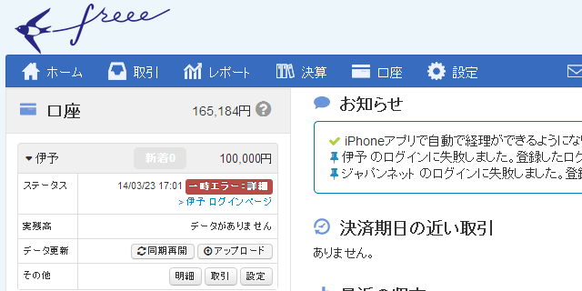

青色申告が終わりましたね。お疲れ様！　僕は来年からやろうかなと思っていたのだけど、Twitter を見てる限り、大変そうですね……阿鼻叫喚って感じ。早い目に準備しておくに越したことないなぁ、と思ったので、今流行のクラウドサービス「Freee」を使ってみたよ。

<ul>
<li><a href="http://www.freee.co.jp/">&#x4F1A;&#x8A08;&#x30BD;&#x30D5;&#x30C8;&#x300C;freee(&#x30D5;&#x30EA;&#x30FC;)&#x300D;&#xFF5C;&#x5168;&#x81EA;&#x52D5;&#x306E;&#x30AF;&#x30E9;&#x30A6;&#x30C9;&#x4F1A;&#x8A08;&#x30BD;&#x30D5;&#x30C8;</a></li>
</ul>
「Freee」だったら取引明細を自動で同期できるというし、記帳がだいぶ楽になりそう。自分が今持っている口座は、

<ul>
<li>ジャパンネット銀行：メインで使っていた。近所のローソンの ATM で使えない以外は、一番便利だと思う</li>
<li>楽天銀行：もっぱらクレジットカードの引き落とし＆貯金用 ＋ totoBIG 購入用に利用</li>
<li>伊予銀行（New！）：家賃・光熱費・税金などの引き落とし</li>
<li>三菱東京 UFJ 銀行：ジャパンネット銀行で保険料が自動引き落としできなかったので仕方なく使ってる</li>
</ul>
の4つ。このうち三菱東京 UFJ 銀行の口座は今月末で解約しようと思っている<a href="#f1" name="fn1" title="保険料の引き落としを伊予銀行に統一できた">*1</a>ので、残りは3つ。「Freee」はこのいずれにも対応しているとのことだったけれど、

<ul>
<li>ジャパンネット銀行はログインIDに未対応</li>
<li>伊予銀行は取引明細の自動同期に失敗</li>
</ul>
という結果だった。ジャパンネット銀行の件はログインIDの利用をやめろ、つまり、今2つ持っているセキュリティトークンの一つを利用停止にしろとのこと。ちょっと不便になるけれど仕方ない。伊予銀行の件はサポートデスクに連絡したら「ごめんなさい」という返事があったのだけど、今のところまだちゃんと動いていないみたい。あと、オンラインパスワードを「Freee」に預けないといけないのはだいぶ不安かな……とくに楽天銀行・伊予銀行は「ひみつの質問」の答えまで預けなきゃいけないので、怖さは倍増だ<a href="#f2" name="fn2" title="ジャパンネット銀行はセキュリティトークンがないと基本的に出金できないので、オンラインパスワードが破られてもお金までは取られない">*2</a>。

そほかの使い勝手は……まぁまぁ、いいと思う。とくに難しいところはなかった。自分が経理をやったのはもう8年も前なので、基本的な仕分けのやり方も忘れていたけれど、それほど躓くことなく記帳できている。Web アプリケーションなのに、入力性のよさは褒めてもいい。8年前の「弥生会計」よりは楽な感じを受けた。

けれど、一つだけ失敗。

2014年1月末に「Freee」で記帳を始めたのだけど、帳簿が「2013年期」だった。年度締めをして会計期間を「2014-01-01～2014-12-31」にしないといけなかったのだ。結局すべてデータを削除してやり直す羽目になったのだけど、このデータの削除がまた面倒くさかった……。こんなミスをするのは僕だけかもしれないけれど、これから始める人は気を付けてください……orz

あと、口座間移動で入出金がダブってしまうのはちょっと格好悪い。片方の口座の記録を「無視」すればいいのだけれど、最初は口座間移動するたびに口座の残高が膨れ上がって少しびっくりした。

<h4>P.S.</h4>

1月のお給料と2月にもらった退職金は「事業主貸し」でつけとけばいいんだよね？　ここだけよくわからん。あと、デビットカードで引き落とされた後に調整でお金が返ってきたのだけど、これの帳簿の付け方がわからん。たかだか200円なので雑収入に突っ込んでおいたけど。

<a href="#fn1" name="f1" class="footnote-number">*1</a>:保険料の引き落としを伊予銀行に統一できた

<a href="#fn2" name="f2" class="footnote-number">*2</a>:ジャパンネット銀行はセキュリティトークンがないと基本的に出金できないので、オンラインパスワードが破られてもお金までは取られない

