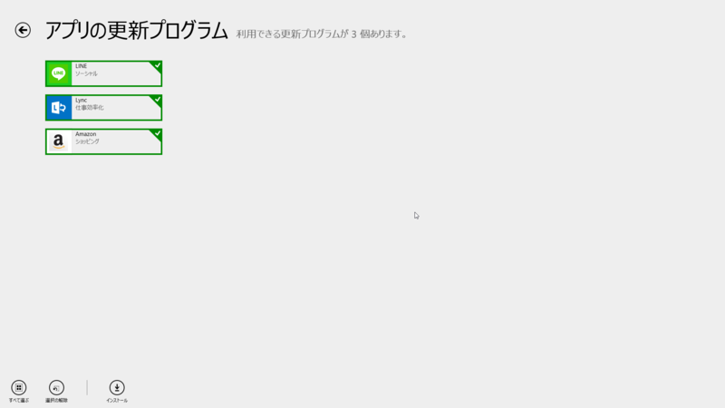
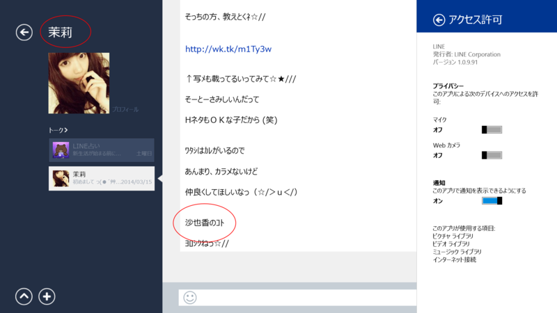
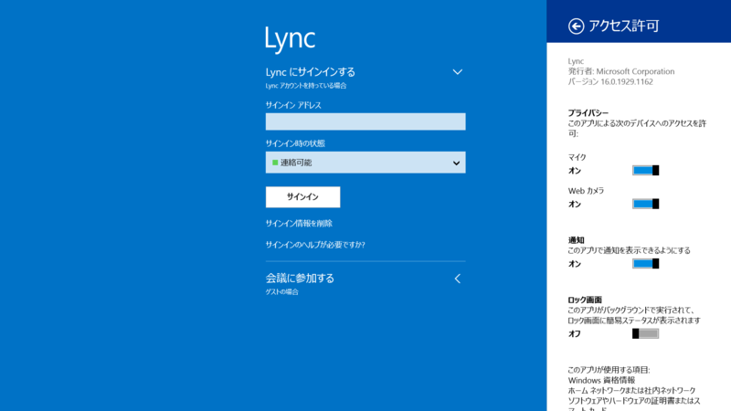
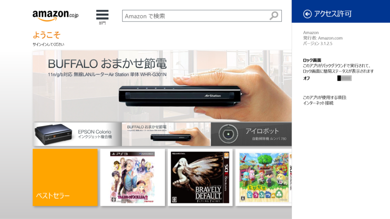

 

<h3>LINE 1.0.9.91</h3>

 

<blockquote>

不具合修正および性能改善

</blockquote>

1.0.8.90 より。割とどうでもいい話で恐縮なんだが、<b>お前の名前はどっちなんだ。</b> 

<ul>
<li><a href="http://apps.microsoft.com/windows/ja-jp/app/line/b039ba22-c3af-45b3-aea2-83d612c9bce6">Windows &#x30B9;&#x30C8;&#x30A2; &#x306E; Windows &#x7528; LINE &#x30A2;&#x30D7;&#x30EA;</a></li>
</ul>

<h3>Lync 16.0.1929.1162</h3>

 

<blockquote>

Lync の Windows ストア アプリの更新プログラム:2014 年 3 月の更新には新機能が含まれています。次のことができるようになりました。

<ul>
<li>会議の参加者を、個人としてもグループとしても管理できます。</li>
<li>通話中や会議中に、会話のコントロールに簡単にアクセスできます。</li>
<li>「今すぐミーティング」機能を使って、すぐに緊急会議を開始できます。</li>
<li>会議のリストをスタート画面にタイルとしてピン留めすれば、会議のスケジュールを簡単に確認できます。</li>
<li>参加/今すぐミーティングのタイルをスタート画面にピン留めすれば、スケジュールされている会議への参加や、新しい Lync 会議の開始がすばやく簡単にできます。</li>
</ul>
</blockquote>

16.0.1929.1140 より。

<ul>
<li><a href="http://apps.microsoft.com/windows/ja-jp/app/ba4b9485-8712-41ff-a9ea-6243a3e07682">Windows &#x30B9;&#x30C8;&#x30A2; &#x306E; Windows &#x7528; Lync &#x30A2;&#x30D7;&#x30EA;</a></li>
</ul>

<h3>Amazon 3.1.2.5</h3>

 

<blockquote>

Performance improvements

</blockquote>

3.1.1.1 より。そういえばアプリから買ったこと、まだないや。

<ul>
<li><a href="http://apps.microsoft.com/windows/ja-jp/app/80299018-3dee-418d-8466-374fe9463309">Windows &#x30B9;&#x30C8;&#x30A2; &#x306E; Windows &#x7528; Amazon &#x30A2;&#x30D7;&#x30EA;</a></li>
</ul>

