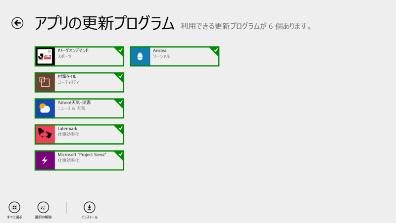
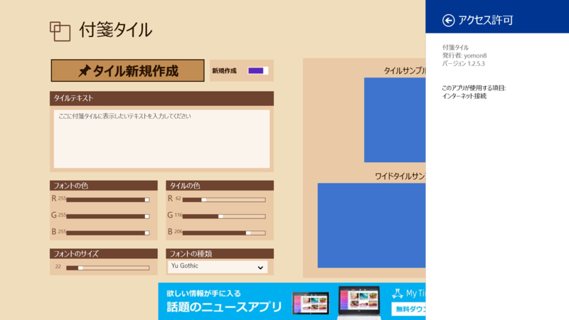
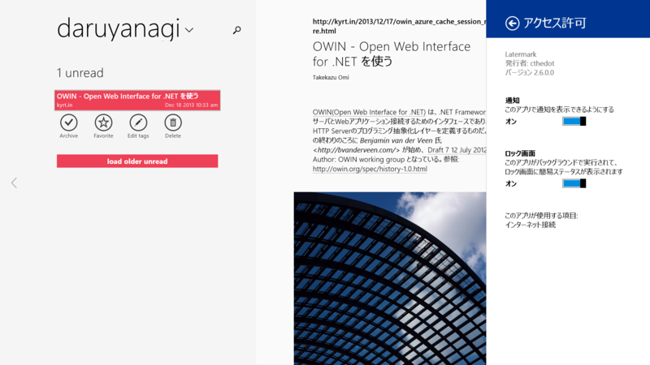
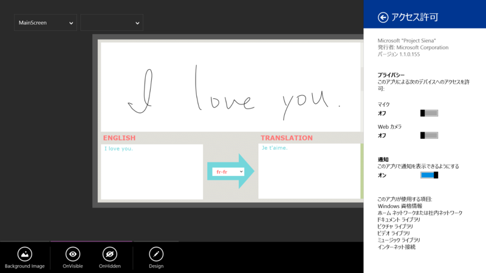
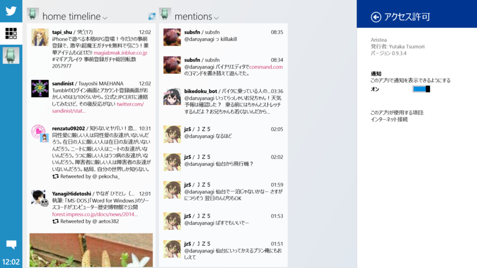

 

<h3>付箋タイル 1.2.5.3</h3>

 

<blockquote>

<1.2.5> 
タイルの黒の枠線を無くしました。

</blockquote>

<ul>
<li><a href="http://apps.microsoft.com/windows/ja-jp/app/43762868-3915-4c75-b5ca-d4f12b1d1ba4">Windows &#x30B9;&#x30C8;&#x30A2; &#x306E; Windows &#x7528; &#x4ED8;&#x7B8B;&#x30BF;&#x30A4;&#x30EB; &#x30A2;&#x30D7;&#x30EA;</a></li>
</ul>

<h3>Latermark 2.6.0.0</h3>

 

<blockquote>

v2.6

<ul>
<li>enable Settings/Permissions/Notifications for unobtrusive error messages which do not block the UI</li>
<li>multi-edit, select "Edit Lists" from bottom appbar</li>
<li>right click (or hold on touch device) on item for edit without viewing article</li>
<li>share selected text from Latermark to e.g. a translation app (Language Translator works)</li>
<li>improved sync of offline actions, failed ones can be retried or deleted manually now</li>
<li>changed some keyboard shortcuts, press "?" for details</li>
<li>added open in Latermark options for snapped/small screens</li>
<li>added option how many items are sync at any time (select less for slower hardware/network, default is 100)</li>
<li>added new style option to change between paragraphs being "book-like" indented (default) or separated by empty line</li>
<li>improved tag filter layer in "snapped" mode</li>
<li>fixed after deletion of items count of list not updated if list empty</li>
<li>fixed deleting items from search results</li>
<li>major refactoring and bugfixing</li>
</ul>
</blockquote>

<a href="http://apps.microsoft.com/windows/ja-jp/app/latermark/db1d9e9d-5e8b-48e8-affd-172d99dacdb9">Windows &#x30B9;&#x30C8;&#x30A2; &#x306E; Windows &#x7528; Latermark &#x30A2;&#x30D7;&#x30EA;</a> 

<h3>Microsoft "Project Siena" 1.1.0.155</h3>

 

<blockquote>

<ul>
<li>Quick start: create an app by merely selecting a folder full of images</li>
<li>Add translate, search, speak, and social network connections to any app</li>
<li>Easily and securely read and update to SaaS and IT-created services</li>
<li>Enrich apps with YouTube videos</li>
<li>New Function Explorer</li>
</ul>
</blockquote>

<ul>
<li><a href="http://blogs.msdn.com/b/somasegar/archive/2014/03/24/project-siena-beta-2-enabling-business-users-to-create-apps-connected-to-enterprise-services-web-and-social.aspx">Project Siena Beta 2: Enabling business users to create apps connected to enterprise services, web and social - Somasegar&#39;s blog - Site Home - MSDN Blogs</a></li>
<li><a href="http://www.forest.impress.co.jp/docs/news/20140325_641137.html">Windows &#x30B9;&#x30C8;&#x30A2;&#x30A2;&#x30D7;&#x30EA;&#x958B;&#x767A;&#x30C4;&#x30FC;&#x30EB;&#x300C;Project Siena&#x300D;&#x306E;Beta 2&#x304C;&#x516C;&#x958B; - &#x7A93;&#x306E;&#x675C;</a></li>
<li><a href="http://apps.microsoft.com/windows/ja-jp/app/microsoft-project-siena/5ae47651-e8f3-4e41-aab7-e19ab1b80180">Windows &#x30B9;&#x30C8;&#x30A2; &#x306E; Windows &#x7528; Microsoft &quot;Project Siena&quot; &#x30A2;&#x30D7;&#x30EA;</a></li>
</ul>

<h3>Aristea 0.9.3.4</h3>

 

<blockquote>

<ul>
<li>画像をダブルタップすると大きく表示できるようにしました</li>
<li>細かい見た目を修正しました</li>
<li>一部のローカライズを修正しました</li>
<li>共有コントラクトに対応しました</li>
<li>URLを含む文字数の計算を修正しました</li>
<li>ユーザ情報を表示できるようにしました</li>
<li>細かい使いやすさを向上しました</li>
<li>アプリがクラッシュする不具合を修正しました</li>
<li>その他細かい不具合を修正しました</li>
</ul>
</blockquote>

<ul>
<li><a href="http://apps.microsoft.com/windows/ja-jp/app/88e09e92-fdc4-4510-96d9-649f20ad8ecf">Windows &#x30B9;&#x30C8;&#x30A2; &#x306E; Windows &#x7528; Aristea &#x30A2;&#x30D7;&#x30EA;</a></li>
</ul>

