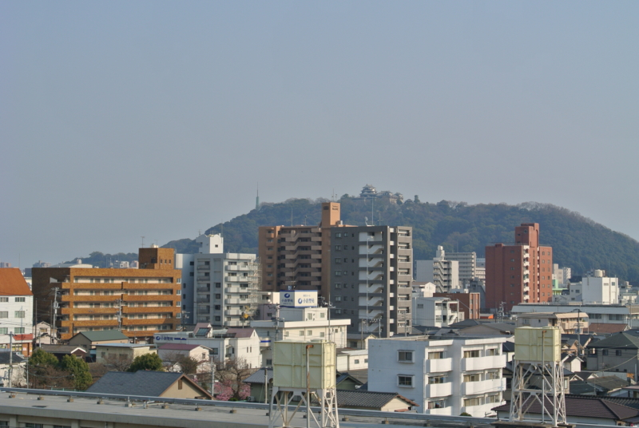
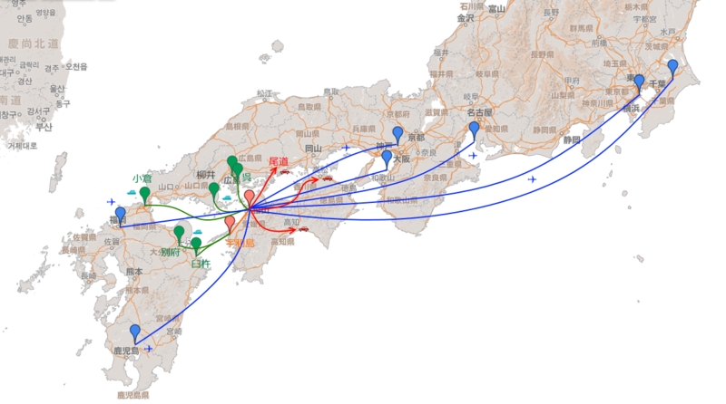
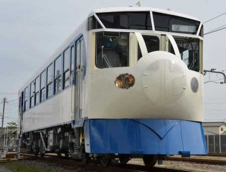
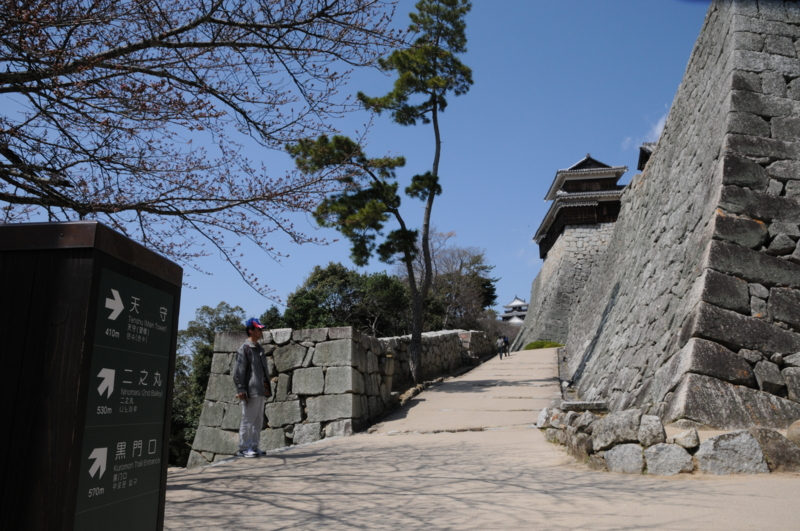
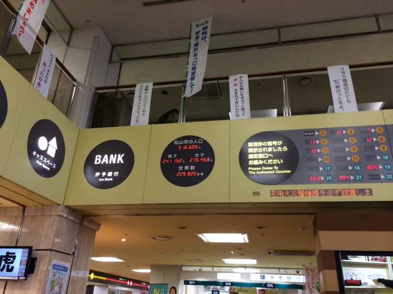

ベランダから松山城の天守閣が望めるこの部屋に引っ越して、一ヶ月と少しが経った。ようやく人の住める状況になり、生活も落ち着いてきた。ここでずっと住むことに不安がないわけではないけれど、まぁ、高望みさえしなければどうとでもなるような気もする。お給料が安くてもいいから、どこか副業 OK で楽なお仕事、ないかなぁ。

しかし、なんで生まれた大阪でもなく、育った名張でもなく、割りと愛着のある奈良でもなく、大好きな京都でもなく、なぜ縁もゆかりもない松山なんぞに来たんだろう、とたまに我に返って思わないでもない。我ながらびっくりだわ。まぁ、引っ越した理由はいくつかあるんだけど……。

まず、街がコンパクトだ。

松山市駅から街の外れにある自分の家まで、歩いても1時間かかるだろうか。それぐらい小さな街。松山城の周りをぐるっと路面電車が走っていて、150円でどこでもいける。京都もわりとそうだけど、自転車でどこへでも行けるぐらいの大きさが、街のサイズとしてはちょうどいいと僕は思っている。この考えにとくに根拠はないのだけど、街がデカすぎると街に振り回された生活になってしまうように感じる。トイレの部屋が広すぎると落ち着いてウンコができないのと一緒で、だだっ広い街は住んでいてゾワゾワする。これはなにも東京だけじゃなくて、郊外型の街にも言えると思う。ジャスコや東京靴流通センターやコジマしかない街はヤバい。街はキュッと凝集しているほうがいい。けれど、あまりにも巨大すぎるのも手に負えないし、疎外感を感じる。そういう意味では、地方の中核都市・政令指定都市あたりが住みやすそうというのはある。

つぎに、地図を見る限り割りとあちこち行くに便利だ。

東京や大阪には LCC で安く飛べる（いつ定期便がなくなるか若干不安だが）。尾道、高知、高松はクルマで2時間圏内。呉・広島は船で対岸だし、小倉まで行くにもフェリーがある。高速バスもあちこちに出ている。まぁ、実際に使ってみないとわからないことはあると思うけれど、いろんな交通手段があるのは楽しみではある。北海道・東北・北陸へは行きづらいが、そもそも僕は寒いのが苦手なのでさほど問題にはならない。

ただし、JR にはあまり多くを期待できないようだ。愛媛県人は JR を「汽車」と呼ぶ。「電車」という尊称は、もっぱら伊予鉄（路面電車）に捧げられているのだ。

とまぁ、いろいろ理由はあるのだけど、この街で一番気に入っているのはやっぱりお城かもしれない。

<blockquote>

春や昔 十五万石の 城下かな

</blockquote>

と正岡子規が詠んだ気持ち、毎朝お城を見ているとなんとなく分かる。『魔女の宅急便』でキキが「時計台があって海の見える街がいい」と言っているが、自分にとってそれは「路面電車でちょろちょろ移動できて、カッコいいお城のある街」だったのだと思う。で、できれば飛行機の便がよければいい。そういう意味で、松山は格好の町だった。道後温泉本館もそうだけど、この街にはわりあい古いものが残っていて、それがちゃんと生きているのがいい。

今住んでいる山越は、市街地からほんのちょっと外れたところにあって、とても静かだ。けれど、やる気さえあればすぐに街に出かけられるし、近所にスーパー・コンビニもある。布団から手を伸ばせば何にでも手の届く4畳半のような立地が気に入っている。

<h4>追記</h4>

ちなみに、愛媛は美人が多いそうだ。市役所で市の人口をチェックしたところ、男より女の方が三万人も多いので、モテない自分にもワンチャンあるかもしれぬ。ただし、愛媛に美人が多いという情報がいずれも愛媛出身の自称美女によってもたらされたモノであるのが若干僕を不安にさせている。

